# Documentación Técnica: Implementación de thomasmol/whisper-diarization

**Modelo:** thomasmol/whisper-diarization  
**Fecha:** Diciembre 2024  
**Versión del Documento:** 1.0  
**Para:** Claude Code - Implementación en Aplicación Médica

---

## 📋 Tabla de Contenidos

1. [Información del Modelo](#modelo)
2. [Especificaciones Técnicas](#specs)
3. [Inputs y Outputs](#io)
4. [Arquitectura Recomendada](#arquitectura)
5. [Código de Implementación](#codigo)
6. [Sistema Híbrido de Diarización](#hibrido)
7. [Validación de Calidad](#calidad)
8. [Integración con SOAP](#soap)
9. [Casos de Prueba](#pruebas)
10. [Troubleshooting](#troubleshooting)

---

## <a name="modelo"></a>1. Información del Modelo

### 1.1 Detalles del Modelo

```yaml
Nombre: thomasmol/whisper-diarization
Version ID: 1495a9cddc83b2203b0d8d3516e38b80fd1572ebc4bc5700ac1da56a9b3ed886
Runs: 3,389,521+ (más probado en Replicate)
Base: Whisper Large V3 Turbo
Diarización: pyannote.audio 3.x
Idiomas: Multiidioma (español confirmado)
```

### 1.2 Ventajas Clave

| Característica | Valor | Impacto |
|----------------|-------|---------|
| **Velocidad** | 18x más rápido que audio real | Experiencia de usuario excelente |
| **Confidence** | 99% promedio | Alta confiabilidad médica |
| **Simplicidad** | 4 parámetros principales | Fácil integración |
| **Estabilidad** | 3.3M+ runs | Batalla-probado |
| **Costo** | ~$0.0023 por minuto | Económico |

### 1.3 URL del Modelo

```
https://replicate.com/thomasmol/whisper-diarization
```

---

## <a name="specs"></a>2. Especificaciones Técnicas

### 2.1 Requisitos del Sistema

**Python:**
```bash
python >= 3.10
replicate >= 0.22.0
```

**Dependencias:**
```bash
pip install replicate pydub anthropic loguru
```

**API Token:**
```bash
# Configurar en .env
REPLICATE_API_TOKEN=r8_xxxxxxxxxxxxxxxxxxxxx
```

### 2.2 Formatos de Audio Soportados

| Formato | Extensión | Recomendado | Notas |
|---------|-----------|-------------|-------|
| MP3 | .mp3 | ✅ Sí | Más común, buena compresión |
| WAV | .wav | ✅ Sí | Sin pérdida, mejor calidad |
| M4A | .m4a | ✅ Sí | Apple devices |
| FLAC | .flac | ⚠️ Convertir | Convertir a WAV/MP3 primero |
| OGG | .ogg | ⚠️ Convertir | Convertir a WAV/MP3 primero |

**Límites:**
- Tamaño máximo: 25 MB (si supera, comprimir)
- Duración máxima: Ilimitada (pero >1 hora puede ser lento)
- Sample rate recomendado: 16000 Hz o 44100 Hz

---

## <a name="io"></a>3. Inputs y Outputs

### 3.1 Schema de Input

```python
{
    "file": File | str,              # REQUIRED: Audio file or URL
    "file_url": str,                 # Optional: URL alternativa
    "language": str,                 # Optional: "es" para español
    "num_speakers": int,             # Optional: Número esperado de speakers
    "translate": bool,               # Optional: False para mantener español
    "group_segments": bool,          # Optional: True para agrupar por speaker
    "prompt": str,                   # Optional: Contexto para mejorar precisión
    "offset_seconds": int            # Optional: Iniciar desde segundo X
}
```

### 3.2 Parámetros Detallados

#### **file** (REQUIRED)
```python
# Opción 1: Archivo local
with open("consulta.mp3", "rb") as audio:
    input = {"file": audio}

# Opción 2: URL pública
input = {"file_url": "https://ejemplo.com/audio.mp3"}
```

#### **language** (OPTIONAL pero RECOMENDADO)
```python
"language": "es"  # Español
"language": "en"  # Inglés
"language": None  # Auto-detectar (más lento)
```

**Códigos de idioma soportados:**
```python
SUPPORTED_LANGUAGES = [
    'af', 'am', 'ar', 'as', 'az', 'ba', 'be', 'bg', 'bn', 'bo', 'br', 'bs', 
    'ca', 'cs', 'cy', 'da', 'de', 'el', 'en', 'es', 'et', 'eu', 'fa', 'fi', 
    'fo', 'fr', 'gl', 'gu', 'ha', 'haw', 'he', 'hi', 'hr', 'ht', 'hu', 'hy',
    'id', 'is', 'it', 'ja', 'jw', 'ka', 'kk', 'km', 'kn', 'ko', 'la', 'lb',
    'ln', 'lo', 'lt', 'lv', 'mg', 'mi', 'mk', 'ml', 'mn', 'mr', 'ms', 'mt',
    'my', 'ne', 'nl', 'nn', 'no', 'oc', 'pa', 'pl', 'ps', 'pt', 'ro', 'ru',
    'sa', 'sd', 'si', 'sk', 'sl', 'sn', 'so', 'sq', 'sr', 'su', 'sv', 'sw',
    'ta', 'te', 'tg', 'th', 'tk', 'tl', 'tr', 'tt', 'uk', 'ur', 'uz', 'vi',
    'yi', 'yo', 'zh'
]
```

#### **num_speakers** (OPTIONAL pero RECOMENDADO)
```python
"num_speakers": 2  # Para consulta médica (doctor + paciente)
"num_speakers": 3  # Si hay enfermera/acompañante
"num_speakers": None  # Auto-detectar (menos preciso)
```

⚠️ **IMPORTANTE:** El modelo puede ignorar este parámetro si detecta un número diferente de speakers. Si solo detecta 1 speaker cuando esperabas 2, usa el sistema híbrido (ver sección 6).

#### **translate** (OPTIONAL)
```python
"translate": False  # Mantener en español original (RECOMENDADO)
"translate": True   # Traducir a inglés (NO usar para app médica)
```

#### **group_segments** (OPTIONAL)
```python
"group_segments": True   # Agrupa frases del mismo speaker (RECOMENDADO)
"group_segments": False  # Cada palabra es un segmento (muy granular)
```

**Ejemplo de diferencia:**

```python
# group_segments: False
[
  {"text": " He", "speaker": "SPEAKER_00"},
  {"text": " estado", "speaker": "SPEAKER_00"},
  {"text": " teniendo", "speaker": "SPEAKER_00"}
]

# group_segments: True
[
  {"text": "He estado teniendo problemas al levantarme.", "speaker": "SPEAKER_00"}
]
```

#### **prompt** (OPTIONAL pero ÚTIL)
```python
"prompt": "Doctor, paciente, consulta médica, síntomas, diagnóstico, tratamiento"
```

Este parámetro ayuda al modelo a:
- Mejorar precisión en terminología médica
- Entender el contexto del audio
- Reducir errores en palabras técnicas

**Prompts recomendados por especialidad:**

```python
MEDICAL_PROMPTS = {
    'general': 'Doctor, paciente, consulta médica, síntomas, diagnóstico, tratamiento',
    'cardiologia': 'Doctor, paciente, presión arterial, corazón, arritmia, electrocardiograma',
    'pediatria': 'Doctor, paciente, niño, fiebre, vacunas, desarrollo',
    'ginecologia': 'Doctor, paciente, menstruación, embarazo, anticonceptivos'
}
```

### 3.3 Schema de Output

```python
{
    "language": str,                # Idioma detectado (ej: "es")
    "segments": [                   # Array de segmentos transcritos
        {
            "start": float,         # Tiempo inicio (segundos)
            "end": float,           # Tiempo fin (segundos)
            "text": str,            # Texto transcrito
            "speaker": str,         # "SPEAKER_00", "SPEAKER_01", etc.
            "duration": float,      # Duración del segmento
            "avg_logprob": float,   # Probabilidad logarítmica promedio
            "words": [              # Array de palabras individuales
                {
                    "word": str,          # Palabra
                    "start": float,       # Tiempo inicio palabra
                    "end": float,         # Tiempo fin palabra
                    "speaker": str,       # Speaker de esta palabra
                    "probability": float  # Confianza (0-1)
                }
            ]
        }
    ],
    "num_speakers": int            # Número de speakers detectados
}
```

### 3.4 Ejemplo de Output Completo

```json
{
  "language": "es",
  "num_speakers": 1,
  "segments": [
    {
      "start": 3.18,
      "end": 5.6,
      "text": "He estado teniendo problemas al levantarme.",
      "speaker": "SPEAKER_00",
      "duration": 2.42,
      "avg_logprob": -0.114,
      "words": [
        {
          "word": " He",
          "start": 3.18,
          "end": 3.74,
          "speaker": "SPEAKER_00",
          "probability": 0.892
        },
        {
          "word": " estado",
          "start": 3.74,
          "end": 4.02,
          "speaker": "SPEAKER_00",
          "probability": 0.9995
        },
        {
          "word": " teniendo",
          "start": 4.02,
          "end": 4.46,
          "speaker": "SPEAKER_00",
          "probability": 0.9995
        }
      ]
    }
  ]
}
```

---

## <a name="arquitectura"></a>4. Arquitectura Recomendada

### 4.1 Flujo General

```mermaid
graph TB
    A[Audio de Consulta] --> B[Validar Audio]
    B --> C{¿Formato válido?}
    C -->|No| D[Convertir a MP3]
    C -->|Sí| E{¿Tamaño > 25MB?}
    D --> E
    E -->|Sí| F[Comprimir Audio]
    E -->|No| G[Transcribir con thomasmol]
    F --> G
    G --> H{¿Speakers detectados?}
    H -->|2+| I[Mapear a Doctor/Patient]
    H -->|1| J[Sistema Híbrido]
    I --> K[Validar Confianza]
    J --> K
    K --> L{¿Palabras <85%?}
    L -->|Sí| M[Marcar para Revisión]
    L -->|No| N[Generar SOAP]
    M --> N
    N --> O[Guardar Resultado]
```



### 4.2 Estructura de Directorios

```
medical-transcription-app/
├── src/
│   ├── transcription/
│   │   ├── __init__.py
│   │   ├── thomasmol_client.py      # Cliente del modelo
│   │   ├── audio_validator.py       # Validación de audio
│   │   ├── audio_processor.py       # Conversión/compresión
│   │   └── speaker_assigner.py      # Sistema híbrido
│   ├── quality/
│   │   ├── __init__.py
│   │   ├── confidence_checker.py    # Validación de confianza
│   │   └── medical_terms.py         # Diccionario médico
│   ├── soap/
│   │   ├── __init__.py
│   │   └── generator.py             # Generación SOAP con Claude
│   └── api/
│       ├── __init__.py
│       └── main.py                  # FastAPI endpoints
├── config/
│   ├── settings.py                  # Configuración
│   └── medical_prompts.json         # Prompts por especialidad
├── tests/
│   ├── test_transcription.py
│   └── fixtures/
│       └── sample_audios/
├── .env
├── requirements.txt
└── README.md
```

---

## <a name="codigo"></a>5. Código de Implementación

### 5.1 Cliente de Transcripción

**src/transcription/thomasmol_client.py:**

```python
"""
Cliente para el modelo thomasmol/whisper-diarization
"""
import replicate
from typing import Dict, Any, Optional
from pathlib import Path
import json
from loguru import logger

class ThomasmolClient:
    """
    Cliente optimizado para thomasmol/whisper-diarization
    """
    
    MODEL_VERSION = "1495a9cddc83b2203b0d8d3516e38b80fd1572ebc4bc5700ac1da56a9b3ed886"
    
    def __init__(self, api_token: Optional[str] = None):
        """
        Inicializa el cliente
        
        Args:
            api_token: Token de Replicate (si no se provee, usa env var)
        """
        self.client = replicate.Client(api_token=api_token)
        logger.info("ThomasmolClient inicializado")
    
    def transcribe(
        self,
        audio_path: str,
        language: str = "es",
        num_speakers: int = 2,
        prompt: Optional[str] = None,
        group_segments: bool = True
    ) -> Dict[str, Any]:
        """
        Transcribe audio con diarización
        
        Args:
            audio_path: Ruta al archivo de audio
            language: Código de idioma (ej: "es")
            num_speakers: Número esperado de speakers
            prompt: Contexto para mejorar precisión
            group_segments: Agrupar segmentos por speaker
        
        Returns:
            Dict con transcripción y metadata
        
        Raises:
            FileNotFoundError: Si audio no existe
            ValueError: Si parámetros son inválidos
        """
        # Validar archivo
        audio_file = Path(audio_path)
        if not audio_file.exists():
            raise FileNotFoundError(f"Audio no encontrado: {audio_path}")
        
        logger.info(f"Transcribiendo: {audio_path}")
        logger.info(f"Parámetros: lang={language}, speakers={num_speakers}")
        
        # Preparar prompt
        if prompt is None:
            prompt = self._get_default_prompt()
        
        try:
            # Ejecutar modelo
            with open(audio_path, "rb") as audio:
                output = self.client.run(
                    f"thomasmol/whisper-diarization:{self.MODEL_VERSION}",
                    input={
                        "file": audio,
                        "language": language,
                        "num_speakers": num_speakers,
                        "prompt": prompt,
                        "group_segments": group_segments,
                        "translate": False  # Mantener idioma original
                    }
                )
            
            # Validar output
            if not output or 'segments' not in output:
                raise ValueError("Output inválido del modelo")
            
            # Agregar metadata
            result = {
                'transcription': output,
                'metadata': {
                    'audio_file': audio_path,
                    'language': output.get('language', language),
                    'num_speakers_detected': output.get('num_speakers', 0),
                    'num_speakers_expected': num_speakers,
                    'total_segments': len(output.get('segments', [])),
                    'model_version': self.MODEL_VERSION
                }
            }
            
            logger.success(
                f"Transcripción exitosa: {result['metadata']['total_segments']} segmentos, "
                f"{result['metadata']['num_speakers_detected']} speakers detectados"
            )
            
            return result
            
        except Exception as e:
            logger.error(f"Error en transcripción: {e}")
            raise
    
    def _get_default_prompt(self) -> str:
        """
        Prompt por defecto para consultas médicas
        """
        return (
            "Doctor, paciente, consulta médica, síntomas, diagnóstico, "
            "tratamiento, medicamento, alergia, presión arterial, análisis"
        )
    
    def transcribe_batch(
        self,
        audio_paths: list[str],
        **kwargs
    ) -> list[Dict[str, Any]]:
        """
        Transcribe múltiples audios
        
        Args:
            audio_paths: Lista de rutas a archivos
            **kwargs: Argumentos para transcribe()
        
        Returns:
            Lista de resultados
        """
        results = []
        
        for i, path in enumerate(audio_paths, 1):
            logger.info(f"Procesando audio {i}/{len(audio_paths)}")
            try:
                result = self.transcribe(path, **kwargs)
                results.append(result)
            except Exception as e:
                logger.error(f"Error procesando {path}: {e}")
                results.append({'error': str(e), 'audio_path': path})
        
        return results

# Singleton
thomasmol_client = ThomasmolClient()
```

### 5.2 Validador de Audio

**src/transcription/audio_validator.py:**

```python
"""
Validación y procesamiento de archivos de audio
"""
from pathlib import Path
from pydub import AudioSegment
from loguru import logger
import os

class AudioValidator:
    """
    Valida y procesa archivos de audio antes de transcripción
    """
    
    SUPPORTED_FORMATS = ['.mp3', '.wav', '.m4a', '.flac', '.ogg']
    MAX_SIZE_MB = 25
    MAX_SIZE_BYTES = MAX_SIZE_MB * 1024 * 1024
    
    @staticmethod
    def validate(audio_path: str) -> tuple[bool, str]:
        """
        Valida archivo de audio
        
        Returns:
            (is_valid, message)
        """
        path = Path(audio_path)
        
        # Existe?
        if not path.exists():
            return False, f"Archivo no existe: {audio_path}"
        
        # Formato soportado?
        if path.suffix.lower() not in AudioValidator.SUPPORTED_FORMATS:
            return False, f"Formato no soportado: {path.suffix}"
        
        # Tamaño OK?
        size_mb = path.stat().st_size / (1024 * 1024)
        if size_mb > AudioValidator.MAX_SIZE_MB:
            return False, f"Archivo muy grande: {size_mb:.2f}MB (máx: {AudioValidator.MAX_SIZE_MB}MB)"
        
        # Intentar cargar
        try:
            AudioSegment.from_file(audio_path)
        except Exception as e:
            return False, f"Audio corrupto o inválido: {e}"
        
        return True, "Audio válido"
    
    @staticmethod
    def convert_to_mp3(
        audio_path: str,
        output_path: Optional[str] = None
    ) -> str:
        """
        Convierte audio a MP3
        
        Args:
            audio_path: Audio original
            output_path: Ruta de salida (si None, usa temp)
        
        Returns:
            Ruta al MP3 generado
        """
        logger.info(f"Convirtiendo a MP3: {audio_path}")
        
        # Cargar audio
        audio = AudioSegment.from_file(audio_path)
        
        # Ruta de salida
        if output_path is None:
            output_path = str(Path(audio_path).with_suffix('.mp3'))
        
        # Convertir a mono (mejor para diarización)
        audio = audio.set_channels(1)
        
        # Exportar
        audio.export(output_path, format='mp3', bitrate='128k')
        
        logger.success(f"MP3 generado: {output_path}")
        return output_path
    
    @staticmethod
    def compress_audio(
        audio_path: str,
        target_mb: int = 20,
        output_path: Optional[str] = None
    ) -> str:
        """
        Comprime audio si excede tamaño objetivo
        
        Args:
            audio_path: Audio a comprimir
            target_mb: Tamaño objetivo en MB
            output_path: Ruta de salida
        
        Returns:
            Ruta al audio comprimido
        """
        logger.info(f"Comprimiendo audio a ~{target_mb}MB")
        
        # Cargar
        audio = AudioSegment.from_file(audio_path)
        
        # Calcular bitrate necesario
        duration_seconds = len(audio) / 1000
        target_bytes = target_mb * 1024 * 1024
        target_bitrate = int((target_bytes * 8) / duration_seconds)
        
        # Limitar bitrate mínimo
        target_bitrate = max(64, min(target_bitrate, 320))
        
        # Ruta de salida
        if output_path is None:
            output_path = str(Path(audio_path).with_name(
                f"{Path(audio_path).stem}_compressed{Path(audio_path).suffix}"
            ))
        
        # Exportar comprimido
        audio.export(
            output_path,
            format='mp3',
            bitrate=f'{target_bitrate}k'
        )
        
        new_size = Path(output_path).stat().st_size / (1024 * 1024)
        logger.success(f"Audio comprimido: {new_size:.2f}MB (bitrate: {target_bitrate}kbps)")
        
        return output_path
    
    @staticmethod
    def prepare_audio(audio_path: str) -> str:
        """
        Pipeline completo de preparación
        
        Returns:
            Ruta al audio preparado
        """
        path = Path(audio_path)
        
        # 1. Validar
        is_valid, message = AudioValidator.validate(audio_path)
        if not is_valid:
            raise ValueError(message)
        
        # 2. Convertir a MP3 si no lo es
        if path.suffix.lower() != '.mp3':
            audio_path = AudioValidator.convert_to_mp3(audio_path)
            path = Path(audio_path)
        
        # 3. Comprimir si es muy grande
        size_mb = path.stat().st_size / (1024 * 1024)
        if size_mb > AudioValidator.MAX_SIZE_MB:
            audio_path = AudioValidator.compress_audio(audio_path)
        
        return audio_path

# Singleton
audio_validator = AudioValidator()
```

### 5.3 Sistema Híbrido de Asignación de Speakers

**src/transcription/speaker_assigner.py:**

```python
"""
Sistema híbrido para asignar speakers cuando diarización automática falla
"""
from typing import Dict, List, Any
from loguru import logger
import json

class SpeakerAssigner:
    """
    Asigna speakers usando análisis de contenido + heurísticas
    """
    
    # Patrones de lenguaje médico
    DOCTOR_PATTERNS = [
        # Preguntas diagnósticas
        '¿cuándo', '¿qué', '¿cómo', '¿dónde', '¿por qué',
        
        # Afirmaciones clínicas
        'tiene', 'presenta', 'muestra', 'indica',
        
        # Acciones médicas
        'voy a', 'vamos a', 'tengo algo', 'le recomiendoque', 'prescribir', 'recomendar',
        
        # Lenguaje técnico
        'los estudios', 'el análisis', 'la radiografía', 'el examen',
        'contraataca', 'dirigida', 'tratamiento', 'diagnóstico',
        
        # Explicaciones
        'esto significa', 'lo que pasa es', 'es normal', 'no se preocupe'
    ]
    
    PATIENT_PATTERNS = [
        # Síntomas subjetivos
        'me duele', 'siento', 'tengo', 'he estado', 'he tenido',
        
        # Temporalidad
        'hace', 'desde hace', 'días', 'semanas', 'meses',
        
        # Descripciones personales
        'problemas al', 'no puedo', 'me cuesta', 'cuando',
        
        # Respuestas simples
        'sí doctor', 'no doctor', 'creo que', 'no estoy seguro'
    ]
    
    def assign_speakers(
        self,
        segments: List[Dict[str, Any]],
        num_speakers_detected: int
    ) -> List[Dict[str, Any]]:
        """
        Pipeline principal de asignación
        
        Args:
            segments: Segmentos de transcripción
            num_speakers_detected: Número detectado por el modelo
        
        Returns:
            Segmentos con speakers asignados
        """
        if num_speakers_detected >= 2:
            logger.info(f"{num_speakers_detected} speakers detectados, mapeando a roles")
            return self._map_to_roles(segments)
        else:
            logger.warning("Solo 1 speaker detectado, usando heurística")
            return self._assign_by_heuristics(segments)
    
    def _assign_by_heuristics(
        self,
        segments: List[Dict[str, Any]]
    ) -> List[Dict[str, Any]]:
        """
        Asigna speakers usando análisis de contenido
        """
        for i, segment in enumerate(segments):
            text = segment['text'].lower()
            
            # Calcular scores
            doctor_score = sum(
                1 for pattern in self.DOCTOR_PATTERNS
                if pattern in text
            )
            
            patient_score = sum(
                1 for pattern in self.PATIENT_PATTERNS
                if pattern in text
            )
            
            # Asignar speaker
            if doctor_score > patient_score:
                speaker = 'Doctor'
                confidence = 'heuristic_high'
            elif patient_score > doctor_score:
                speaker = 'Patient'
                confidence = 'heuristic_high'
            elif i == 0:
                # Primera frase típicamente es el paciente (motivo de consulta)
                speaker = 'Patient'
                confidence = 'heuristic_medium'
            else:
                # Alternar con el anterior
                prev_speaker = segments[i-1].get('speaker', 'Doctor')
                speaker = 'Patient' if prev_speaker == 'Doctor' else 'Doctor'
                confidence = 'heuristic_low'
            
            # Actualizar segmento
            segment['speaker'] = speaker
            segment['speaker_confidence'] = confidence
            
            # Actualizar palabras
            for word in segment.get('words', []):
                word['speaker'] = speaker
        
        # Log estadísticas
        doctor_count = sum(1 for s in segments if s['speaker'] == 'Doctor')
        patient_count = len(segments) - doctor_count
        
        logger.info(
            f"Asignación heurística: {doctor_count} Doctor, {patient_count} Patient"
        )
        
        return segments
    
    def _map_to_roles(
        self,
        segments: List[Dict[str, Any]]
    ) -> List[Dict[str, Any]]:
        """
        Mapea SPEAKER_00/01 a Doctor/Patient basado en contenido
        """
        # Analizar cada speaker
        speaker_stats = {}
        
        for segment in segments:
            speaker = segment['speaker']
            if speaker not in speaker_stats:
                speaker_stats[speaker] = {'doctor': 0, 'patient': 0}
            
            text = segment['text'].lower()
            
            # Contar patrones
            for pattern in self.DOCTOR_PATTERNS:
                if pattern in text:
                    speaker_stats[speaker]['doctor'] += 1
            
            for pattern in self.PATIENT_PATTERNS:
                if pattern in text:
                    speaker_stats[speaker]['patient'] += 1
        
        # Determinar mapeo
        mapping = {}
        for speaker, stats in speaker_stats.items():
            if stats['doctor'] > stats['patient']:
                mapping[speaker] = 'Doctor'
            else:
                mapping[speaker] = 'Patient'
        
        # Aplicar mapeo
        for segment in segments:
            original_speaker = segment['speaker']
            segment['speaker'] = mapping.get(original_speaker, original_speaker)
            segment['speaker_confidence'] = 'automatic'
            
            # Actualizar palabras
            for word in segment.get('words', []):
                word['speaker'] = segment['speaker']
        
        logger.info(f"Mapeo aplicado: {mapping}")
        return segments
    
    def validate_assignment(
        self,
        segments: List[Dict[str, Any]]
    ) -> Dict[str, Any]:
        """
        Valida la calidad de la asignación
        
        Returns:
            Estadísticas de validación
        """
        total = len(segments)
        doctor = sum(1 for s in segments if s['speaker'] == 'Doctor')
        patient = total - doctor
        
        heuristic = sum(
            1 for s in segments
            if s.get('speaker_confidence', '').startswith('heuristic')
        )
        
        return {
            'total_segments': total,
            'doctor_segments': doctor,
            'patient_segments': patient,
            'doctor_percentage': (doctor / total * 100) if total > 0 else 0,
            'heuristic_assignments': heuristic,
            'heuristic_percentage': (heuristic / total * 100) if total > 0 else 0,
            'quality': 'high' if heuristic == 0 else 'medium' if heuristic < total/2 else 'low'
        }

# Singleton
speaker_assigner = SpeakerAssigner()
```

### 5.4 Validador de Confianza

**src/quality/confidence_checker.py:**

```python
"""
Validación de confianza de transcripción
"""
from typing import Dict, List, Any
from loguru import logger
import json
from pathlib import Path

class ConfidenceChecker:
    """
    Valida confianza de transcripción y detecta términos críticos
    """
    
    # Thresholds
    CONFIDENCE_CRITICAL = 0.85  # Para términos médicos críticos
    CONFIDENCE_GENERAL = 0.70   # Para texto general
    
    def __init__(self, medical_terms_path: str = "config/medical_terms.json"):
        """
        Inicializa con diccionario de términos médicos
        """
        self.medical_terms = self._load_medical_terms(medical_terms_path)
        self.critical_terms = self._flatten_critical_terms()
    
    def _load_medical_terms(self, path: str) -> Dict:
        """
        Carga diccionario de términos médicos
        """
        try:
            with open(path, 'r', encoding='utf-8') as f:
                return json.load(f)
        except FileNotFoundError:
            logger.warning(f"Diccionario médico no encontrado: {path}")
            return self._get_default_terms()
    
    def _get_default_terms(self) -> Dict:
        """
        Términos médicos por defecto
        """
        return {
            "critical_terms": {
                "allergies": [
                    "penicilina", "penicillin", "aspirina", "aspirin",
                    "ibuprofeno", "ibuprofen", "amoxicilina", "amoxicillin",
                    "sulfa", "mariscos", "latex"
                ],
                "medications": [
                    "metformina", "metformin", "insulina", "insulin",
                    "losartán", "losartan", "enalapril", "warfarina",
                    "anticoagulante", "digitálicos"
                ],
                "conditions": [
                    "infarto", "hemorragia", "embolia", "stroke",
                    "anafilaxia", "anaphylaxis", "convulsión", "seizure",
                    "shock", "coma"
                ]
            },
            "vital_signs": {
                "patterns": [
                    r"\d+/\d+",           # 120/80
                    r"\d+\s*mg/dL",       # 100 mg/dL
                    r"\d+\s*°[CF]"        # 37.5 °C
                ]
            }
        }
    
    def _flatten_critical_terms(self) -> List[str]:
        """
        Aplana términos críticos en lista única
        """
        terms = []
        for category in self.medical_terms.get('critical_terms', {}).values():
            terms.extend([t.lower() for t in category])
        return terms
    
    def check(
        self,
        transcription: Dict[str, Any]
    ) -> Dict[str, Any]:
        """
        Valida confianza de transcripción
        
        Returns:
            Reporte de calidad
        """
        logger.info("Validando confianza de transcripción...")
        
        report = {
            'overall_confidence': 0.0,
            'low_confidence_words': [],
            'critical_alerts': [],
            'statistics': {
                'total_words': 0,
                'total_segments': 0,
                'words_below_70': 0,
                'words_below_85': 0
            }
        }
        
        all_confidences = []
        
        for segment in transcription.get('segments', []):
            report['statistics']['total_segments'] += 1
            
            for word_data in segment.get('words', []):
                word = word_data.get('word', '').strip()
                confidence = word_data.get('probability', 1.0)
                start_time = word_data.get('start', 0)
                speaker = word_data.get('speaker', 'UNKNOWN')
                
                report['statistics']['total_words'] += 1
                all_confidences.append(confidence)
                
                # Detectar baja confianza general
                if confidence < self.CONFIDENCE_GENERAL:
                    report['statistics']['words_below_70'] += 1
                    report['low_confidence_words'].append({
                        'word': word,
                        'confidence': confidence,
                        'time': start_time,
                        'speaker': speaker
                    })
                
                if confidence < self.CONFIDENCE_CRITICAL:
                    report['statistics']['words_below_85'] += 1
                
                # CRÍTICO: Términos médicos con baja confianza
                if self._is_critical_term(word):
                    if confidence < self.CONFIDENCE_CRITICAL:
                        report['critical_alerts'].append({
                            'word': word,
                            'confidence': confidence,
                            'time': start_time,
                            'speaker': speaker,
                            'severity': 'HIGH',
                            'message': f'Término médico crítico con baja confianza: {word}'
                        })
        
        # Calcular confianza general
        if all_confidences:
            report['overall_confidence'] = sum(all_confidences) / len(all_confidences)
        
        # Clasificar calidad
        report['quality_level'] = self._classify_quality(report)
        
        logger.info(
            f"Validación completada: "
            f"Confianza={report['overall_confidence']:.2%}, "
            f"Alertas={len(report['critical_alerts'])}, "
            f"Calidad={report['quality_level']}"
        )
        
        return report
    
    def _is_critical_term(self, word: str) -> bool:
        """
        Verifica si palabra es término médico crítico
        """
        word_clean = word.lower().strip('.,;:!?')
        return word_clean in self.critical_terms
    
    def _classify_quality(self, report: Dict) -> str:
        """
        Clasifica calidad general
        """
        conf = report['overall_confidence']
        alerts = len(report['critical_alerts'])
        
        if conf >= 0.95 and alerts == 0:
            return 'excellent'
        elif conf >= 0.85 and alerts <= 2:
            return 'good'
        elif conf >= 0.70 and alerts <= 5:
            return 'acceptable'
        else:
            return 'poor'

# Singleton
confidence_checker = ConfidenceChecker()
```

---

## <a name="hibrido"></a>6. Sistema Híbrido de Diarización

### 6.1 Lógica de Decisión

```python
def process_transcription(audio_path: str) -> Dict:
    """
    Pipeline completo con sistema híbrido
    """
    # 1. Transcribir
    result = thomasmol_client.transcribe(audio_path)
    transcription = result['transcription']
    
    # 2. Verificar speakers
    speakers_detected = transcription['num_speakers']
    
    if speakers_detected >= 2:
        # Diarización automática funcionó
        segments = speaker_assigner.assign_speakers(
            transcription['segments'],
            speakers_detected
        )
        method = 'automatic'
    else:
        # Usar heurística
        segments = speaker_assigner.assign_speakers(
            transcription['segments'],
            speakers_detected
        )
        method = 'heuristic'
    
    # 3. Validar calidad
    quality_report = confidence_checker.check(transcription)
    assignment_stats = speaker_assigner.validate_assignment(segments)
    
    return {
        'segments': segments,
        'quality_report': quality_report,
        'assignment_stats': assignment_stats,
        'diarization_method': method,
        'needs_review': (
            quality_report['quality_level'] in ['poor', 'acceptable'] or
            len(quality_report['critical_alerts']) > 0 or
            assignment_stats['quality'] == 'low'
        )
    }
```

### 6.2 Configuración de Prompts por Especialidad

**config/medical_prompts.json:**

```json
{
  "general": {
    "prompt": "Doctor, paciente, consulta médica, síntomas, diagnóstico, tratamiento, medicamento, alergia",
    "critical_terms": ["alergia", "medicamento", "presión", "azúcar", "dolor"]
  },
  "cardiologia": {
    "prompt": "Doctor, paciente, corazón, presión arterial, arritmia, electrocardiograma, angina, infarto",
    "critical_terms": ["presión", "infarto", "arritmia", "angina", "anticoagulante"]
  },
  "pediatria": {
    "prompt": "Doctor, paciente, niño, fiebre, vacunas, desarrollo, peso, talla, crecimiento",
    "critical_terms": ["vacuna", "fiebre", "convulsión", "deshidratación", "alergia"]
  },
  "endocrinologia": {
    "prompt": "Doctor, paciente, diabetes, glucosa, insulina, tiroides, hormona, azúcar",
    "critical_terms": ["insulina", "glucosa", "hipoglucemia", "cetoacidosis"]
  }
}
```

---

## <a name="calidad"></a>7. Validación de Calidad

### 7.1 Criterios de Validación

```python
VALIDATION_CRITERIA = {
    'excellent': {
        'overall_confidence': >= 0.95,
        'critical_alerts': 0,
        'low_confidence_words': <= 2,
        'diarization_quality': 'high'
    },
    'good': {
        'overall_confidence': >= 0.85,
        'critical_alerts': <= 2,
        'low_confidence_words': <= 5,
        'diarization_quality': ['high', 'medium']
    },
    'acceptable': {
        'overall_confidence': >= 0.70,
        'critical_alerts': <= 5,
        'low_confidence_words': <= 10,
        'diarization_quality': ['high', 'medium', 'low']
    },
    'poor': {
        'overall_confidence': < 0.70,
        'critical_alerts': > 5,
        'requires_manual_review': True
    }
}
```

### 7.2 Acción por Nivel de Calidad

| Calidad | Acción | Proceso |
|---------|--------|---------|
| `excellent` | ✅ Procesar directamente | SOAP automático |
| `good` | ⚠️ Revisar alertas | SOAP con marcadores de revisión |
| `acceptable` | ⚠️⚠️ Revisión obligatoria | SOAP + validación manual |
| `poor` | ❌ Bloquear SOAP | Retranscribir o corrección manual |

---

## <a name="soap"></a>8. Integración con SOAP

### 8.1 Generador SOAP con Claude

**src/soap/generator.py:**

```python
"""
Generación de notas SOAP usando Claude
"""
from anthropic import Anthropic
from typing import Dict, Any
from loguru import logger
import os

class SOAPGenerator:
    """
    Genera notas SOAP desde transcripción
    """
    
    def __init__(self):
        self.client = Anthropic(api_key=os.getenv('ANTHROPIC_API_KEY'))
    
    def generate(
        self,
        segments: list[Dict],
        quality_report: Dict
    ) -> Dict[str, Any]:
        """
        Genera nota SOAP
        """
        # Formatear transcripción
        transcript = self._format_transcript(segments)
        
        # Formatear alertas
        alerts = self._format_alerts(quality_report)
        
        # Prompt
        prompt = self._build_prompt(transcript, alerts)
        
        # Llamar Claude
        response = self.client.messages.create(
            model="claude-sonnet-4-20250514",
            max_tokens=4000,
            temperature=0.3,
            messages=[{"role": "user", "content": prompt}]
        )
        
        soap_note = response.content[0].text
        
        return {
            'soap_note': soap_note,
            'quality_alerts': quality_report.get('critical_alerts', []),
            'needs_review': len(quality_report.get('critical_alerts', [])) > 0
        }
    
    def _format_transcript(self, segments: list) -> str:
        """Formatea transcripción para prompt"""
        lines = []
        for seg in segments:
            speaker = seg.get('speaker', 'UNKNOWN')
            text = seg.get('text', '')
            time = seg.get('start', 0)
            conf = seg.get('speaker_confidence', 'automatic')
            
            marker = ' [?]' if 'heuristic' in conf else ''
            lines.append(f"[{time:.1f}s] {speaker}{marker}: {text}")
        
        return "\n".join(lines)
    
    def _format_alerts(self, quality_report: Dict) -> str:
        """Formatea alertas de calidad"""
        if not quality_report.get('critical_alerts'):
            return "✅ Sin alertas críticas"
        
        alerts = ["⚠️ ALERTAS DE CALIDAD - Verificar manualmente:"]
        for alert in quality_report['critical_alerts']:
            alerts.append(
                f"- '{alert['word']}' (confianza: {alert['confidence']:.0%}) "
                f"@ {alert['time']:.1f}s"
            )
        
        return "\n".join(alerts)
    
    def _build_prompt(self, transcript: str, alerts: str) -> str:
        """Construye prompt para Claude"""
        return f"""Eres un asistente médico experto. Convierte esta transcripción de consulta a formato SOAP.

TRANSCRIPCIÓN:
{transcript}

{alerts}

INSTRUCCIONES:
1. Genera nota SOAP con secciones: S, O, A, P
2. Marca términos con baja confianza: [VERIFICAR: palabra]
3. Extrae: alergias, medicamentos, valores vitales
4. Si speakers marcados con [?], indica que la asignación es aproximada

NOTA SOAP:"""

# Singleton
soap_generator = SOAPGenerator()
```

---

## <a name="pruebas"></a>9. Casos de Prueba

### 9.1 Audio de Prueba Sintético

```python
# tests/create_test_audio.py
from gtts import gTTS
from pydub import AudioSegment
import os

def create_test_consultation():
    """Crea audio de prueba"""
    dialogue = [
        ("Patient", "Buenos días doctor, he estado teniendo dolor de cabeza muy fuerte desde hace tres días."),
        ("Doctor", "¿Cuándo empezó exactamente el dolor? ¿Ha tenido fiebre?"),
        ("Patient", "Empezó el lunes por la mañana. No he tenido fiebre, solo el dolor."),
        ("Doctor", "¿Toma algún medicamento actualmente? ¿Tiene alergias?"),
        ("Patient", "Tomo losartán para la presión. Soy alérgico a la penicilina."),
        ("Doctor", "Entiendo. Voy a recetarle ibuprofeno para el dolor. Tome uno cada ocho horas."),
    ]
    
    audio_segments = []
    for i, (speaker, text) in enumerate(dialogue):
        tts = gTTS(text=text, lang='es', slow=False)
        temp_file = f"temp_{i}.mp3"
        tts.save(temp_file)
        
        audio = AudioSegment.from_mp3(temp_file)
        silence = AudioSegment.silent(duration=800)
        audio_segments.append(audio + silence)
        
        os.remove(temp_file)
    
    final_audio = sum(audio_segments)
    output_path = "tests/fixtures/sample_audios/test_consultation.mp3"
    final_audio.export(output_path, format="mp3")
    
    print(f"✅ Audio creado: {output_path}")

if __name__ == "__main__":
    create_test_consultation()
```

### 9.2 Script de Prueba

```python
# tests/test_full_pipeline.py
import sys
sys.path.append('.')

from src.transcription.thomasmol_client import thomasmol_client
from src.transcription.speaker_assigner import speaker_assigner
from src.quality.confidence_checker import confidence_checker
from src.soap.generator import soap_generator
from loguru import logger
import json

def test_full_pipeline(audio_path: str):
    """
    Prueba el pipeline completo
    """
    logger.info("="*60)
    logger.info("TEST: Pipeline Completo")
    logger.info("="*60)
    
    # 1. Transcribir
    logger.info("\n📝 PASO 1: Transcripción")
    result = thomasmol_client.transcribe(audio_path)
    logger.info(f"✅ {result['metadata']['total_segments']} segmentos")
    
    # 2. Asignar speakers
    logger.info("\n👥 PASO 2: Asignación de Speakers")
    segments = speaker_assigner.assign_speakers(
        result['transcription']['segments'],
        result['metadata']['num_speakers_detected']
    )
    assignment_stats = speaker_assigner.validate_assignment(segments)
    logger.info(f"✅ {assignment_stats['doctor_segments']} Doctor, {assignment_stats['patient_segments']} Patient")
    
    # 3. Validar calidad
    logger.info("\n🔍 PASO 3: Validación de Calidad")
    result['transcription']['segments'] = segments
    quality_report = confidence_checker.check(result['transcription'])
    logger.info(f"✅ Confianza: {quality_report['overall_confidence']:.2%}")
    logger.info(f"⚠️  Alertas: {len(quality_report['critical_alerts'])}")
    
    # 4. Generar SOAP
    logger.info("\n📄 PASO 4: Generación SOAP")
    soap_result = soap_generator.generate(segments, quality_report)
    logger.info("✅ SOAP generada")
    
    # Guardar resultados
    with open('test_results.json', 'w', encoding='utf-8') as f:
        json.dump({
            'transcription': segments,
            'quality': quality_report,
            'assignment': assignment_stats,
            'soap': soap_result
        }, f, indent=2, ensure_ascii=False)
    
    logger.info("\n💾 Resultados guardados en test_results.json")
    
    # Mostrar SOAP
    logger.info("\n"+"="*60)
    logger.info("NOTA SOAP:")
    logger.info("="*60)
    print(soap_result['soap_note'])
    
    return {
        'segments': segments,
        'quality_report': quality_report,
        'soap': soap_result
    }

if __name__ == "__main__":
    test_full_pipeline("tests/fixtures/sample_audios/test_consultation.mp3")
```

---

## <a name="troubleshooting"></a>10. Troubleshooting

### 10.1 Problemas Comunes

#### **Error: "Audio file too large"**

```python
# Solución: Comprimir antes de enviar
from src.transcription.audio_validator import audio_validator

compressed = audio_validator.compress_audio("audio.mp3", target_mb=20)
result = thomasmol_client.transcribe(compressed)
```

#### **Error: "Only 1 speaker detected"**

```python
# Esto es esperado en algunos audios
# El sistema híbrido se encarga automáticamente

result = process_transcription(audio_path)
if result['diarization_method'] == 'heuristic':
    logger.warning("Usando asignación heurística")
```

#### **Error: "Low confidence on critical terms"**

```python
# Marcar para revisión manual
if len(quality_report['critical_alerts']) > 0:
    # Mostrar alertas al usuario
    for alert in quality_report['critical_alerts']:
        print(f"⚠️ Revisar: {alert['word']} @ {alert['time']:.1f}s")
```

### 10.2 Optimizaciones de Performance

```python
# Para procesar múltiples audios en paralelo
from concurrent.futures import ThreadPoolExecutor

def batch_transcribe(audio_paths: list):
    with ThreadPoolExecutor(max_workers=3) as executor:
        results = list(executor.map(process_transcription, audio_paths))
    return results
```

---

## 📝 Resumen para Claude Code

### Implementación Paso a Paso

1. **Setup inicial:**
```bash
pip install replicate pydub anthropic loguru
export REPLICATE_API_TOKEN=your_token
export ANTHROPIC_API_KEY=your_key
```

2. **Estructura de archivos:**
- Copiar todos los módulos Python del código proporcionado
- Crear config/medical_prompts.json
- Crear tests/fixtures/sample_audios/

3. **Pipeline básico:**
```python
from src.transcription.thomasmol_client import thomasmol_client
from src.transcription.speaker_assigner import speaker_assigner
from src.quality.confidence_checker import confidence_checker

# Transcribir
result = thomasmol_client.transcribe("audio.mp3")

# Asignar speakers
segments = speaker_assigner.assign_speakers(
    result['transcription']['segments'],
    result['metadata']['num_speakers_detected']
)

# Validar
quality = confidence_checker.check(result['transcription'])
```

4. **Testing:**
```bash
python tests/create_test_audio.py
python tests/test_full_pipeline.py
```

### Métricas de Éxito

- ✅ Confianza promedio > 90%
- ✅ Velocidad < 2 segundos por audio de 20s
- ✅ Diarización correcta en >80% de casos
- ✅ SOAP generado en <5 segundos

---

**FIN DE DOCUMENTACIÓN**