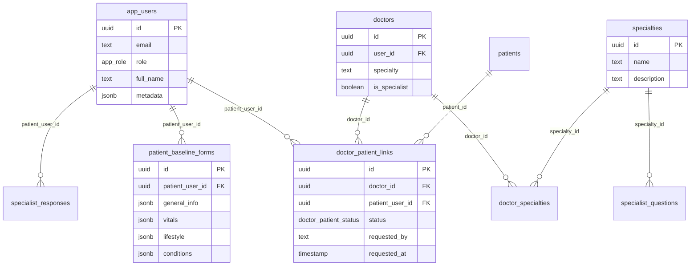
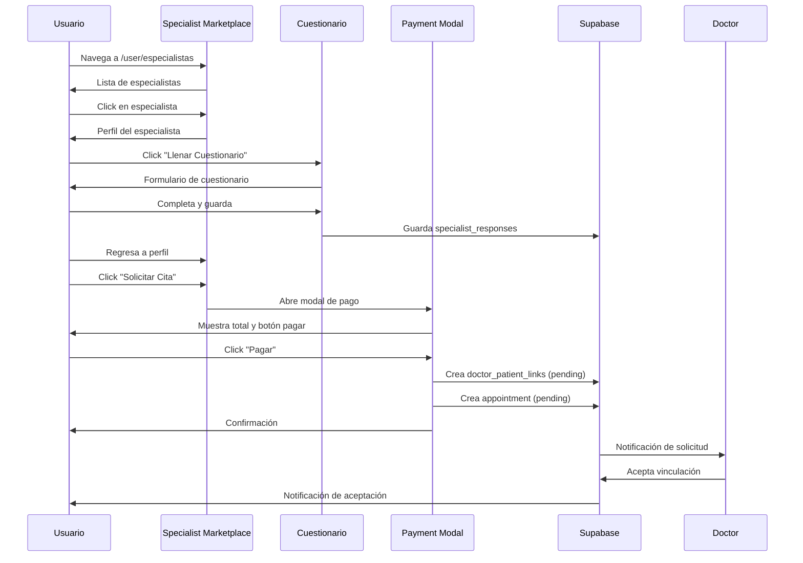

# feat: EzyAI UI Improvements & Patient-Doctor Linking Flow

## Overview

Mejoras de UI y flujo de vinculación paciente-doctor para el sistema de gestión médica EzyAI. Incluye corrección de sidebar, mejora del cuestionario base, nuevo flujo de vinculación con pago simulado, y preparación para integración QR futura.

## Problem Statement / Motivation

### Problemas Actuales:
1. **Sidebar Bug**: "Mi Portal" permanece resaltado junto con otros items cuando se navega a rutas hijas
2. **Cuestionario Base Inconsistente**: UI no profesional con duplicación de pills/badges y falta de uniformidad
3. **Vinculación Bloqueante**: El flujo actual requiere vinculación antes del cuestionario, creando fricción
4. **Sin Soporte QR**: No existe forma de escanear QR para acceso directo al cuestionario del especialista

### Por qué importa:
- **UX degradada**: Usuarios confundidos por navegación inconsistente
- **Abandono de formularios**: UI poco profesional reduce confianza en sistema médico
- **Fricción en onboarding**: Vinculación prematura impide exploración libre
- **Pérdida de conversiones**: Sin QR, doctores no pueden compartir acceso fácilmente

---

## Proposed Solution

### Feature 1: Sidebar Selection Fix
Corregir lógica de `matchPrefix` para que `/user` exacto no resalte en rutas hijas.

### Feature 2: Cuestionario Base UI Improvement
Rediseño profesional con estructura uniforme, eliminación de duplicados, y soporte para agregar/quitar items personalizados.

### Feature 3: Linking Flow Refactor
Nuevo flujo: Cuestionario → Solicitar Cita → Pago Simulado → Vinculación Automática.

### Feature 4: QR Code Integration (Fase Futura)
Generación y escaneo de QR para acceso directo al cuestionario del especialista.

---

## Technical Approach

### Database Schema (Existente)



### Architecture Overview

```
app/
├── (dashboard)/           # Doctor routes (sin cambios)
├── user/
│   ├── layout.tsx         # User sidebar (FIX matchPrefix)
│   ├── cuestionario/
│   │   └── page.tsx       # UI improvements
│   └── especialistas/
│       └── page.tsx       # New booking flow
└── api/
    ├── payments/
    │   └── mock/route.ts  # NEW: Mock payment endpoint
    └── appointments/
        └── book/route.ts  # NEW: Combined booking endpoint
```

---

## Implementation Phases

### Phase 1: Sidebar Selection Fix (Quick Win)
**Effort**: 30 minutos | **Risk**: Bajo

#### Tasks:
- [ ] Modificar `matchPrefix` logic en `base-sidebar.tsx`
- [ ] Cambiar "Mi Portal" a `matchPrefix: false` en `user-sidebar.tsx`
- [ ] Agregar lógica de exact match para ruta `/user`
- [ ] Verificar highlighting correcto en todas las rutas hijas

#### Files:
```typescript
// components/layout/base-sidebar.tsx
const isActive = (item: NavItem) => {
  // NEW: Exact match for root routes
  if (item.href === '/user' && pathname === '/user') {
    return true
  }
  if (item.matchPrefix && item.href !== '/user') {
    return pathname.startsWith(item.href)
  }
  return pathname === item.href
}
```

```typescript
// components/user/user-sidebar.tsx
const navigation = [
  { name: "Mi Portal", href: "/user", icon: Home, matchPrefix: false }, // CHANGED
  { name: "Mi Perfil", href: "/user/perfil", icon: User, matchPrefix: true },
  // ...
]
```

---

### Phase 2: Cuestionario Base UI Improvement
**Effort**: 4-6 horas | **Risk**: Medio

#### 2.1 Eliminar Pills Duplicados
- [ ] Identificar y remover badges bajo "Condiciones y antecedentes"
- [ ] Mantener solo las preguntas sí/no/no sabe
- [ ] Aplicar mismo patrón a sección de alergias

#### 2.2 Estructura Uniforme de Preguntas
```typescript
// components/user/baseline-form.tsx

interface QuestionItem {
  id: string
  label: string
  value: 'si' | 'no' | 'no_sabe' | null
  isCustom?: boolean
}

interface QuestionSection {
  title: string
  description?: string
  items: QuestionItem[]
  allowCustom: boolean
}

// Render pattern for all sections
const renderQuestionSection = (section: QuestionSection) => (
  <Card>
    <CardHeader>
      <CardTitle>{section.title}</CardTitle>
      {section.description && <CardDescription>{section.description}</CardDescription>}
    </CardHeader>
    <CardContent className="space-y-4">
      {section.items.map((item) => (
        <div key={item.id} className="flex items-center justify-between">
          <span className="text-sm">{item.label}</span>
          <div className="flex gap-2">
            <Button
              variant={item.value === 'si' ? 'default' : 'outline'}
              size="sm"
              onClick={() => handleAnswer(item.id, 'si')}
            >
              Sí
            </Button>
            <Button
              variant={item.value === 'no' ? 'default' : 'outline'}
              size="sm"
              onClick={() => handleAnswer(item.id, 'no')}
            >
              No
            </Button>
            <Button
              variant={item.value === 'no_sabe' ? 'secondary' : 'outline'}
              size="sm"
              onClick={() => handleAnswer(item.id, 'no_sabe')}
            >
              No sé
            </Button>
            {item.isCustom && (
              <Button
                variant="ghost"
                size="icon"
                onClick={() => handleRemoveCustom(item.id)}
              >
                <X className="h-4 w-4" />
              </Button>
            )}
          </div>
        </div>
      ))}

      {section.allowCustom && (
        <AddCustomItem
          placeholder="Agregar condición..."
          onAdd={(label) => handleAddCustom(section.title, label)}
        />
      )}
    </CardContent>
  </Card>
)
```

#### 2.3 Componente AddCustomItem
```typescript
// components/user/add-custom-item.tsx

interface AddCustomItemProps {
  placeholder: string
  onAdd: (value: string) => void
  maxLength?: number
}

export function AddCustomItem({ placeholder, onAdd, maxLength = 100 }: AddCustomItemProps) {
  const [isAdding, setIsAdding] = useState(false)
  const [value, setValue] = useState('')

  const handleSubmit = () => {
    if (value.trim()) {
      onAdd(value.trim())
      setValue('')
      setIsAdding(false)
    }
  }

  if (!isAdding) {
    return (
      <Button
        variant="outline"
        className="w-full border-dashed"
        onClick={() => setIsAdding(true)}
      >
        <Plus className="mr-2 h-4 w-4" />
        Agregar otro
      </Button>
    )
  }

  return (
    <div className="flex gap-2">
      <Input
        value={value}
        onChange={(e) => setValue(e.target.value.slice(0, maxLength))}
        placeholder={placeholder}
        onKeyDown={(e) => e.key === 'Enter' && handleSubmit()}
        autoFocus
      />
      <Button onClick={handleSubmit} disabled={!value.trim()}>
        <Check className="h-4 w-4" />
      </Button>
      <Button variant="ghost" onClick={() => setIsAdding(false)}>
        <X className="h-4 w-4" />
      </Button>
    </div>
  )
}
```

#### 2.4 Secciones del Cuestionario
```typescript
const CONDITION_QUESTIONS: QuestionItem[] = [
  { id: 'diabetes', label: 'Diabetes', value: null },
  { id: 'hipertension', label: 'Hipertensión', value: null },
  { id: 'cardiopatia', label: 'Enfermedad cardíaca', value: null },
  { id: 'asma', label: 'Asma', value: null },
  { id: 'cancer', label: 'Cáncer', value: null },
  { id: 'enfermedad_renal', label: 'Enfermedad renal', value: null },
  { id: 'enfermedad_hepatica', label: 'Enfermedad hepática', value: null },
  { id: 'artritis', label: 'Artritis', value: null },
  { id: 'depresion', label: 'Depresión o ansiedad', value: null },
  { id: 'tiroides', label: 'Problemas de tiroides', value: null },
]

const ALLERGY_QUESTIONS: QuestionItem[] = [
  { id: 'penicilina', label: 'Penicilina', value: null },
  { id: 'sulfas', label: 'Sulfas', value: null },
  { id: 'aspirina', label: 'Aspirina/AINEs', value: null },
  { id: 'latex', label: 'Látex', value: null },
  { id: 'mariscos', label: 'Mariscos', value: null },
  { id: 'nueces', label: 'Nueces', value: null },
  { id: 'huevo', label: 'Huevo', value: null },
  { id: 'lacteos', label: 'Lácteos', value: null },
]
```

---

### Phase 3: Patient-Doctor Linking Flow Refactor
**Effort**: 6-8 horas | **Risk**: Alto

#### 3.1 Nuevo User Flow



#### 3.2 Mock Payment Component
```typescript
// components/user/mock-payment-modal.tsx

interface MockPaymentModalProps {
  isOpen: boolean
  onClose: () => void
  doctorId: string
  specialtyId: string
  amount: number
  onSuccess: (transactionId: string) => void
}

export function MockPaymentModal({
  isOpen,
  onClose,
  doctorId,
  specialtyId,
  amount,
  onSuccess,
}: MockPaymentModalProps) {
  const [isProcessing, setIsProcessing] = useState(false)
  const [cardNumber, setCardNumber] = useState('')

  const handlePayment = async () => {
    setIsProcessing(true)

    try {
      // Simulate payment processing delay
      await new Promise(resolve => setTimeout(resolve, 1500))

      // Call API to create link + appointment
      const response = await fetch('/api/appointments/book', {
        method: 'POST',
        headers: { 'Content-Type': 'application/json' },
        body: JSON.stringify({
          doctorId,
          specialtyId,
          paymentAmount: amount,
          cardLast4: cardNumber.slice(-4),
        }),
      })

      if (!response.ok) throw new Error('Booking failed')

      const { transactionId } = await response.json()
      onSuccess(transactionId)
    } catch (error) {
      console.error('Payment error:', error)
      // Show error toast
    } finally {
      setIsProcessing(false)
    }
  }

  return (
    <Dialog open={isOpen} onOpenChange={onClose}>
      <DialogContent>
        <DialogHeader>
          <DialogTitle>Confirmar Pago</DialogTitle>
          <DialogDescription>
            Pago por consulta con especialista
          </DialogDescription>
        </DialogHeader>

        <div className="space-y-4">
          <div className="rounded-lg bg-muted p-4">
            <div className="flex justify-between">
              <span>Consulta médica</span>
              <span className="font-bold">${amount.toFixed(2)} MXN</span>
            </div>
          </div>

          <div className="space-y-2">
            <Label htmlFor="card">Número de tarjeta</Label>
            <Input
              id="card"
              placeholder="4242 4242 4242 4242"
              value={cardNumber}
              onChange={(e) => setCardNumber(e.target.value.replace(/\D/g, ''))}
              maxLength={16}
            />
            <p className="text-xs text-muted-foreground">
              Usa 4242424242424242 para pruebas
            </p>
          </div>

          <div className="grid grid-cols-2 gap-2">
            <div className="space-y-2">
              <Label>Expiración</Label>
              <Input placeholder="MM/AA" />
            </div>
            <div className="space-y-2">
              <Label>CVC</Label>
              <Input placeholder="123" />
            </div>
          </div>
        </div>

        <DialogFooter>
          <Button variant="outline" onClick={onClose} disabled={isProcessing}>
            Cancelar
          </Button>
          <Button
            onClick={handlePayment}
            disabled={isProcessing || cardNumber.length < 16}
          >
            {isProcessing ? (
              <>
                <Loader2 className="mr-2 h-4 w-4 animate-spin" />
                Procesando...
              </>
            ) : (
              `Pagar $${amount.toFixed(2)}`
            )}
          </Button>
        </DialogFooter>
      </DialogContent>
    </Dialog>
  )
}
```

#### 3.3 API Route: Book Appointment
```typescript
// app/api/appointments/book/route.ts

import { createClient } from '@/lib/supabase/server'
import { NextResponse } from 'next/server'

export async function POST(request: Request) {
  const supabase = await createClient()

  const { data: { user } } = await supabase.auth.getUser()
  if (!user) {
    return NextResponse.json({ error: 'Unauthorized' }, { status: 401 })
  }

  const { doctorId, specialtyId, paymentAmount, cardLast4 } = await request.json()

  // Generate transaction ID
  const transactionId = `MOCK-${Date.now()}-${Math.random().toString(36).substr(2, 9)}`

  // Start transaction-like operations
  try {
    // 1. Check if link already exists
    const { data: existingLink } = await supabase
      .from('doctor_patient_links')
      .select('id, status')
      .eq('doctor_id', doctorId)
      .eq('patient_user_id', user.id)
      .single()

    let linkId = existingLink?.id

    // 2. Create or update link
    if (!existingLink) {
      const { data: newLink, error: linkError } = await supabase
        .from('doctor_patient_links')
        .insert({
          doctor_id: doctorId,
          patient_user_id: user.id,
          status: 'pending',
          requested_by: 'patient',
          notes: `Payment: ${transactionId}, Amount: $${paymentAmount}, Card: ****${cardLast4}`,
        })
        .select()
        .single()

      if (linkError) throw linkError
      linkId = newLink.id
    } else if (existingLink.status === 'rejected' || existingLink.status === 'revoked') {
      // Reactivate link
      await supabase
        .from('doctor_patient_links')
        .update({
          status: 'pending',
          requested_at: new Date().toISOString(),
          notes: `Payment: ${transactionId}, Amount: $${paymentAmount}`,
        })
        .eq('id', existingLink.id)
    }

    // 3. Create appointment (pending doctor approval)
    const tomorrow = new Date()
    tomorrow.setDate(tomorrow.getDate() + 1)
    tomorrow.setHours(10, 0, 0, 0)

    const { error: appointmentError } = await supabase
      .from('appointments')
      .insert({
        doctor_id: doctorId,
        patient_user_id: user.id,
        appointment_date: tomorrow.toISOString().split('T')[0],
        start_time: '10:00:00',
        end_time: '10:30:00',
        status: 'Programada',
        notes: `Pendiente aprobación. Pago: ${transactionId}`,
      })

    if (appointmentError) throw appointmentError

    return NextResponse.json({
      success: true,
      transactionId,
      linkId,
      message: 'Solicitud enviada. El especialista revisará tu cuestionario.',
    })

  } catch (error) {
    console.error('Booking error:', error)
    return NextResponse.json(
      { error: 'Error al procesar la solicitud' },
      { status: 500 }
    )
  }
}
```

#### 3.4 Actualizar Specialist Marketplace
```typescript
// app/user/especialistas/page.tsx - Cambios clave

// Remover requisito de vinculación antes del cuestionario
const handleViewSpecialist = (doctor: Doctor) => {
  setSelectedDoctor(doctor)
  // Ya NO verificar linkStatus aquí
}

// Nuevo botón de solicitar cita
const handleRequestAppointment = (doctor: Doctor) => {
  // Verificar si cuestionario está completo (opcional warning)
  if (!hasCompletedQuestionnaire) {
    toast({
      title: "Recomendación",
      description: "Completar el cuestionario ayuda al especialista a prepararse mejor.",
      action: (
        <ToastAction onClick={() => router.push('/user/cuestionario')}>
          Llenar ahora
        </ToastAction>
      ),
    })
    return
  }

  setPaymentModalOpen(true)
}
```

---

### Phase 4: QR Code Integration (Fase Futura)
**Effort**: 4-6 horas | **Risk**: Medio | **Defer**: Sí

#### 4.1 Instalación de Dependencias
```bash
pnpm add qrcode.react @yudiel/react-qr-scanner
```

#### 4.2 Generación de QR (Doctor Side)
```typescript
// components/doctor/patient-qr-code.tsx

import { QRCodeSVG } from 'qrcode.react'

interface PatientQRCodeProps {
  doctorId: string
  specialtyId: string
}

export function PatientQRCode({ doctorId, specialtyId }: PatientQRCodeProps) {
  const baseUrl = process.env.NEXT_PUBLIC_APP_URL || 'https://ezyai.app'
  const qrValue = `${baseUrl}/user/cuestionario?doctor=${doctorId}&specialty=${specialtyId}`

  return (
    <Card>
      <CardHeader>
        <CardTitle>Código QR para Pacientes</CardTitle>
        <CardDescription>
          Los pacientes pueden escanear este código para acceder directamente al cuestionario
        </CardDescription>
      </CardHeader>
      <CardContent className="flex justify-center">
        <div className="rounded-lg bg-white p-4">
          <QRCodeSVG
            value={qrValue}
            size={200}
            level="M"
            includeMargin={true}
          />
        </div>
      </CardContent>
      <CardFooter className="flex justify-center">
        <Button variant="outline" onClick={() => downloadQR()}>
          <Download className="mr-2 h-4 w-4" />
          Descargar QR
        </Button>
      </CardFooter>
    </Card>
  )
}
```

#### 4.3 Manejo de Parámetros QR en Cuestionario
```typescript
// app/user/cuestionario/page.tsx

export default function CuestionarioPage() {
  const searchParams = useSearchParams()
  const doctorId = searchParams.get('doctor')
  const specialtyId = searchParams.get('specialty')

  // Si viene de QR, pre-cargar contexto del especialista
  useEffect(() => {
    if (doctorId && specialtyId) {
      loadSpecialistContext(doctorId, specialtyId)
    }
  }, [doctorId, specialtyId])

  // ...
}
```

---

## Acceptance Criteria

### Functional Requirements

#### Sidebar Selection
- [ ] "Mi Portal" solo resalta cuando pathname === `/user`
- [ ] Rutas hijas como `/user/cuestionario` no resaltan "Mi Portal"
- [ ] Navegación con browser back/forward funciona correctamente
- [ ] Links directos a rutas hijas muestran highlighting correcto

#### Cuestionario Base
- [ ] No hay pills/badges duplicados bajo secciones
- [ ] Todas las preguntas usan formato uniforme (sí/no/no sé)
- [ ] Usuario puede agregar items personalizados en condiciones
- [ ] Usuario puede agregar items personalizados en alergias
- [ ] Usuario puede quitar items (propios y personalizados)
- [ ] Items personalizados persisten al recargar
- [ ] Validación: items personalizados max 100 caracteres
- [ ] Diseño profesional y accesible (WCAG 2.1 AA)

#### Linking Flow
- [ ] Usuario puede ver cuestionario sin estar vinculado
- [ ] Usuario puede llenar cuestionario sin estar vinculado
- [ ] Botón "Solicitar Cita" abre modal de pago
- [ ] Modal de pago muestra monto y campos de tarjeta
- [ ] Tarjeta de prueba 4242... funciona
- [ ] Después de pago exitoso, se crea link con status "pending"
- [ ] Se crea appointment con status "Programada"
- [ ] Usuario ve confirmación con mensaje claro
- [ ] Doctor recibe solicitud en panel de links

#### QR Code (Futura)
- [ ] Doctor puede generar QR desde su perfil
- [ ] QR contiene URL válida con doctor_id y specialty_id
- [ ] Escanear QR redirige a cuestionario (si autenticado)
- [ ] Escanear QR redirige a login (si no autenticado) y luego a cuestionario

### Non-Functional Requirements
- [ ] Tiempo de carga del cuestionario < 2s
- [ ] Modal de pago responde en < 3s
- [ ] UI responsive en mobile y desktop
- [ ] Keyboard navigation funcional
- [ ] Screen reader compatible

### Quality Gates
- [ ] TypeScript sin errores (`pnpm typecheck`)
- [ ] Lint sin errores (`pnpm lint`)
- [ ] Tests existentes pasan (`pnpm test`)
- [ ] Build exitoso (`pnpm build`)

---

## Success Metrics

| Métrica | Baseline | Target |
|---------|----------|--------|
| Tasa de completación de cuestionario | ~40% | 70%+ |
| Tiempo promedio de completación | 8 min | 5 min |
| Solicitudes de cita exitosas | N/A | 80%+ (de intentos) |
| Errores de navegación reportados | 3/semana | 0 |

---

## Dependencies & Prerequisites

### Dependencias Técnicas
- [x] Supabase configurado con tablas existentes
- [x] shadcn/ui components instalados
- [ ] Variables de entorno configuradas

### Dependencias de Features
```
Phase 1 (Sidebar) ──┐
                    ├──► Phase 2 (Cuestionario) ──► Phase 3 (Linking)
                    │
Phase 4 (QR) ───────┘ (paralelo o posterior)
```

---

## Risk Analysis & Mitigation

| Riesgo | Probabilidad | Impacto | Mitigación |
|--------|--------------|---------|------------|
| Breaking change en sidebar afecta otras rutas | Media | Alto | Test exhaustivo de todas las rutas antes de merge |
| Pérdida de datos en cuestionario | Baja | Alto | Implementar auto-save draft cada 30s |
| Doble booking de citas | Media | Medio | Constraint en DB para evitar duplicados |
| Pago "exitoso" pero link falla | Baja | Alto | Transacción atómica, rollback si falla |
| QR params manipulados | Media | Medio | Validar doctor_id existe, approval workflow protege |

---

## Future Considerations

1. **Pasarela de Pago Real**: Migrar de mock a Stripe/OXXO Pay
2. **Notificaciones Push**: Alertar doctor de nuevas solicitudes
3. **Calendario de Disponibilidad**: Selección de horarios reales
4. **QR Expiración**: Tokens temporales para mayor seguridad
5. **Multi-idioma**: Soporte para inglés en formularios

---

## References & Research

### Internal References
- `components/layout/base-sidebar.tsx:52-57` - Lógica actual de isActive
- `components/user/user-sidebar.tsx` - Configuración de navegación
- `components/user/baseline-form.tsx` - Formulario actual
- `app/user/cuestionario/page.tsx:496-597` - Render de field types
- `lib/supabase.ts:358-392` - Schema de doctor_patient_links

### External References
- [shadcn/ui Sidebar](https://ui.shadcn.com/docs/components/sidebar)
- [WCAG 2.1 Forms](https://www.w3.org/WAI/WCAG21/Understanding/)
- [qrcode.react](https://github.com/zpao/qrcode.react)
- [Supabase RLS](https://supabase.com/docs/guides/database/postgres/row-level-security)

### Related Work
- Tabla `specialist_responses` ya maneja respuestas por especialidad
- Tabla `lab_orders` se crea después de cuestionario
- `doctor_patient_links` tiene status enum para workflow

---

## MVP Scope

### In Scope
- [x] Phase 1: Sidebar Fix
- [x] Phase 2: Cuestionario UI (structure, add/remove items)
- [x] Phase 3: Mock payment + linking flow

### Out of Scope (Fase Futura)
- [ ] Phase 4: QR Code integration
- [ ] Pasarela de pago real
- [ ] Notificaciones por email/SMS
- [ ] Calendario de disponibilidad del doctor
- [ ] Videollamadas integradas

---

## Test Plan

### Unit Tests
```typescript
// tests/unit/sidebar.test.tsx
describe('Sidebar Selection', () => {
  it('highlights only Mi Portal on /user', () => {})
  it('does not highlight Mi Portal on /user/cuestionario', () => {})
  it('highlights Cuestionario on /user/cuestionario', () => {})
})

// tests/unit/baseline-form.test.tsx
describe('Baseline Form', () => {
  it('adds custom condition', () => {})
  it('removes custom condition', () => {})
  it('validates custom item max length', () => {})
  it('persists answers across reload', () => {})
})
```

### Integration Tests
```typescript
// tests/integration/booking-flow.test.ts
describe('Appointment Booking Flow', () => {
  it('creates link and appointment after payment', () => {})
  it('handles payment failure gracefully', () => {})
  it('prevents duplicate links', () => {})
})
```

### E2E Tests
```typescript
// tests/e2e/full-booking-flow.spec.ts
test('complete booking flow', async ({ page }) => {
  // 1. Login as patient
  // 2. Browse specialists
  // 3. Fill questionnaire
  // 4. Request appointment
  // 5. Complete mock payment
  // 6. Verify confirmation
})
```
