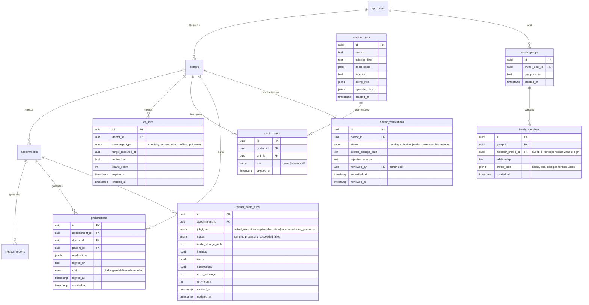

# feat: Implementación de Brechas Críticas - Sistema Médico EzyAI

> **Fecha**: 2025-12-28
> **Prioridad**: Alta (Bloqueante para MVP)
> **Complejidad**: Alta - Sistema multi-módulo
> **Estimación**: 4-6 sprints

---

## Overview

Este plan aborda las brechas críticas identificadas en el sistema médico EzyAI, organizadas por capas de implementación: Datos, Backend/Lógica, y Frontend. Los módulos están priorizados por dependencias y criticidad para el flujo de adquisición de pacientes vía QR.

### Módulos a Implementar

| ID | Módulo | Estado | Prioridad | Bloqueante |
|----|--------|--------|-----------|------------|
| 4.1 | Auth OAuth + Recovery | Parcial | P0 | Sí (QR) |
| 4.35 | QR Links & Deep Linking | Nuevo | P0 | Sí |
| 4.10 | Unidades Médicas | Falta | P1 | No |
| 4.28 | Recetas Médicas | Falta | P0 | Sí |
| 4.9 | Perfil Médico Verificación | Mejora | P1 | No |
| 4.13 | Expediente & Seguridad RLS | Upgrade | P0 | Sí |
| 4.4 | Familias/Cuidadores | Nuevo | P2 | No |
| 4.27 | AI Background Jobs (Extender virtual_intern_runs) | Mejora | P1 | No |
| 4.29 | PDF Export | Nuevo | P1 | No |

### Decisiones de Diseño

> **AI Background Jobs**: Se reutiliza la tabla `virtual_intern_runs` existente en lugar de crear una nueva tabla `ai_processing_jobs`. La tabla existente ya tiene la estructura necesaria (status, findings, alerts, suggestions) y solo requiere extensión con nuevos campos (job_type, audio_storage_path, retry_count, etc.). Esto reduce complejidad y mantiene consistencia con el sistema actual.

---

## ERD - Nuevas Tablas y Extensiones



---

## Fase 1: Infraestructura de Datos (Sprint 1)

### 1.1 Migración: Crear Tablas Base

**Archivo**: `db/migrations/001_create_qr_links.sql`

```sql
-- QR Links for patient acquisition
CREATE TABLE public.qr_links (
    id UUID PRIMARY KEY DEFAULT gen_random_uuid(),
    doctor_id UUID NOT NULL REFERENCES public.doctors(id) ON DELETE CASCADE,
    campaign_type TEXT NOT NULL CHECK (campaign_type IN ('specialty_survey', 'quick_profile', 'appointment')),
    target_resource_id UUID, -- Can reference surveys, forms, etc.
    redirect_url TEXT NOT NULL,
    scans_count INTEGER DEFAULT 0,
    expires_at TIMESTAMPTZ,
    metadata JSONB DEFAULT '{}',
    created_at TIMESTAMPTZ DEFAULT NOW()
);

-- Index for fast lookups
CREATE INDEX idx_qr_links_doctor_id ON public.qr_links(doctor_id);
CREATE INDEX idx_qr_links_created_at ON public.qr_links(created_at DESC);

-- RLS
ALTER TABLE public.qr_links ENABLE ROW LEVEL SECURITY;

CREATE POLICY "Doctors can manage their own QR links"
ON public.qr_links FOR ALL
TO authenticated
USING (
    doctor_id IN (
        SELECT id FROM doctors WHERE user_id = auth.uid()
    )
);

CREATE POLICY "Public can read active QR links for scanning"
ON public.qr_links FOR SELECT
TO anon
USING (
    expires_at IS NULL OR expires_at > NOW()
);
```

**Archivo**: `db/migrations/002_create_medical_units.sql`

```sql
-- Medical Units (Consultorios)
CREATE TABLE public.medical_units (
    id UUID PRIMARY KEY DEFAULT gen_random_uuid(),
    name TEXT NOT NULL,
    address_line TEXT,
    coordinates POINT, -- (lat, long)
    logo_url TEXT,
    billing_info JSONB DEFAULT '{}', -- RFC, razón social, etc.
    operating_hours JSONB DEFAULT '{}', -- {"monday": {"open": "09:00", "close": "18:00"}}
    phone TEXT,
    email TEXT,
    created_at TIMESTAMPTZ DEFAULT NOW(),
    updated_at TIMESTAMPTZ DEFAULT NOW()
);

-- Doctor-Unit relationship
CREATE TABLE public.doctor_units (
    id UUID PRIMARY KEY DEFAULT gen_random_uuid(),
    doctor_id UUID NOT NULL REFERENCES public.doctors(id) ON DELETE CASCADE,
    unit_id UUID NOT NULL REFERENCES public.medical_units(id) ON DELETE CASCADE,
    role TEXT NOT NULL CHECK (role IN ('owner', 'admin', 'staff')),
    is_primary BOOLEAN DEFAULT false,
    created_at TIMESTAMPTZ DEFAULT NOW(),
    UNIQUE(doctor_id, unit_id)
);

-- Indexes
CREATE INDEX idx_doctor_units_doctor ON public.doctor_units(doctor_id);
CREATE INDEX idx_doctor_units_unit ON public.doctor_units(unit_id);

-- RLS
ALTER TABLE public.medical_units ENABLE ROW LEVEL SECURITY;
ALTER TABLE public.doctor_units ENABLE ROW LEVEL SECURITY;

-- Doctors can see units they belong to
CREATE POLICY "Doctors can view their units"
ON public.medical_units FOR SELECT
TO authenticated
USING (
    id IN (
        SELECT unit_id FROM doctor_units du
        JOIN doctors d ON du.doctor_id = d.id
        WHERE d.user_id = auth.uid()
    )
);

-- Owners can manage their units
CREATE POLICY "Owners can manage their units"
ON public.medical_units FOR ALL
TO authenticated
USING (
    id IN (
        SELECT unit_id FROM doctor_units du
        JOIN doctors d ON du.doctor_id = d.id
        WHERE d.user_id = auth.uid() AND du.role = 'owner'
    )
);
```

**Archivo**: `db/migrations/003_create_prescriptions.sql`

```sql
-- Prescriptions (Recetas Médicas)
CREATE TABLE public.prescriptions (
    id UUID PRIMARY KEY DEFAULT gen_random_uuid(),
    appointment_id UUID REFERENCES public.appointments(id) ON DELETE SET NULL,
    doctor_id UUID NOT NULL REFERENCES public.doctors(id) ON DELETE CASCADE,
    patient_id UUID NOT NULL REFERENCES public.patients(id) ON DELETE CASCADE,
    medications JSONB NOT NULL DEFAULT '[]',
    -- [{
    --   "brand_name": "Tempra",
    --   "generic_name": "Paracetamol",
    --   "dosage": "500mg",
    --   "frequency": "Cada 8 horas",
    --   "duration": "3 días",
    --   "instructions": "Tomar con alimentos",
    --   "quantity": "30 tabletas"
    -- }]
    diagnosis TEXT,
    notes TEXT,
    status TEXT NOT NULL DEFAULT 'draft' CHECK (status IN ('draft', 'signed', 'delivered', 'cancelled')),
    signed_url TEXT, -- URL to signed PDF in storage
    signed_at TIMESTAMPTZ,
    delivered_at TIMESTAMPTZ,
    valid_until DATE, -- Prescription expiration
    created_at TIMESTAMPTZ DEFAULT NOW(),
    updated_at TIMESTAMPTZ DEFAULT NOW()
);

-- Indexes
CREATE INDEX idx_prescriptions_doctor ON public.prescriptions(doctor_id);
CREATE INDEX idx_prescriptions_patient ON public.prescriptions(patient_id);
CREATE INDEX idx_prescriptions_appointment ON public.prescriptions(appointment_id);
CREATE INDEX idx_prescriptions_status ON public.prescriptions(status);

-- RLS
ALTER TABLE public.prescriptions ENABLE ROW LEVEL SECURITY;

-- Doctors can manage prescriptions they created
CREATE POLICY "Doctors can manage their prescriptions"
ON public.prescriptions FOR ALL
TO authenticated
USING (
    doctor_id IN (
        SELECT id FROM doctors WHERE user_id = auth.uid()
    )
);

-- Patients can view their prescriptions
CREATE POLICY "Patients can view their prescriptions"
ON public.prescriptions FOR SELECT
TO authenticated
USING (
    patient_id IN (
        SELECT id FROM patients WHERE user_id = auth.uid()
    )
);
```

**Archivo**: `db/migrations/004_create_family_groups.sql`

```sql
-- Family Groups (Cuidadores)
CREATE TABLE public.family_groups (
    id UUID PRIMARY KEY DEFAULT gen_random_uuid(),
    owner_user_id UUID NOT NULL REFERENCES auth.users(id) ON DELETE CASCADE,
    group_name TEXT DEFAULT 'Mi Familia',
    created_at TIMESTAMPTZ DEFAULT NOW()
);

CREATE TABLE public.family_members (
    id UUID PRIMARY KEY DEFAULT gen_random_uuid(),
    group_id UUID NOT NULL REFERENCES public.family_groups(id) ON DELETE CASCADE,
    user_id UUID REFERENCES auth.users(id) ON DELETE SET NULL, -- NULL for dependents without accounts
    relationship TEXT NOT NULL CHECK (relationship IN ('self', 'spouse', 'child', 'parent', 'sibling', 'grandparent', 'other')),
    -- Profile data for members without user accounts
    profile_data JSONB DEFAULT '{}',
    -- {
    --   "full_name": "...",
    --   "date_of_birth": "...",
    --   "gender": "...",
    --   "allergies": [...],
    --   "blood_type": "..."
    -- }
    is_primary BOOLEAN DEFAULT false, -- Is this the main account holder
    created_at TIMESTAMPTZ DEFAULT NOW()
);

-- Indexes
CREATE INDEX idx_family_members_group ON public.family_members(group_id);
CREATE INDEX idx_family_members_user ON public.family_members(user_id);

-- RLS
ALTER TABLE public.family_groups ENABLE ROW LEVEL SECURITY;
ALTER TABLE public.family_members ENABLE ROW LEVEL SECURITY;

CREATE POLICY "Users can manage their family groups"
ON public.family_groups FOR ALL
TO authenticated
USING (owner_user_id = auth.uid());

CREATE POLICY "Users can manage their family members"
ON public.family_members FOR ALL
TO authenticated
USING (
    group_id IN (
        SELECT id FROM family_groups WHERE owner_user_id = auth.uid()
    )
);
```

**Archivo**: `db/migrations/005_create_doctor_verification.sql`

```sql
-- Doctor Verification System
CREATE TABLE public.doctor_verifications (
    id UUID PRIMARY KEY DEFAULT gen_random_uuid(),
    doctor_id UUID NOT NULL UNIQUE REFERENCES public.doctors(id) ON DELETE CASCADE,
    status TEXT NOT NULL DEFAULT 'pending' CHECK (status IN ('pending', 'submitted', 'under_review', 'verified', 'rejected')),
    cedula_professional TEXT, -- License number
    cedula_storage_path TEXT, -- Private bucket path
    specialty_certificate_path TEXT,
    additional_documents JSONB DEFAULT '[]', -- [{path, type, uploaded_at}]
    rejection_reason TEXT,
    rejection_details JSONB,
    reviewed_by UUID REFERENCES auth.users(id),
    submitted_at TIMESTAMPTZ,
    reviewed_at TIMESTAMPTZ,
    verified_at TIMESTAMPTZ,
    created_at TIMESTAMPTZ DEFAULT NOW(),
    updated_at TIMESTAMPTZ DEFAULT NOW()
);

-- Index
CREATE INDEX idx_doctor_verifications_status ON public.doctor_verifications(status);

-- RLS
ALTER TABLE public.doctor_verifications ENABLE ROW LEVEL SECURITY;

-- Doctors can view and update their own verification
CREATE POLICY "Doctors can manage their verification"
ON public.doctor_verifications FOR ALL
TO authenticated
USING (
    doctor_id IN (
        SELECT id FROM doctors WHERE user_id = auth.uid()
    )
);

-- Admins can view all verifications (requires admin check in app logic)
CREATE POLICY "Admins can view all verifications"
ON public.doctor_verifications FOR SELECT
TO authenticated
USING (
    EXISTS (
        SELECT 1 FROM app_users
        WHERE id = auth.uid() AND role = 'admin'
    )
);
```

**Archivo**: `db/migrations/006_extend_virtual_intern_runs.sql`

```sql
-- Extend virtual_intern_runs for all AI background jobs
-- Reuses existing table that already has: id, appointment_id, status, findings, alerts, suggestions

-- Add new columns for extended job types
ALTER TABLE public.virtual_intern_runs
ADD COLUMN IF NOT EXISTS job_type TEXT DEFAULT 'virtual_intern'
    CHECK (job_type IN ('virtual_intern', 'transcription', 'diarization', 'enrichment', 'soap_generation')),
ADD COLUMN IF NOT EXISTS audio_storage_path TEXT,
ADD COLUMN IF NOT EXISTS input_data JSONB DEFAULT '{}',
ADD COLUMN IF NOT EXISTS error_message TEXT,
ADD COLUMN IF NOT EXISTS retry_count INTEGER DEFAULT 0,
ADD COLUMN IF NOT EXISTS max_retries INTEGER DEFAULT 3,
ADD COLUMN IF NOT EXISTS priority INTEGER DEFAULT 0,
ADD COLUMN IF NOT EXISTS started_at TIMESTAMPTZ,
ADD COLUMN IF NOT EXISTS completed_at TIMESTAMPTZ;

-- Update status enum to include all needed values (if needed - already has pending, processing, succeeded, failed)
-- Existing enum: pending, processing, succeeded, failed
-- Map: queued -> pending, completed -> succeeded

-- Indexes for job queue processing
CREATE INDEX IF NOT EXISTS idx_vir_runs_job_type ON public.virtual_intern_runs(job_type);
CREATE INDEX IF NOT EXISTS idx_vir_runs_queue ON public.virtual_intern_runs(status, priority DESC, created_at ASC)
    WHERE status = 'pending';

-- RLS already enabled on virtual_intern_runs
-- Add policy for doctors to view their jobs
CREATE POLICY IF NOT EXISTS "Doctors can view their appointment AI jobs"
ON public.virtual_intern_runs FOR SELECT
TO authenticated
USING (
    appointment_id IN (
        SELECT a.id FROM appointments a
        JOIN doctors d ON a.doctor_id = d.id
        WHERE d.user_id = auth.uid()
    )
);
```

### 1.2 TypeScript Types Update

**Archivo**: `lib/supabase.ts` (agregar)

```typescript
// Add to existing Database type

// QR Links
export interface QRLink {
  id: string
  doctor_id: string
  campaign_type: 'specialty_survey' | 'quick_profile' | 'appointment'
  target_resource_id: string | null
  redirect_url: string
  scans_count: number
  expires_at: string | null
  metadata: Record<string, unknown>
  created_at: string
}

// Medical Units
export interface MedicalUnit {
  id: string
  name: string
  address_line: string | null
  coordinates: { lat: number; lng: number } | null
  logo_url: string | null
  billing_info: {
    rfc?: string
    razon_social?: string
    direccion_fiscal?: string
    regimen_fiscal?: string
  }
  operating_hours: Record<string, { open: string; close: string }>
  phone: string | null
  email: string | null
  created_at: string
  updated_at: string
}

export interface DoctorUnit {
  id: string
  doctor_id: string
  unit_id: string
  role: 'owner' | 'admin' | 'staff'
  is_primary: boolean
  created_at: string
}

// Prescriptions
export interface Medication {
  brand_name: string
  generic_name: string
  dosage: string
  frequency: string
  duration: string
  instructions?: string
  quantity?: string
}

export interface Prescription {
  id: string
  appointment_id: string | null
  doctor_id: string
  patient_id: string
  medications: Medication[]
  diagnosis: string | null
  notes: string | null
  status: 'draft' | 'signed' | 'delivered' | 'cancelled'
  signed_url: string | null
  signed_at: string | null
  delivered_at: string | null
  valid_until: string | null
  created_at: string
  updated_at: string
}

// Family Groups
export interface FamilyGroup {
  id: string
  owner_user_id: string
  group_name: string
  created_at: string
}

export interface FamilyMember {
  id: string
  group_id: string
  user_id: string | null
  relationship: 'self' | 'spouse' | 'child' | 'parent' | 'sibling' | 'grandparent' | 'other'
  profile_data: {
    full_name?: string
    date_of_birth?: string
    gender?: string
    allergies?: string[]
    blood_type?: string
    medical_notes?: string
  }
  is_primary: boolean
  created_at: string
}

// Doctor Verification
export interface DoctorVerification {
  id: string
  doctor_id: string
  status: 'pending' | 'submitted' | 'under_review' | 'verified' | 'rejected'
  cedula_professional: string | null
  cedula_storage_path: string | null
  specialty_certificate_path: string | null
  additional_documents: Array<{
    path: string
    type: string
    uploaded_at: string
  }>
  rejection_reason: string | null
  rejection_details: Record<string, unknown> | null
  reviewed_by: string | null
  submitted_at: string | null
  reviewed_at: string | null
  verified_at: string | null
  created_at: string
  updated_at: string
}

// Virtual Intern Runs (Extended for all AI jobs)
// Extends existing table - reuse instead of creating ai_processing_jobs
export interface VirtualInternRun {
  id: string
  appointment_id: string | null
  job_type: 'virtual_intern' | 'transcription' | 'diarization' | 'enrichment' | 'soap_generation'
  status: 'pending' | 'processing' | 'succeeded' | 'failed'
  // Existing fields
  findings: Record<string, unknown> | null
  alerts: Array<{ type: string; message: string }> | null
  suggestions: Array<{ category: string; text: string }> | null
  // Extended fields for all job types
  audio_storage_path: string | null
  input_data: Record<string, unknown>
  error_message: string | null
  retry_count: number
  max_retries: number
  priority: number
  started_at: string | null
  completed_at: string | null
  created_at: string
  updated_at: string
}

// Alias for backwards compatibility and semantic clarity
export type AIProcessingJob = VirtualInternRun
```

---

## Fase 2: Auth Bridge & QR System (Sprint 2)

### 2.1 OAuth Setup en Supabase

**Configuración Manual en Dashboard**:
1. Authentication → Providers → Enable Google
2. Authentication → Providers → Enable Apple
3. Configurar redirect URLs: `https://tudominio.com/auth/callback`

**Archivo**: `lib/supabase-auth.ts` (nuevo)

```typescript
import { supabase } from './supabase'

export async function signInWithGoogle() {
  const { data, error } = await supabase.auth.signInWithOAuth({
    provider: 'google',
    options: {
      redirectTo: `${window.location.origin}/auth/callback`,
      queryParams: {
        access_type: 'offline',
        prompt: 'consent',
      },
    },
  })
  return { data, error }
}

export async function signInWithApple() {
  const { data, error } = await supabase.auth.signInWithOAuth({
    provider: 'apple',
    options: {
      redirectTo: `${window.location.origin}/auth/callback`,
    },
  })
  return { data, error }
}

export async function resetPassword(email: string) {
  const { data, error } = await supabase.auth.resetPasswordForEmail(email, {
    redirectTo: `${window.location.origin}/auth/reset-password`,
  })
  return { data, error }
}

export async function updatePassword(newPassword: string) {
  const { data, error } = await supabase.auth.updateUser({
    password: newPassword,
  })
  return { data, error }
}

// Handle account linking detection
export async function checkExistingAccount(email: string) {
  // Check if email exists in app_users
  const { data } = await supabase
    .from('app_users')
    .select('id, email')
    .eq('email', email)
    .single()

  return data !== null
}
```

### 2.2 Auth Callback Route

**Archivo**: `app/auth/callback/route.ts`

```typescript
import { createClient } from '@/lib/supabase/server'
import { NextResponse } from 'next/server'
import type { NextRequest } from 'next/server'

export async function GET(request: NextRequest) {
  const requestUrl = new URL(request.url)
  const code = requestUrl.searchParams.get('code')
  const redirectTo = requestUrl.searchParams.get('redirect_to')
  const context = requestUrl.searchParams.get('context') // doctor_id for QR flows

  if (code) {
    const supabase = createClient()
    const { data: { session }, error } = await supabase.auth.exchangeCodeForSession(code)

    if (error) {
      console.error('Auth callback error:', error)
      return NextResponse.redirect(new URL('/login?error=auth_failed', request.url))
    }

    // Get user role for redirect decision
    const { data: appUser } = await supabase
      .from('app_users')
      .select('role')
      .eq('id', session?.user.id)
      .single()

    // Determine redirect destination
    let destination = '/dashboard' // default for doctors

    if (redirectTo) {
      // QR flow: redirect to target with context
      const targetUrl = new URL(redirectTo, request.url)
      if (context) {
        targetUrl.searchParams.set('doctor_id', context)
      }
      destination = targetUrl.pathname + targetUrl.search
    } else if (appUser?.role === 'user') {
      destination = '/user'
    }

    return NextResponse.redirect(new URL(destination, request.url))
  }

  return NextResponse.redirect(new URL('/login', request.url))
}
```

### 2.3 QR Deep Link System

**Archivo**: `middleware.ts` (actualizar)

```typescript
import { NextResponse } from 'next/server'
import type { NextRequest } from 'next/server'
import { createMiddlewareClient } from '@supabase/auth-helpers-nextjs'

export async function middleware(request: NextRequest) {
  const { pathname } = request.nextUrl
  const res = NextResponse.next()

  // Handle QR deep links
  if (pathname.startsWith('/link/qr/')) {
    const qrId = pathname.split('/link/qr/')[1]

    // Create supabase client for middleware
    const supabase = createMiddlewareClient({ req: request, res })

    // Get QR link data
    const { data: qrLink, error } = await supabase
      .from('qr_links')
      .select('redirect_url, doctor_id, campaign_type, expires_at')
      .eq('id', qrId)
      .single()

    if (error || !qrLink) {
      return NextResponse.redirect(new URL('/404', request.url))
    }

    // Check expiration
    if (qrLink.expires_at && new Date(qrLink.expires_at) < new Date()) {
      return NextResponse.redirect(new URL('/link/expired', request.url))
    }

    // Increment scan count (fire and forget)
    supabase.rpc('increment_qr_scan', { qr_id: qrId })

    // Check if user is authenticated
    const { data: { session } } = await supabase.auth.getSession()

    if (session) {
      // Authenticated: redirect directly with doctor context
      const targetUrl = new URL(qrLink.redirect_url, request.url)
      targetUrl.searchParams.set('doctor_id', qrLink.doctor_id)
      targetUrl.searchParams.set('source', 'qr')
      return NextResponse.redirect(targetUrl)
    } else {
      // Anonymous: redirect to register with return URL
      const registerUrl = new URL('/register', request.url)
      registerUrl.searchParams.set('redirect_to', qrLink.redirect_url)
      registerUrl.searchParams.set('context', qrLink.doctor_id)
      registerUrl.searchParams.set('campaign', qrLink.campaign_type)
      return NextResponse.redirect(registerUrl)
    }
  }

  return res
}

export const config = {
  matcher: [
    '/link/qr/:id*',
    '/((?!api|_next/static|_next/image|favicon.ico).*)',
  ],
}
```

**Archivo**: `app/api/qr/route.ts` (CRUD para QR Links)

```typescript
import { NextRequest, NextResponse } from 'next/server'
import { createClient } from '@/lib/supabase/server'
import { z } from 'zod'

const CreateQRSchema = z.object({
  campaign_type: z.enum(['specialty_survey', 'quick_profile', 'appointment']),
  target_resource_id: z.string().uuid().optional(),
  expires_in_days: z.number().min(1).max(365).optional(),
  metadata: z.record(z.unknown()).optional(),
})

export async function POST(request: NextRequest) {
  try {
    const supabase = createClient()
    const { data: { user } } = await supabase.auth.getUser()

    if (!user) {
      return NextResponse.json({ error: 'Unauthorized' }, { status: 401 })
    }

    // Get doctor profile
    const { data: doctor } = await supabase
      .from('doctors')
      .select('id')
      .eq('user_id', user.id)
      .single()

    if (!doctor) {
      return NextResponse.json({ error: 'Doctor profile not found' }, { status: 404 })
    }

    const body = await request.json()
    const validation = CreateQRSchema.safeParse(body)

    if (!validation.success) {
      return NextResponse.json(
        { error: 'Invalid request', details: validation.error.flatten() },
        { status: 400 }
      )
    }

    const { campaign_type, target_resource_id, expires_in_days, metadata } = validation.data

    // Generate QR link
    const qrId = crypto.randomUUID()
    const redirectUrl = `${process.env.NEXT_PUBLIC_APP_URL}/link/qr/${qrId}`

    const expiresAt = expires_in_days
      ? new Date(Date.now() + expires_in_days * 24 * 60 * 60 * 1000).toISOString()
      : null

    const { data: qrLink, error } = await supabase
      .from('qr_links')
      .insert({
        id: qrId,
        doctor_id: doctor.id,
        campaign_type,
        target_resource_id,
        redirect_url: redirectUrl,
        expires_at: expiresAt,
        metadata: metadata || {},
      })
      .select()
      .single()

    if (error) {
      return NextResponse.json({ error: error.message }, { status: 500 })
    }

    return NextResponse.json({
      ...qrLink,
      qr_url: redirectUrl,
    })
  } catch (error) {
    console.error('QR creation error:', error)
    return NextResponse.json({ error: 'Internal server error' }, { status: 500 })
  }
}

export async function GET(request: NextRequest) {
  const supabase = createClient()
  const { data: { user } } = await supabase.auth.getUser()

  if (!user) {
    return NextResponse.json({ error: 'Unauthorized' }, { status: 401 })
  }

  const { data: doctor } = await supabase
    .from('doctors')
    .select('id')
    .eq('user_id', user.id)
    .single()

  if (!doctor) {
    return NextResponse.json({ error: 'Doctor profile not found' }, { status: 404 })
  }

  const { data: qrLinks, error } = await supabase
    .from('qr_links')
    .select('*')
    .eq('doctor_id', doctor.id)
    .order('created_at', { ascending: false })

  if (error) {
    return NextResponse.json({ error: error.message }, { status: 500 })
  }

  return NextResponse.json(qrLinks)
}
```

---

## Fase 3: Recetas Médicas (Sprint 2-3)

### 3.1 Zod Schema para Medicamentos

**Archivo**: `lib/schemas/prescription.ts`

```typescript
import { z } from 'zod'

export const MedicationSchema = z.object({
  brand_name: z.string().min(1, 'Nombre comercial requerido'),
  generic_name: z.string().min(1, 'Nombre genérico requerido'),
  dosage: z.string().min(1, 'Dosis requerida'),
  frequency: z.string().min(1, 'Frecuencia requerida'),
  duration: z.string().min(1, 'Duración requerida'),
  instructions: z.string().optional(),
  quantity: z.string().optional(),
})

export const CreatePrescriptionSchema = z.object({
  appointment_id: z.string().uuid().optional(),
  patient_id: z.string().uuid(),
  medications: z.array(MedicationSchema).min(1, 'Agregar al menos un medicamento'),
  diagnosis: z.string().optional(),
  notes: z.string().optional(),
  valid_days: z.number().min(1).max(365).default(30),
})

export type MedicationType = z.infer<typeof MedicationSchema>
export type CreatePrescriptionType = z.infer<typeof CreatePrescriptionSchema>
```

### 3.2 API Route para Recetas

**Archivo**: `app/api/prescriptions/route.ts`

```typescript
import { NextRequest, NextResponse } from 'next/server'
import { createClient } from '@/lib/supabase/server'
import { CreatePrescriptionSchema } from '@/lib/schemas/prescription'

export async function POST(request: NextRequest) {
  try {
    const supabase = createClient()
    const { data: { user } } = await supabase.auth.getUser()

    if (!user) {
      return NextResponse.json({ error: 'Unauthorized' }, { status: 401 })
    }

    const { data: doctor } = await supabase
      .from('doctors')
      .select('id')
      .eq('user_id', user.id)
      .single()

    if (!doctor) {
      return NextResponse.json({ error: 'Doctor not found' }, { status: 404 })
    }

    const body = await request.json()
    const validation = CreatePrescriptionSchema.safeParse(body)

    if (!validation.success) {
      return NextResponse.json(
        { error: 'Validation failed', details: validation.error.flatten() },
        { status: 400 }
      )
    }

    const { patient_id, appointment_id, medications, diagnosis, notes, valid_days } = validation.data

    // Calculate valid_until date
    const validUntil = new Date()
    validUntil.setDate(validUntil.getDate() + valid_days)

    const { data: prescription, error } = await supabase
      .from('prescriptions')
      .insert({
        doctor_id: doctor.id,
        patient_id,
        appointment_id,
        medications,
        diagnosis,
        notes,
        status: 'draft',
        valid_until: validUntil.toISOString().split('T')[0],
      })
      .select(`
        *,
        patient:patients(first_name, last_name),
        doctor:doctors(first_name, last_name, specialty)
      `)
      .single()

    if (error) {
      return NextResponse.json({ error: error.message }, { status: 500 })
    }

    return NextResponse.json(prescription)
  } catch (error) {
    console.error('Prescription creation error:', error)
    return NextResponse.json({ error: 'Internal server error' }, { status: 500 })
  }
}

export async function GET(request: NextRequest) {
  const supabase = createClient()
  const { data: { user } } = await supabase.auth.getUser()

  if (!user) {
    return NextResponse.json({ error: 'Unauthorized' }, { status: 401 })
  }

  const { searchParams } = new URL(request.url)
  const patientId = searchParams.get('patient_id')
  const status = searchParams.get('status')

  const { data: doctor } = await supabase
    .from('doctors')
    .select('id')
    .eq('user_id', user.id)
    .single()

  let query = supabase
    .from('prescriptions')
    .select(`
      *,
      patient:patients(first_name, last_name),
      appointment:appointments(date, status)
    `)
    .eq('doctor_id', doctor?.id)
    .order('created_at', { ascending: false })

  if (patientId) {
    query = query.eq('patient_id', patientId)
  }

  if (status) {
    query = query.eq('status', status)
  }

  const { data, error } = await query

  if (error) {
    return NextResponse.json({ error: error.message }, { status: 500 })
  }

  return NextResponse.json(data)
}
```

### 3.3 Sign Prescription API

**Archivo**: `app/api/prescriptions/[id]/sign/route.ts`

```typescript
import { NextRequest, NextResponse } from 'next/server'
import { createClient } from '@/lib/supabase/server'

export async function POST(
  request: NextRequest,
  { params }: { params: Promise<{ id: string }> }
) {
  const { id } = await params
  const supabase = createClient()

  const { data: { user } } = await supabase.auth.getUser()

  if (!user) {
    return NextResponse.json({ error: 'Unauthorized' }, { status: 401 })
  }

  // Verify doctor owns this prescription
  const { data: prescription, error: fetchError } = await supabase
    .from('prescriptions')
    .select(`
      *,
      doctor:doctors!inner(id, user_id, first_name, last_name, specialty),
      patient:patients(first_name, last_name, date_of_birth)
    `)
    .eq('id', id)
    .single()

  if (fetchError || !prescription) {
    return NextResponse.json({ error: 'Prescription not found' }, { status: 404 })
  }

  if (prescription.doctor.user_id !== user.id) {
    return NextResponse.json({ error: 'Forbidden' }, { status: 403 })
  }

  if (prescription.status !== 'draft') {
    return NextResponse.json({ error: 'Prescription already signed' }, { status: 400 })
  }

  // Generate PDF would happen here (see PDF generation section)
  // For now, we'll just update the status
  const { data: updated, error: updateError } = await supabase
    .from('prescriptions')
    .update({
      status: 'signed',
      signed_at: new Date().toISOString(),
      // signed_url would be set after PDF generation
    })
    .eq('id', id)
    .select()
    .single()

  if (updateError) {
    return NextResponse.json({ error: updateError.message }, { status: 500 })
  }

  return NextResponse.json(updated)
}
```

### 3.4 Prescription Form Component

**Archivo**: `components/prescriptions/prescription-form.tsx`

```tsx
'use client'

import { useState } from 'react'
import { useForm, useFieldArray } from 'react-hook-form'
import { zodResolver } from '@hookform/resolvers/zod'
import { Plus, Trash2, Save, Send } from 'lucide-react'

import { Button } from '@/components/ui/button'
import { Input } from '@/components/ui/input'
import { Textarea } from '@/components/ui/textarea'
import {
  Form,
  FormControl,
  FormField,
  FormItem,
  FormLabel,
  FormMessage,
} from '@/components/ui/form'
import {
  Card,
  CardContent,
  CardDescription,
  CardHeader,
  CardTitle,
} from '@/components/ui/card'
import { CreatePrescriptionSchema, type CreatePrescriptionType } from '@/lib/schemas/prescription'

// Common medications for autocomplete
const COMMON_MEDICATIONS = [
  { brand: 'Tempra', generic: 'Paracetamol', commonDosage: '500mg' },
  { brand: 'Advil', generic: 'Ibuprofeno', commonDosage: '400mg' },
  { brand: 'Amoxil', generic: 'Amoxicilina', commonDosage: '500mg' },
  { brand: 'Bactrim', generic: 'Trimetoprim/Sulfametoxazol', commonDosage: '800/160mg' },
  { brand: 'Losec', generic: 'Omeprazol', commonDosage: '20mg' },
  { brand: 'Zitromax', generic: 'Azitromicina', commonDosage: '500mg' },
  { brand: 'Aspirina', generic: 'Acido Acetilsalicilico', commonDosage: '100mg' },
  { brand: 'Metformina', generic: 'Metformina', commonDosage: '850mg' },
]

interface PrescriptionFormProps {
  patientId: string
  appointmentId?: string
  onSuccess?: (prescription: unknown) => void
}

export function PrescriptionForm({ patientId, appointmentId, onSuccess }: PrescriptionFormProps) {
  const [isSubmitting, setIsSubmitting] = useState(false)
  const [suggestions, setSuggestions] = useState<typeof COMMON_MEDICATIONS>([])

  const form = useForm<CreatePrescriptionType>({
    resolver: zodResolver(CreatePrescriptionSchema),
    defaultValues: {
      patient_id: patientId,
      appointment_id: appointmentId,
      medications: [
        {
          brand_name: '',
          generic_name: '',
          dosage: '',
          frequency: '',
          duration: '',
          instructions: '',
          quantity: '',
        },
      ],
      diagnosis: '',
      notes: '',
      valid_days: 30,
    },
  })

  const { fields, append, remove } = useFieldArray({
    control: form.control,
    name: 'medications',
  })

  const handleBrandSearch = (value: string, index: number) => {
    if (value.length >= 2) {
      const filtered = COMMON_MEDICATIONS.filter(
        (med) =>
          med.brand.toLowerCase().includes(value.toLowerCase()) ||
          med.generic.toLowerCase().includes(value.toLowerCase())
      )
      setSuggestions(filtered)
    } else {
      setSuggestions([])
    }
  }

  const selectMedication = (med: typeof COMMON_MEDICATIONS[0], index: number) => {
    form.setValue(`medications.${index}.brand_name`, med.brand)
    form.setValue(`medications.${index}.generic_name`, med.generic)
    form.setValue(`medications.${index}.dosage`, med.commonDosage)
    setSuggestions([])
  }

  const onSubmit = async (data: CreatePrescriptionType, sign = false) => {
    setIsSubmitting(true)
    try {
      const response = await fetch('/api/prescriptions', {
        method: 'POST',
        headers: { 'Content-Type': 'application/json' },
        body: JSON.stringify(data),
      })

      if (!response.ok) {
        throw new Error('Error al crear receta')
      }

      const prescription = await response.json()

      if (sign) {
        // Sign the prescription
        const signResponse = await fetch(`/api/prescriptions/${prescription.id}/sign`, {
          method: 'POST',
        })

        if (!signResponse.ok) {
          throw new Error('Error al firmar receta')
        }

        const signedPrescription = await signResponse.json()
        onSuccess?.(signedPrescription)
      } else {
        onSuccess?.(prescription)
      }
    } catch (error) {
      console.error('Prescription error:', error)
    } finally {
      setIsSubmitting(false)
    }
  }

  return (
    <Form {...form}>
      <form className="space-y-6">
        {/* Diagnosis */}
        <FormField
          control={form.control}
          name="diagnosis"
          render={({ field }) => (
            <FormItem>
              <FormLabel>Diagnostico</FormLabel>
              <FormControl>
                <Textarea
                  placeholder="Ingrese el diagnostico..."
                  className="resize-none"
                  {...field}
                />
              </FormControl>
              <FormMessage />
            </FormItem>
          )}
        />

        {/* Medications */}
        <div className="space-y-4">
          <div className="flex items-center justify-between">
            <h3 className="text-lg font-medium">Medicamentos</h3>
            <Button
              type="button"
              variant="outline"
              size="sm"
              onClick={() =>
                append({
                  brand_name: '',
                  generic_name: '',
                  dosage: '',
                  frequency: '',
                  duration: '',
                  instructions: '',
                  quantity: '',
                })
              }
            >
              <Plus className="mr-2 h-4 w-4" />
              Agregar Medicamento
            </Button>
          </div>

          {fields.map((field, index) => (
            <Card key={field.id}>
              <CardHeader className="pb-3">
                <div className="flex items-center justify-between">
                  <CardTitle className="text-base">Medicamento {index + 1}</CardTitle>
                  {fields.length > 1 && (
                    <Button
                      type="button"
                      variant="ghost"
                      size="sm"
                      onClick={() => remove(index)}
                    >
                      <Trash2 className="h-4 w-4 text-destructive" />
                    </Button>
                  )}
                </div>
              </CardHeader>
              <CardContent className="space-y-4">
                <div className="grid grid-cols-2 gap-4">
                  <FormField
                    control={form.control}
                    name={`medications.${index}.brand_name`}
                    render={({ field }) => (
                      <FormItem className="relative">
                        <FormLabel>Nombre Comercial</FormLabel>
                        <FormControl>
                          <Input
                            {...field}
                            onChange={(e) => {
                              field.onChange(e)
                              handleBrandSearch(e.target.value, index)
                            }}
                            placeholder="Ej: Tempra"
                          />
                        </FormControl>
                        {suggestions.length > 0 && (
                          <div className="absolute z-10 mt-1 w-full bg-white border rounded-md shadow-lg">
                            {suggestions.map((med, i) => (
                              <button
                                key={i}
                                type="button"
                                className="w-full px-3 py-2 text-left hover:bg-gray-100"
                                onClick={() => selectMedication(med, index)}
                              >
                                <span className="font-medium">{med.brand}</span>
                                <span className="text-gray-500 ml-2">({med.generic})</span>
                              </button>
                            ))}
                          </div>
                        )}
                        <FormMessage />
                      </FormItem>
                    )}
                  />

                  <FormField
                    control={form.control}
                    name={`medications.${index}.generic_name`}
                    render={({ field }) => (
                      <FormItem>
                        <FormLabel>Nombre Generico</FormLabel>
                        <FormControl>
                          <Input {...field} placeholder="Ej: Paracetamol" />
                        </FormControl>
                        <FormMessage />
                      </FormItem>
                    )}
                  />
                </div>

                <div className="grid grid-cols-3 gap-4">
                  <FormField
                    control={form.control}
                    name={`medications.${index}.dosage`}
                    render={({ field }) => (
                      <FormItem>
                        <FormLabel>Dosis</FormLabel>
                        <FormControl>
                          <Input {...field} placeholder="Ej: 500mg" />
                        </FormControl>
                        <FormMessage />
                      </FormItem>
                    )}
                  />

                  <FormField
                    control={form.control}
                    name={`medications.${index}.frequency`}
                    render={({ field }) => (
                      <FormItem>
                        <FormLabel>Frecuencia</FormLabel>
                        <FormControl>
                          <Input {...field} placeholder="Ej: Cada 8 horas" />
                        </FormControl>
                        <FormMessage />
                      </FormItem>
                    )}
                  />

                  <FormField
                    control={form.control}
                    name={`medications.${index}.duration`}
                    render={({ field }) => (
                      <FormItem>
                        <FormLabel>Duracion</FormLabel>
                        <FormControl>
                          <Input {...field} placeholder="Ej: 5 dias" />
                        </FormControl>
                        <FormMessage />
                      </FormItem>
                    )}
                  />
                </div>

                <FormField
                  control={form.control}
                  name={`medications.${index}.instructions`}
                  render={({ field }) => (
                    <FormItem>
                      <FormLabel>Instrucciones (Opcional)</FormLabel>
                      <FormControl>
                        <Input {...field} placeholder="Ej: Tomar con alimentos" />
                      </FormControl>
                      <FormMessage />
                    </FormItem>
                  )}
                />
              </CardContent>
            </Card>
          ))}
        </div>

        {/* Notes */}
        <FormField
          control={form.control}
          name="notes"
          render={({ field }) => (
            <FormItem>
              <FormLabel>Notas Adicionales (Opcional)</FormLabel>
              <FormControl>
                <Textarea
                  placeholder="Indicaciones adicionales para el paciente..."
                  className="resize-none"
                  {...field}
                />
              </FormControl>
              <FormMessage />
            </FormItem>
          )}
        />

        {/* Actions */}
        <div className="flex gap-4">
          <Button
            type="button"
            variant="outline"
            disabled={isSubmitting}
            onClick={form.handleSubmit((data) => onSubmit(data, false))}
          >
            <Save className="mr-2 h-4 w-4" />
            Guardar Borrador
          </Button>
          <Button
            type="button"
            disabled={isSubmitting}
            onClick={form.handleSubmit((data) => onSubmit(data, true))}
          >
            <Send className="mr-2 h-4 w-4" />
            Firmar y Enviar
          </Button>
        </div>
      </form>
    </Form>
  )
}
```

---

## Fase 4: Unidades Médicas & Verificación (Sprint 3)

### 4.1 Medical Unit Setup Wizard

**Archivo**: `components/medical-units/unit-setup-wizard.tsx`

```tsx
'use client'

import { useState } from 'react'
import { useForm } from 'react-hook-form'
import { zodResolver } from '@hookform/resolvers/zod'
import { z } from 'zod'
import { Building2, MapPin, Clock, Upload } from 'lucide-react'

import { Button } from '@/components/ui/button'
import { Input } from '@/components/ui/input'
import {
  Form,
  FormControl,
  FormField,
  FormItem,
  FormLabel,
  FormMessage,
} from '@/components/ui/form'
import { Card, CardContent, CardDescription, CardHeader, CardTitle } from '@/components/ui/card'

const UnitSchema = z.object({
  name: z.string().min(2, 'Nombre requerido'),
  address_line: z.string().min(5, 'Direccion requerida'),
  phone: z.string().optional(),
  email: z.string().email().optional().or(z.literal('')),
  billing_info: z.object({
    rfc: z.string().optional(),
    razon_social: z.string().optional(),
  }).optional(),
})

type UnitFormValues = z.infer<typeof UnitSchema>

interface UnitSetupWizardProps {
  onComplete: (unit: unknown) => void
}

export function UnitSetupWizard({ onComplete }: UnitSetupWizardProps) {
  const [step, setStep] = useState(1)
  const [logoFile, setLogoFile] = useState<File | null>(null)
  const [isSubmitting, setIsSubmitting] = useState(false)

  const form = useForm<UnitFormValues>({
    resolver: zodResolver(UnitSchema),
    defaultValues: {
      name: '',
      address_line: '',
      phone: '',
      email: '',
      billing_info: {
        rfc: '',
        razon_social: '',
      },
    },
  })

  const onSubmit = async (data: UnitFormValues) => {
    setIsSubmitting(true)
    try {
      // Upload logo if provided
      let logoUrl = null
      if (logoFile) {
        const formData = new FormData()
        formData.append('file', logoFile)
        const uploadRes = await fetch('/api/upload/unit-logo', {
          method: 'POST',
          body: formData,
        })
        if (uploadRes.ok) {
          const { url } = await uploadRes.json()
          logoUrl = url
        }
      }

      // Create medical unit
      const response = await fetch('/api/medical-units', {
        method: 'POST',
        headers: { 'Content-Type': 'application/json' },
        body: JSON.stringify({
          ...data,
          logo_url: logoUrl,
        }),
      })

      if (!response.ok) {
        throw new Error('Error al crear consultorio')
      }

      const unit = await response.json()
      onComplete(unit)
    } catch (error) {
      console.error('Unit creation error:', error)
    } finally {
      setIsSubmitting(false)
    }
  }

  return (
    <div className="max-w-2xl mx-auto">
      <div className="mb-8 text-center">
        <h1 className="text-2xl font-bold">Configura tu Consultorio</h1>
        <p className="text-muted-foreground mt-2">
          Paso {step} de 3
        </p>
      </div>

      <Form {...form}>
        <form onSubmit={form.handleSubmit(onSubmit)} className="space-y-6">
          {step === 1 && (
            <Card>
              <CardHeader>
                <CardTitle className="flex items-center gap-2">
                  <Building2 className="h-5 w-5" />
                  Informacion Basica
                </CardTitle>
                <CardDescription>
                  Datos principales de tu consultorio
                </CardDescription>
              </CardHeader>
              <CardContent className="space-y-4">
                <FormField
                  control={form.control}
                  name="name"
                  render={({ field }) => (
                    <FormItem>
                      <FormLabel>Nombre del Consultorio</FormLabel>
                      <FormControl>
                        <Input {...field} placeholder="Ej: Consultorio Dr. Garcia" />
                      </FormControl>
                      <FormMessage />
                    </FormItem>
                  )}
                />

                <FormField
                  control={form.control}
                  name="phone"
                  render={({ field }) => (
                    <FormItem>
                      <FormLabel>Telefono</FormLabel>
                      <FormControl>
                        <Input {...field} placeholder="Ej: 55 1234 5678" />
                      </FormControl>
                      <FormMessage />
                    </FormItem>
                  )}
                />

                <FormField
                  control={form.control}
                  name="email"
                  render={({ field }) => (
                    <FormItem>
                      <FormLabel>Correo Electronico</FormLabel>
                      <FormControl>
                        <Input {...field} type="email" placeholder="consultorio@ejemplo.com" />
                      </FormControl>
                      <FormMessage />
                    </FormItem>
                  )}
                />

                <div>
                  <FormLabel>Logo (Opcional)</FormLabel>
                  <div className="mt-2 flex items-center gap-4">
                    <Input
                      type="file"
                      accept="image/*"
                      onChange={(e) => setLogoFile(e.target.files?.[0] || null)}
                    />
                  </div>
                </div>
              </CardContent>
            </Card>
          )}

          {step === 2 && (
            <Card>
              <CardHeader>
                <CardTitle className="flex items-center gap-2">
                  <MapPin className="h-5 w-5" />
                  Ubicacion
                </CardTitle>
                <CardDescription>
                  Direccion de tu consultorio
                </CardDescription>
              </CardHeader>
              <CardContent className="space-y-4">
                <FormField
                  control={form.control}
                  name="address_line"
                  render={({ field }) => (
                    <FormItem>
                      <FormLabel>Direccion Completa</FormLabel>
                      <FormControl>
                        <Input {...field} placeholder="Calle, Numero, Colonia, CP, Ciudad" />
                      </FormControl>
                      <FormMessage />
                    </FormItem>
                  )}
                />

                {/* Map component would go here */}
                <div className="h-48 bg-gray-100 rounded-lg flex items-center justify-center">
                  <p className="text-muted-foreground">Mapa (proximamente)</p>
                </div>
              </CardContent>
            </Card>
          )}

          {step === 3 && (
            <Card>
              <CardHeader>
                <CardTitle>Datos Fiscales (Opcional)</CardTitle>
                <CardDescription>
                  Para emitir facturas a pacientes
                </CardDescription>
              </CardHeader>
              <CardContent className="space-y-4">
                <FormField
                  control={form.control}
                  name="billing_info.rfc"
                  render={({ field }) => (
                    <FormItem>
                      <FormLabel>RFC</FormLabel>
                      <FormControl>
                        <Input {...field} placeholder="Ej: XXXX000000XXX" />
                      </FormControl>
                      <FormMessage />
                    </FormItem>
                  )}
                />

                <FormField
                  control={form.control}
                  name="billing_info.razon_social"
                  render={({ field }) => (
                    <FormItem>
                      <FormLabel>Razon Social</FormLabel>
                      <FormControl>
                        <Input {...field} placeholder="Nombre o razon social" />
                      </FormControl>
                      <FormMessage />
                    </FormItem>
                  )}
                />
              </CardContent>
            </Card>
          )}

          <div className="flex justify-between">
            {step > 1 && (
              <Button
                type="button"
                variant="outline"
                onClick={() => setStep(step - 1)}
              >
                Anterior
              </Button>
            )}

            {step < 3 ? (
              <Button
                type="button"
                className="ml-auto"
                onClick={() => setStep(step + 1)}
              >
                Siguiente
              </Button>
            ) : (
              <Button type="submit" disabled={isSubmitting} className="ml-auto">
                {isSubmitting ? 'Creando...' : 'Crear Consultorio'}
              </Button>
            )}
          </div>
        </form>
      </Form>
    </div>
  )
}
```

### 4.2 Doctor Verification Component

**Archivo**: `components/verification/verification-status.tsx`

```tsx
'use client'

import { useState } from 'react'
import { Upload, CheckCircle, Clock, XCircle, AlertCircle } from 'lucide-react'
import { Button } from '@/components/ui/button'
import { Card, CardContent, CardDescription, CardHeader, CardTitle } from '@/components/ui/card'
import { Input } from '@/components/ui/input'
import { Label } from '@/components/ui/label'
import { Alert, AlertDescription } from '@/components/ui/alert'
import type { DoctorVerification } from '@/lib/supabase'

const STATUS_CONFIG = {
  pending: {
    icon: AlertCircle,
    color: 'text-yellow-500',
    bg: 'bg-yellow-50',
    label: 'Pendiente',
    description: 'Sube tu cedula profesional para verificar tu cuenta',
  },
  submitted: {
    icon: Clock,
    color: 'text-blue-500',
    bg: 'bg-blue-50',
    label: 'En Revision',
    description: 'Tu documentacion esta siendo revisada (24-48 hrs)',
  },
  under_review: {
    icon: Clock,
    color: 'text-blue-500',
    bg: 'bg-blue-50',
    label: 'En Revision',
    description: 'Un administrador esta revisando tu documentacion',
  },
  verified: {
    icon: CheckCircle,
    color: 'text-green-500',
    bg: 'bg-green-50',
    label: 'Verificado',
    description: 'Tu cuenta ha sido verificada exitosamente',
  },
  rejected: {
    icon: XCircle,
    color: 'text-red-500',
    bg: 'bg-red-50',
    label: 'Rechazado',
    description: 'Tu verificacion fue rechazada',
  },
}

interface VerificationStatusProps {
  verification: DoctorVerification | null
  onSubmit: (files: { cedula: File; certificate?: File }) => Promise<void>
}

export function VerificationStatus({ verification, onSubmit }: VerificationStatusProps) {
  const [isUploading, setIsUploading] = useState(false)
  const [cedulaFile, setCedulaFile] = useState<File | null>(null)
  const [certificateFile, setCertificateFile] = useState<File | null>(null)

  const status = verification?.status || 'pending'
  const config = STATUS_CONFIG[status]
  const StatusIcon = config.icon

  const handleSubmit = async () => {
    if (!cedulaFile) return

    setIsUploading(true)
    try {
      await onSubmit({
        cedula: cedulaFile,
        certificate: certificateFile || undefined,
      })
    } finally {
      setIsUploading(false)
    }
  }

  return (
    <Card>
      <CardHeader>
        <CardTitle className="flex items-center gap-2">
          <StatusIcon className={`h-5 w-5 ${config.color}`} />
          Estado de Verificacion: {config.label}
        </CardTitle>
        <CardDescription>{config.description}</CardDescription>
      </CardHeader>
      <CardContent>
        {status === 'rejected' && verification?.rejection_reason && (
          <Alert variant="destructive" className="mb-4">
            <AlertDescription>
              <strong>Motivo:</strong> {verification.rejection_reason}
            </AlertDescription>
          </Alert>
        )}

        {(status === 'pending' || status === 'rejected') && (
          <div className="space-y-4">
            <div>
              <Label htmlFor="cedula">Cedula Profesional *</Label>
              <Input
                id="cedula"
                type="file"
                accept=".pdf,.jpg,.jpeg,.png"
                onChange={(e) => setCedulaFile(e.target.files?.[0] || null)}
                className="mt-1"
              />
              <p className="text-xs text-muted-foreground mt-1">
                PDF o imagen de tu cedula profesional
              </p>
            </div>

            <div>
              <Label htmlFor="certificate">Certificado de Especialidad (Opcional)</Label>
              <Input
                id="certificate"
                type="file"
                accept=".pdf,.jpg,.jpeg,.png"
                onChange={(e) => setCertificateFile(e.target.files?.[0] || null)}
                className="mt-1"
              />
            </div>

            <Button
              onClick={handleSubmit}
              disabled={!cedulaFile || isUploading}
              className="w-full"
            >
              <Upload className="mr-2 h-4 w-4" />
              {isUploading ? 'Subiendo...' : 'Enviar para Verificacion'}
            </Button>
          </div>
        )}

        {(status === 'submitted' || status === 'under_review') && (
          <div className={`p-4 rounded-lg ${config.bg}`}>
            <p className="text-sm">
              Tu documentacion fue recibida el{' '}
              {verification?.submitted_at
                ? new Date(verification.submitted_at).toLocaleDateString('es-MX')
                : 'N/A'}
            </p>
            <p className="text-sm mt-2">
              Te notificaremos por correo cuando la verificacion este completa.
            </p>
          </div>
        )}

        {status === 'verified' && (
          <div className={`p-4 rounded-lg ${config.bg}`}>
            <p className="text-sm flex items-center gap-2">
              <CheckCircle className="h-4 w-4 text-green-500" />
              Verificado el{' '}
              {verification?.verified_at
                ? new Date(verification.verified_at).toLocaleDateString('es-MX')
                : 'N/A'}
            </p>
          </div>
        )}
      </CardContent>
    </Card>
  )
}
```

---

## Fase 5: PDF Generation & Export (Sprint 4)

### 5.1 Prescription PDF Component

**Archivo**: `components/pdf/prescription-pdf.tsx`

```tsx
import React from 'react'
import {
  Document,
  Page,
  Text,
  View,
  StyleSheet,
  Image,
  Font,
} from '@react-pdf/renderer'
import type { Prescription, MedicalUnit, Doctor, Patient } from '@/lib/supabase'

// Register fonts (optional, for custom fonts)
// Font.register({
//   family: 'Roboto',
//   src: 'https://fonts.gstatic.com/s/roboto/v30/KFOmCnqEu92Fr1Mu4mxP.ttf',
// })

const styles = StyleSheet.create({
  page: {
    padding: 40,
    fontSize: 11,
    fontFamily: 'Helvetica',
  },
  header: {
    flexDirection: 'row',
    justifyContent: 'space-between',
    marginBottom: 20,
    paddingBottom: 10,
    borderBottom: '1 solid #E5E7EB',
  },
  logo: {
    width: 60,
    height: 60,
  },
  headerInfo: {
    textAlign: 'right',
  },
  doctorName: {
    fontSize: 14,
    fontWeight: 'bold',
  },
  specialty: {
    fontSize: 10,
    color: '#6B7280',
    marginTop: 2,
  },
  cedula: {
    fontSize: 9,
    color: '#6B7280',
    marginTop: 2,
  },
  title: {
    fontSize: 18,
    fontWeight: 'bold',
    textAlign: 'center',
    marginBottom: 20,
    color: '#1F2937',
  },
  section: {
    marginBottom: 15,
  },
  sectionTitle: {
    fontSize: 12,
    fontWeight: 'bold',
    marginBottom: 5,
    color: '#374151',
  },
  patientInfo: {
    backgroundColor: '#F9FAFB',
    padding: 10,
    borderRadius: 4,
  },
  patientRow: {
    flexDirection: 'row',
    marginBottom: 3,
  },
  label: {
    width: 100,
    fontWeight: 'bold',
    color: '#6B7280',
  },
  value: {
    flex: 1,
    color: '#1F2937',
  },
  medication: {
    marginBottom: 12,
    padding: 10,
    backgroundColor: '#F9FAFB',
    borderRadius: 4,
    borderLeft: '3 solid #3B82F6',
  },
  medName: {
    fontSize: 12,
    fontWeight: 'bold',
    color: '#1F2937',
  },
  medGeneric: {
    fontSize: 10,
    color: '#6B7280',
    marginBottom: 5,
  },
  medDetails: {
    flexDirection: 'row',
    flexWrap: 'wrap',
    gap: 10,
  },
  medDetail: {
    backgroundColor: '#E5E7EB',
    padding: '3 8',
    borderRadius: 4,
    fontSize: 9,
  },
  medInstructions: {
    marginTop: 5,
    fontSize: 10,
    fontStyle: 'italic',
    color: '#4B5563',
  },
  footer: {
    position: 'absolute',
    bottom: 40,
    left: 40,
    right: 40,
    flexDirection: 'row',
    justifyContent: 'space-between',
    paddingTop: 20,
    borderTop: '1 solid #E5E7EB',
  },
  signature: {
    textAlign: 'center',
  },
  signatureLine: {
    width: 150,
    borderBottom: '1 solid #1F2937',
    marginBottom: 5,
  },
  signatureLabel: {
    fontSize: 9,
    color: '#6B7280',
  },
  validUntil: {
    textAlign: 'right',
    fontSize: 9,
    color: '#6B7280',
  },
  watermark: {
    position: 'absolute',
    top: '40%',
    left: '30%',
    fontSize: 60,
    color: '#F3F4F6',
    transform: 'rotate(-45deg)',
    opacity: 0.3,
  },
})

interface PrescriptionPDFProps {
  prescription: Prescription
  doctor: Doctor
  patient: Patient
  unit?: MedicalUnit
}

export function PrescriptionPDF({ prescription, doctor, patient, unit }: PrescriptionPDFProps) {
  const today = new Date().toLocaleDateString('es-MX', {
    year: 'numeric',
    month: 'long',
    day: 'numeric',
  })

  return (
    <Document
      title={`Receta - ${patient.first_name} ${patient.last_name}`}
      author={`Dr. ${doctor.first_name} ${doctor.last_name}`}
      subject="Receta Medica"
      creator="EzyAI Medical System"
    >
      <Page size="LETTER" style={styles.page}>
        {/* Watermark for draft */}
        {prescription.status === 'draft' && (
          <Text style={styles.watermark}>BORRADOR</Text>
        )}

        {/* Header */}
        <View style={styles.header}>
          <View>
            {unit?.logo_url && (
              <Image src={unit.logo_url} style={styles.logo} />
            )}
            {unit && (
              <>
                <Text style={{ marginTop: 5, fontWeight: 'bold' }}>{unit.name}</Text>
                <Text style={{ fontSize: 9, color: '#6B7280' }}>{unit.address_line}</Text>
                {unit.phone && (
                  <Text style={{ fontSize: 9, color: '#6B7280' }}>Tel: {unit.phone}</Text>
                )}
              </>
            )}
          </View>
          <View style={styles.headerInfo}>
            <Text style={styles.doctorName}>
              Dr. {doctor.first_name} {doctor.last_name}
            </Text>
            <Text style={styles.specialty}>{doctor.specialty}</Text>
            <Text style={styles.cedula}>Cedula Prof: XXXXXXX</Text>
            <Text style={{ fontSize: 9, marginTop: 5 }}>Fecha: {today}</Text>
          </View>
        </View>

        {/* Title */}
        <Text style={styles.title}>RECETA MEDICA</Text>

        {/* Patient Info */}
        <View style={styles.section}>
          <Text style={styles.sectionTitle}>Datos del Paciente</Text>
          <View style={styles.patientInfo}>
            <View style={styles.patientRow}>
              <Text style={styles.label}>Nombre:</Text>
              <Text style={styles.value}>
                {patient.first_name} {patient.last_name}
              </Text>
            </View>
            {patient.date_of_birth && (
              <View style={styles.patientRow}>
                <Text style={styles.label}>Fecha Nac:</Text>
                <Text style={styles.value}>
                  {new Date(patient.date_of_birth).toLocaleDateString('es-MX')}
                </Text>
              </View>
            )}
          </View>
        </View>

        {/* Diagnosis */}
        {prescription.diagnosis && (
          <View style={styles.section}>
            <Text style={styles.sectionTitle}>Diagnostico</Text>
            <Text>{prescription.diagnosis}</Text>
          </View>
        )}

        {/* Medications */}
        <View style={styles.section}>
          <Text style={styles.sectionTitle}>Medicamentos</Text>
          {prescription.medications.map((med, index) => (
            <View key={index} style={styles.medication}>
              <Text style={styles.medName}>{med.brand_name}</Text>
              <Text style={styles.medGeneric}>({med.generic_name})</Text>
              <View style={styles.medDetails}>
                <Text style={styles.medDetail}>Dosis: {med.dosage}</Text>
                <Text style={styles.medDetail}>Frecuencia: {med.frequency}</Text>
                <Text style={styles.medDetail}>Duracion: {med.duration}</Text>
                {med.quantity && (
                  <Text style={styles.medDetail}>Cantidad: {med.quantity}</Text>
                )}
              </View>
              {med.instructions && (
                <Text style={styles.medInstructions}>{med.instructions}</Text>
              )}
            </View>
          ))}
        </View>

        {/* Notes */}
        {prescription.notes && (
          <View style={styles.section}>
            <Text style={styles.sectionTitle}>Indicaciones Adicionales</Text>
            <Text>{prescription.notes}</Text>
          </View>
        )}

        {/* Footer */}
        <View style={styles.footer}>
          <View style={styles.signature}>
            <View style={styles.signatureLine} />
            <Text style={styles.signatureLabel}>Firma del Medico</Text>
          </View>
          <View style={styles.validUntil}>
            <Text>Receta valida hasta:</Text>
            <Text style={{ fontWeight: 'bold' }}>
              {prescription.valid_until
                ? new Date(prescription.valid_until).toLocaleDateString('es-MX')
                : 'N/A'}
            </Text>
          </View>
        </View>
      </Page>
    </Document>
  )
}
```

### 5.2 PDF Download Button

**Archivo**: `components/prescriptions/prescription-download.tsx`

```tsx
'use client'

import { PDFDownloadLink } from '@react-pdf/renderer'
import { Download } from 'lucide-react'
import { Button } from '@/components/ui/button'
import { PrescriptionPDF } from '@/components/pdf/prescription-pdf'
import type { Prescription, Doctor, Patient, MedicalUnit } from '@/lib/supabase'

interface PrescriptionDownloadProps {
  prescription: Prescription
  doctor: Doctor
  patient: Patient
  unit?: MedicalUnit
}

export function PrescriptionDownload({
  prescription,
  doctor,
  patient,
  unit,
}: PrescriptionDownloadProps) {
  const fileName = `receta-${patient.first_name}-${patient.last_name}-${new Date().toISOString().split('T')[0]}.pdf`

  return (
    <PDFDownloadLink
      document={
        <PrescriptionPDF
          prescription={prescription}
          doctor={doctor}
          patient={patient}
          unit={unit}
        />
      }
      fileName={fileName}
    >
      {({ loading, error }) => (
        <Button variant="outline" size="sm" disabled={loading}>
          <Download className="mr-2 h-4 w-4" />
          {loading ? 'Generando...' : 'Descargar PDF'}
        </Button>
      )}
    </PDFDownloadLink>
  )
}
```

---

## Fase 6: RLS & Security Hardening (Sprint 4-5)

### 6.1 Strict RLS Policies

**Archivo**: `db/migrations/007_strict_rls_policies.sql`

```sql
-- Drop existing permissive policies
DROP POLICY IF EXISTS allow_all_medical_reports ON public.medical_reports;
DROP POLICY IF EXISTS allow_all_appointments ON public.appointments;
DROP POLICY IF EXISTS allow_all_patients ON public.patients;

-- Medical Reports: Strict access control
CREATE POLICY "Doctors can manage reports they created"
ON public.medical_reports FOR ALL
TO authenticated
USING (
    doctor_id IN (
        SELECT id FROM doctors WHERE user_id = auth.uid()
    )
);

CREATE POLICY "Patients can view their own reports"
ON public.medical_reports FOR SELECT
TO authenticated
USING (
    patient_id IN (
        SELECT p.id FROM patients p
        WHERE p.user_id = auth.uid()
    )
);

-- Appointments: Doctor and patient access
CREATE POLICY "Doctors can manage their appointments"
ON public.appointments FOR ALL
TO authenticated
USING (
    doctor_id IN (
        SELECT id FROM doctors WHERE user_id = auth.uid()
    )
);

CREATE POLICY "Patients can view and update their appointments"
ON public.appointments FOR SELECT
TO authenticated
USING (
    patient_id IN (
        SELECT p.id FROM patients p
        WHERE p.user_id = auth.uid()
    )
);

CREATE POLICY "Patients can cancel their appointments"
ON public.appointments FOR UPDATE
TO authenticated
USING (
    patient_id IN (
        SELECT p.id FROM patients p
        WHERE p.user_id = auth.uid()
    )
)
WITH CHECK (
    -- Only allow status changes to 'cancelled'
    status = 'cancelled'
);

-- Patients: Doctor can only see linked patients
CREATE POLICY "Doctors can view their linked patients"
ON public.patients FOR SELECT
TO authenticated
USING (
    -- Doctor created the patient
    doctor_id IN (SELECT id FROM doctors WHERE user_id = auth.uid())
    OR
    -- Patient has accepted link with doctor
    id IN (
        SELECT p.id FROM patients p
        JOIN doctor_patient_links l ON l.patient_user_id = p.user_id
        JOIN doctors d ON l.doctor_id = d.id
        WHERE d.user_id = auth.uid() AND l.status = 'accepted'
    )
);

CREATE POLICY "Patients can view and update own profile"
ON public.patients FOR ALL
TO authenticated
USING (user_id = auth.uid());

-- Clinical Extractions: Same as medical reports
CREATE POLICY "Doctors can manage extractions from their reports"
ON public.clinical_extractions FOR ALL
TO authenticated
USING (
    report_id IN (
        SELECT mr.id FROM medical_reports mr
        JOIN doctors d ON mr.doctor_id = d.id
        WHERE d.user_id = auth.uid()
    )
);

CREATE POLICY "Patients can view their own extractions"
ON public.clinical_extractions FOR SELECT
TO authenticated
USING (
    report_id IN (
        SELECT mr.id FROM medical_reports mr
        JOIN patients p ON mr.patient_id = p.id
        WHERE p.user_id = auth.uid()
    )
);
```

### 6.2 Secure Storage Bucket

**Archivo**: `db/migrations/008_secure_storage.sql`

```sql
-- Create private bucket for sensitive documents
INSERT INTO storage.buckets (id, name, public, file_size_limit, allowed_mime_types)
VALUES (
    'doctor-verifications',
    'doctor-verifications',
    false,
    10485760, -- 10MB limit
    ARRAY['application/pdf', 'image/jpeg', 'image/png']
) ON CONFLICT (id) DO NOTHING;

-- RLS for verification documents: Only admins can read
CREATE POLICY "Only admins can read verification docs"
ON storage.objects FOR SELECT
TO authenticated
USING (
    bucket_id = 'doctor-verifications'
    AND EXISTS (
        SELECT 1 FROM app_users
        WHERE id = auth.uid() AND role = 'admin'
    )
);

-- Doctors can upload to their own folder
CREATE POLICY "Doctors can upload verification docs"
ON storage.objects FOR INSERT
TO authenticated
WITH CHECK (
    bucket_id = 'doctor-verifications'
    AND (storage.foldername(name))[1] = (
        SELECT d.id::text FROM doctors d WHERE d.user_id = auth.uid()
    )
);

-- Doctors can view their own uploads
CREATE POLICY "Doctors can view own verification docs"
ON storage.objects FOR SELECT
TO authenticated
USING (
    bucket_id = 'doctor-verifications'
    AND (storage.foldername(name))[1] = (
        SELECT d.id::text FROM doctors d WHERE d.user_id = auth.uid()
    )
);
```

---

## Acceptance Criteria

### Functional Requirements

- [ ] **Auth**: Usuario puede registrarse/iniciar sesion con Google y Apple
- [ ] **Auth**: Sistema vincula cuentas automaticamente por email verificado
- [ ] **Auth**: Flujo de recuperacion de password funcional
- [ ] **QR**: Doctor puede generar QR codes con diferentes campanas
- [ ] **QR**: Escaneo redirige correctamente segun estado de autenticacion
- [ ] **QR**: Contexto del doctor se preserva a traves del registro
- [ ] **Unidades**: Doctor puede crear y configurar su consultorio
- [ ] **Recetas**: Doctor puede crear recetas con multiples medicamentos
- [ ] **Recetas**: Doctor puede firmar y generar PDF de receta
- [ ] **Recetas**: Paciente puede ver sus recetas
- [ ] **Verificacion**: Doctor puede subir cedula profesional
- [ ] **Verificacion**: Admin puede aprobar/rechazar verificaciones
- [ ] **Familias**: Usuario puede crear grupo familiar
- [ ] **Familias**: Usuario puede agregar dependientes sin cuenta
- [ ] **PDF**: Recetas se generan con formato profesional
- [ ] **AI Jobs**: Procesamiento de audio largo no causa timeout (via virtual_intern_runs extendido)

### Non-Functional Requirements

- [ ] **Security**: RLS policies previenen acceso no autorizado
- [ ] **Security**: Documentos sensibles en bucket privado
- [ ] **Security**: No hay fugas de datos entre doctores/pacientes
- [ ] **Performance**: QR redirect < 500ms
- [ ] **Performance**: PDF generation < 3s
- [ ] **UX**: Formularios tienen validacion en tiempo real
- [ ] **UX**: Estados de carga y error claros

### Quality Gates

- [ ] Migraciones SQL ejecutan sin errores
- [ ] Tests de RLS validan acceso correcto
- [ ] TypeScript types actualizados y sin errores
- [ ] Lint y typecheck pasan
- [ ] E2E tests para flujos criticos (QR, Recetas)

---

## Dependencies & Prerequisites

### External Dependencies

| Dependency | Purpose | Version |
|------------|---------|---------|
| `@react-pdf/renderer` | PDF generation | ^3.x |
| `qrcode.react` | QR code rendering | ^4.x |
| `react-hook-form` | Form management | Existing |
| `zod` | Schema validation | Existing |

### Environment Variables

```env
# OAuth (Configurar en Supabase Dashboard)
# SUPABASE_AUTH_EXTERNAL_GOOGLE_CLIENT_ID
# SUPABASE_AUTH_EXTERNAL_GOOGLE_CLIENT_SECRET
# SUPABASE_AUTH_EXTERNAL_APPLE_CLIENT_ID
# SUPABASE_AUTH_EXTERNAL_APPLE_CLIENT_SECRET

# App URL for QR links
NEXT_PUBLIC_APP_URL=https://tudominio.com
```

### Infrastructure Requirements

- Supabase project con RLS habilitado
- Storage buckets configurados
- OAuth providers habilitados en dashboard

---

## Risk Analysis & Mitigation

| Risk | Impact | Probability | Mitigation |
|------|--------|-------------|------------|
| OAuth account conflicts | High | Medium | Implementar logica de merge clara, UI para resolver conflictos |
| RLS too restrictive | High | Low | Testing exhaustivo, fallback policies |
| PDF generation performance | Medium | Medium | Generar server-side si client-side es lento |
| QR links spam | Low | Medium | Rate limiting, expiracion automatica |
| Storage costs | Medium | Low | Limites de tamano, cleanup automatico |

---

## Future Considerations

1. **Firma Digital**: Integrar firma electronica avanzada para recetas
2. **Notificaciones Push**: Alertar pacientes cuando receta esta lista
3. **Integracion Farmacias**: API para verificar disponibilidad de medicamentos
4. **Telemedicina**: Videollamadas integradas en citas
5. **Analytics**: Dashboard de metricas de QR y conversion

---

## References & Research

### Internal References

- Database Schema: `/Users/jaco/Desktop/proyectos/tec-salud/db/full_schema_with_policies.sql`
- Auth Hook: `/Users/jaco/Desktop/proyectos/tec-salud/hooks/use-auth.ts`
- Supabase Types: `/Users/jaco/Desktop/proyectos/tec-salud/lib/supabase.ts`
- API Patterns: `/Users/jaco/Desktop/proyectos/tec-salud/app/api/medical-reports/route.ts`

### External References

- Supabase Auth OAuth: https://supabase.com/docs/guides/auth/social-login
- Supabase RLS: https://supabase.com/docs/guides/auth/row-level-security
- Next.js 15 Middleware: https://nextjs.org/docs/app/building-your-application/routing/middleware
- react-pdf: https://react-pdf.org/
- qrcode.react: https://github.com/zpao/qrcode.react

### Related Work

- Existing Migrations: `db/migrations/`
- Similar Feature: Consultation Flow (`components/appointments/consultation-flow.tsx`)
