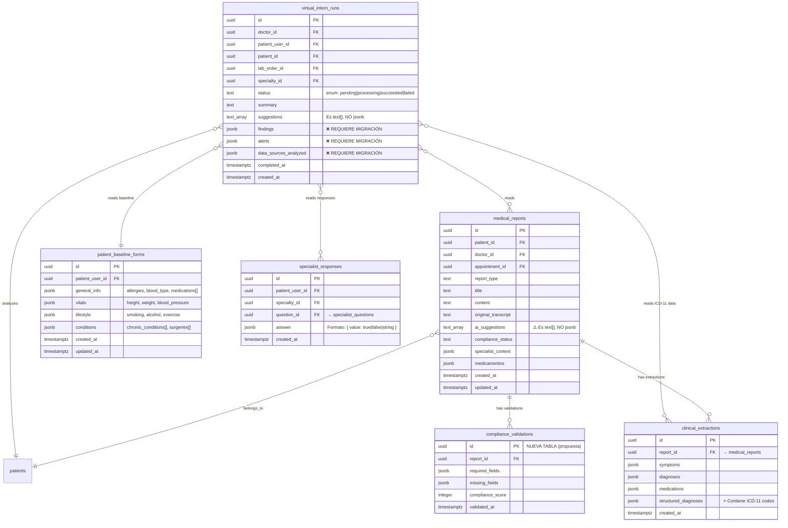

# Plan: Mejoras al Asistente de Cumplimiento y Pasante Virtual

**Fecha**: 2025-12-26
**Tipo**: Enhancement / Feature
**Prioridad**: Alta
**Complejidad**: Alta (Arquitectura + AI + UX)

---

## Overview

Este plan aborda dos características críticas del sistema EzyAI que requieren mejoras significativas:

1. **Asistente de Cumplimiento (Paso 3)**: El sistema actual genera sugerencias de campos faltantes inconsistentes entre consultas similares, causando confusión y pérdida de confianza del usuario.

2. **Pasante Virtual**: Actualmente solo analiza datos parciales del paciente. Se requiere integrar reportes de consulta médica y análisis de PDFs/imágenes de laboratorio.

---

## Estado Actual de Supabase (Verificado 2025-12-26)

### Tablas Relevantes y Estructura Real

#### `medical_reports` (13 registros actuales)
```sql
-- Columnas verificadas:
id: uuid PK
patient_id: uuid FK
doctor_id: uuid FK
appointment_id: uuid FK
report_type: text
title: text
content: text
original_transcript: text
ai_suggestions: text[]  -- ⚠️ Es text[], NO jsonb
compliance_status: text
specialist_context: jsonb  -- Puede contener { specialty, questions_answered }
medicamentos: jsonb        -- Array de medicamentos estructurados
created_at: timestamptz
updated_at: timestamptz
```

#### `virtual_intern_runs` (1 registro actual)
```sql
-- Columnas verificadas:
id: uuid PK
doctor_id: uuid FK
patient_user_id: uuid FK
patient_id: uuid FK
lab_order_id: uuid FK
specialty_id: uuid FK
status: text  -- enum: 'pending' | 'processing' | 'succeeded' | 'failed'
summary: text
suggestions: text[]  -- Array de strings simples
completed_at: timestamptz
created_at: timestamptz

-- ❌ COLUMNAS FALTANTES (requieren migración):
-- findings: jsonb
-- alerts: jsonb
-- data_sources_analyzed: jsonb
```

#### `patient_baseline_forms` (3 registros actuales)
```sql
-- Columnas verificadas:
id: uuid PK
patient_user_id: uuid FK
general_info: jsonb  -- { allergies[], blood_type, medications[{name,dose,frequency}] }
vitals: jsonb        -- { height, weight, blood_pressure, heart_rate }
lifestyle: jsonb     -- { smoking, alcohol, exercise, diet }
conditions: jsonb    -- { chronic_conditions[], surgeries[], family_history[] }
created_at: timestamptz
updated_at: timestamptz

-- Ejemplo de general_info:
{
  "allergies": ["Penicilina", "Mariscos"],
  "blood_type": "O+",
  "medications": [
    { "name": "Metformina", "dose": "850mg", "frequency": "cada 12 horas" }
  ]
}
```

#### `specialist_responses` (130 registros actuales)
```sql
-- Columnas verificadas:
id: uuid PK
patient_user_id: uuid FK
specialty_id: uuid FK
question_id: uuid FK → specialist_questions
answer: jsonb  -- Formato: { "value": true/false/string }
created_at: timestamptz

-- Ejemplo de answer:
{ "value": true }
{ "value": "2 semanas" }
```

#### `clinical_extractions` (61 registros actuales) ⭐ NUEVO
```sql
-- Columnas verificadas:
id: uuid PK
report_id: uuid FK → medical_reports
symptoms: jsonb       -- Array de síntomas
diagnoses: jsonb      -- Array de diagnósticos simples
medications: jsonb    -- Array de medicamentos
structured_diagnoses: jsonb  -- ⭐ CONTIENE CÓDIGOS ICD-11

-- Ejemplo de structured_diagnoses (datos reales):
[
  {
    "name": "Cefalea tensional",
    "icd11Code": "8A80.0",
    "confidence": "alta"
  }
]

-- ⚠️ Muchos registros tienen arrays vacíos - datos sin extraer
```

### Discrepancias Plan vs Realidad

| Elemento | Propuesto en Plan | Realidad en Supabase |
|----------|-------------------|----------------------|
| `virtual_intern_runs.findings` | jsonb | ❌ NO EXISTE |
| `virtual_intern_runs.alerts` | jsonb | ❌ NO EXISTE |
| `virtual_intern_runs.data_sources_analyzed` | jsonb | ❌ NO EXISTE |
| `medical_reports.ai_suggestions` | jsonb | `text[]` |
| Fuente: `clinical_extractions` | No mencionado | ✅ Tiene ICD-11 codes útiles |

---

## Problem Statement

### Problema 1: Inconsistencia en Detección de Campos Faltantes

**Síntomas reportados**:
- Dos consultas casi idénticas generan listas de "campos faltantes" muy diferentes
- Los "puntos pendientes" cambian drásticamente entre regeneraciones
- No hay consistencia en qué se considera realmente "faltante"

**Causa raíz identificada**:
El sistema actual depende 100% de la interpretación del modelo AI para determinar qué campos faltan. Aunque usa `temperature: 0.1`, la evaluación sigue siendo estocástica porque:

1. No existe un checklist determinístico con campos obligatorios fijos
2. Los campos "condicionales" (labs, interconsultas) no tienen reglas claras de cuándo aplican
3. No hay priorización (crítico vs opcional)
4. El prompt mezcla campos obligatorios con condicionales sin distinción

**Archivo afectado**: `app/api/enrich-report/route.ts:4-50`

```typescript
// PROBLEMA: El prompt define campos pero AI decide libremente cuáles faltan
const COMPLIANCE_PROMPT = `...
LISTA DE CAMPOS OBLIGATORIOS DEL REPORTE MÉDICO:
  * Información de Identificación: Nombre del paciente, Edad, Sexo...
  * Información Clínica Principal: Motivo de consulta...
  * Resultados y Procedimientos (solo si aplican): Resultados de laboratorio...
...`
```

### Problema 2: Pasante Virtual con Datos Incompletos

**Estado actual** (`app/api/virtual-intern/route.ts:79-95`):
```typescript
// SOLO analiza 3 fuentes de datos
const prompt = `
Contexto:
- Baseline: ${JSON.stringify(baseline ?? {})}
- Respuestas de especialidad: ${responsesSummary}
- Resultados de laboratorio cargados: ${labsSummary}
`
```

**Datos que NO se analizan actualmente**:
- ❌ Reportes de consulta médica del paciente
- ❌ Contenido visual de PDFs/imágenes de laboratorio (solo lista paths)
- ❌ Historial longitudinal de consultas

---

## Proposed Solution

### Solución 1: Sistema Híbrido de Cumplimiento Determinístico + AI

**Arquitectura propuesta**:

```
┌─────────────────────────────────────────────────────────────────┐
│                    COMPLIANCE ENGINE v2                          │
├─────────────────────────────────────────────────────────────────┤
│  CAPA 1: Checklist Determinístico                               │
│  ┌─────────────────────────────────────────────────────────┐    │
│  │ CAMPOS CRÍTICOS (siempre requeridos)                    │    │
│  │ • Nombre del paciente                                   │    │
│  │ • Edad                                                  │    │
│  │ • Sexo                                                  │    │
│  │ • Fecha y hora de consulta                              │    │
│  │ • Nombre del médico tratante                            │    │
│  │ • Motivo de consulta                                    │    │
│  │ • Diagnóstico/Impresión diagnóstica                     │    │
│  │ • Plan de tratamiento                                   │    │
│  └─────────────────────────────────────────────────────────┘    │
│  ┌─────────────────────────────────────────────────────────┐    │
│  │ CAMPOS IMPORTANTES (fuertemente recomendados)           │    │
│  │ • Historia de la enfermedad actual                      │    │
│  │ • Antecedentes médicos relevantes                       │    │
│  │ • Registro de alergias                                  │    │
│  │ • Medicamentos actuales                                 │    │
│  │ • Examen físico                                         │    │
│  │ • Indicaciones para el paciente                         │    │
│  │ • Próxima cita o instrucciones de seguimiento           │    │
│  └─────────────────────────────────────────────────────────┘    │
│  ┌─────────────────────────────────────────────────────────┐    │
│  │ CAMPOS CONDICIONALES (solo si aplican)                  │    │
│  │ • Resultados de laboratorio                             │    │
│  │   → Requerido SI: transcript.includes("laboratorio")    │    │
│  │     OR transcript.includes("análisis")                  │    │
│  │     OR transcript.includes("estudios de sangre")        │    │
│  │ • Resultados de estudios de imagen                      │    │
│  │   → Requerido SI: transcript.includes("radiografía")    │    │
│  │     OR transcript.includes("ultrasonido")               │    │
│  │     OR transcript.includes("tomografía")                │    │
│  │ • Interconsultas solicitadas                            │    │
│  │   → Requerido SI: transcript.includes("referencia")     │    │
│  │     OR transcript.includes("especialista")              │    │
│  └─────────────────────────────────────────────────────────┘    │
├─────────────────────────────────────────────────────────────────┤
│  CAPA 2: Validación AI (complementaria)                         │
│  • Valida que contenido extraído sea clínicamente coherente     │
│  • NO determina qué campos faltan (solo Capa 1 hace eso)        │
│  • Sugiere mejoras de redacción/completitud                     │
└─────────────────────────────────────────────────────────────────┘
```

### Solución 2: Pasante Virtual con Análisis Completo

**Arquitectura propuesta** (actualizada con datos reales de Supabase):

```
┌─────────────────────────────────────────────────────────────────┐
│                 VIRTUAL INTERN v2                                │
├─────────────────────────────────────────────────────────────────┤
│  FUENTES DE DATOS INTEGRADAS                                    │
│  ┌─────────────────────────────────────────────────────────┐    │
│  │ 1. Cuestionario Base (patient_baseline_forms)   ✅ EXISTE│    │
│  │    → general_info, vitals, lifestyle, conditions        │    │
│  │                                                          │    │
│  │ 2. Cuestionario Especialidad (specialist_responses)     │    │
│  │    ✅ EXISTE → { "value": true/false/string }           │    │
│  │                                                          │    │
│  │ 3. Resultados de Lab (lab_results paths)        ✅ EXISTE│    │
│  │                                                          │    │
│  │ 4. Reportes de Consulta (medical_reports)       ⭐ NUEVO │    │
│  │    → content, ai_suggestions[], medicamentos{}          │    │
│  │                                                          │    │
│  │ 5. Extracciones Clínicas (clinical_extractions) ⭐ NUEVO │    │
│  │    → symptoms, diagnoses, structured_diagnoses[ICD-11]  │    │
│  │                                                          │    │
│  │ 6. Contenido de PDFs/Imágenes (vision AI)       🔮 FUTURO│    │
│  └─────────────────────────────────────────────────────────┘    │
│                                                                  │
│  PIPELINE DE ANÁLISIS                                           │
│  ┌─────────────────────────────────────────────────────────┐    │
│  │ Paso 1: Cargar datos estructurados en paralelo          │    │
│  │         (baseline + specialty + reports + extractions)  │    │
│  │                          ↓                               │    │
│  │ Paso 2: Enriquecer con diagnósticos ICD-11              │    │
│  │         (de clinical_extractions.structured_diagnoses)  │    │
│  │                          ↓                               │    │
│  │ Paso 3: [Futuro] Extraer texto de PDFs (pdfjs-dist)     │    │
│  │         Límite: 10 páginas, 50KB texto                  │    │
│  │                          ↓                               │    │
│  │ Paso 4: Generar resumen + sugerencias accionables       │    │
│  │         Con citas a fuentes específicas y códigos ICD   │    │
│  └─────────────────────────────────────────────────────────┘    │
└─────────────────────────────────────────────────────────────────┘
```

---

## Technical Approach

### Fase 1: Refactorizar Sistema de Cumplimiento

#### 1.1 Crear Schema de Campos de Cumplimiento

**Nuevo archivo**: `lib/compliance/fields-schema.ts`

```typescript
// lib/compliance/fields-schema.ts

export type FieldPriority = 'CRITICAL' | 'IMPORTANT' | 'CONDITIONAL'

export interface ComplianceField {
  id: string
  name: string
  nameEs: string
  priority: FieldPriority
  category: 'identification' | 'clinical' | 'results' | 'followup'
  // Para campos CONDITIONAL: reglas de cuándo aplican
  conditionalTriggers?: string[]
  // Pregunta para el doctor si falta
  questionEs: string
  // Aliases para detectar en transcript/report
  aliases: string[]
}

export const COMPLIANCE_FIELDS: ComplianceField[] = [
  // === CRÍTICOS (siempre requeridos) ===
  {
    id: 'patient_name',
    name: 'Patient Name',
    nameEs: 'Nombre del paciente',
    priority: 'CRITICAL',
    category: 'identification',
    questionEs: '¿Cuál es el nombre completo del paciente?',
    aliases: ['nombre del paciente', 'nombre completo', 'paciente:']
  },
  {
    id: 'patient_age',
    name: 'Patient Age',
    nameEs: 'Edad del paciente',
    priority: 'CRITICAL',
    category: 'identification',
    questionEs: '¿Cuál es la edad del paciente?',
    aliases: ['edad', 'años de edad', 'edad:']
  },
  {
    id: 'patient_sex',
    name: 'Patient Sex',
    nameEs: 'Sexo del paciente',
    priority: 'CRITICAL',
    category: 'identification',
    questionEs: '¿Cuál es el sexo/género del paciente?',
    aliases: ['sexo', 'género', 'masculino', 'femenino']
  },
  {
    id: 'consultation_datetime',
    name: 'Consultation Date/Time',
    nameEs: 'Fecha y hora de consulta',
    priority: 'CRITICAL',
    category: 'identification',
    questionEs: '¿Cuál fue la fecha y hora de la consulta?',
    aliases: ['fecha de consulta', 'fecha y hora', 'fecha:']
  },
  {
    id: 'doctor_name',
    name: 'Treating Physician',
    nameEs: 'Nombre del médico tratante',
    priority: 'CRITICAL',
    category: 'identification',
    questionEs: '¿Cuál es el nombre del médico tratante?',
    aliases: ['médico tratante', 'dr.', 'dra.', 'doctor:']
  },
  {
    id: 'chief_complaint',
    name: 'Chief Complaint',
    nameEs: 'Motivo de consulta',
    priority: 'CRITICAL',
    category: 'clinical',
    questionEs: '¿Cuál es el motivo principal de la consulta?',
    aliases: ['motivo de consulta', 'motivo:', 'razón de consulta', 'queja principal']
  },
  {
    id: 'diagnosis',
    name: 'Diagnosis',
    nameEs: 'Diagnóstico/Impresión diagnóstica',
    priority: 'CRITICAL',
    category: 'clinical',
    questionEs: '¿Cuál es el diagnóstico o impresión diagnóstica?',
    aliases: ['diagnóstico', 'impresión diagnóstica', 'dx:', 'diagnóstico:']
  },
  {
    id: 'treatment_plan',
    name: 'Treatment Plan',
    nameEs: 'Plan de tratamiento',
    priority: 'CRITICAL',
    category: 'clinical',
    questionEs: '¿Cuál es el plan de tratamiento indicado?',
    aliases: ['plan de tratamiento', 'tratamiento:', 'plan:', 'manejo:']
  },

  // === IMPORTANTES (fuertemente recomendados) ===
  {
    id: 'history_present_illness',
    name: 'History of Present Illness',
    nameEs: 'Historia de la enfermedad actual',
    priority: 'IMPORTANT',
    category: 'clinical',
    questionEs: '¿Cuál es la historia de la enfermedad actual?',
    aliases: ['historia de la enfermedad', 'enfermedad actual', 'hea:', 'evolución']
  },
  {
    id: 'medical_history',
    name: 'Relevant Medical History',
    nameEs: 'Antecedentes médicos relevantes',
    priority: 'IMPORTANT',
    category: 'clinical',
    questionEs: '¿Cuáles son los antecedentes médicos relevantes?',
    aliases: ['antecedentes', 'antecedentes médicos', 'historial médico', 'app:', 'apnp:']
  },
  {
    id: 'allergies',
    name: 'Allergies',
    nameEs: 'Registro de alergias',
    priority: 'IMPORTANT',
    category: 'clinical',
    questionEs: '¿El paciente tiene alergias conocidas?',
    aliases: ['alergias', 'alérgico a', 'sin alergias', 'nkda']
  },
  {
    id: 'current_medications',
    name: 'Current Medications',
    nameEs: 'Medicamentos actuales',
    priority: 'IMPORTANT',
    category: 'clinical',
    questionEs: '¿Qué medicamentos toma actualmente el paciente?',
    aliases: ['medicamentos actuales', 'medicación actual', 'fármacos', 'tratamiento previo']
  },
  {
    id: 'physical_exam',
    name: 'Physical Examination',
    nameEs: 'Examen físico',
    priority: 'IMPORTANT',
    category: 'clinical',
    questionEs: '¿Cuáles fueron los hallazgos del examen físico?',
    aliases: ['examen físico', 'exploración física', 'ef:', 'signos vitales']
  },
  {
    id: 'patient_instructions',
    name: 'Patient Instructions',
    nameEs: 'Indicaciones para el paciente',
    priority: 'IMPORTANT',
    category: 'clinical',
    questionEs: '¿Cuáles son las indicaciones para el paciente?',
    aliases: ['indicaciones', 'recomendaciones', 'instrucciones', 'cuidados en casa']
  },
  {
    id: 'followup',
    name: 'Follow-up',
    nameEs: 'Próxima cita o instrucciones de seguimiento',
    priority: 'IMPORTANT',
    category: 'followup',
    questionEs: '¿Cuándo debe regresar el paciente o qué seguimiento se indica?',
    aliases: ['próxima cita', 'seguimiento', 'control', 'regresar en', 'cita de control']
  },

  // === CONDICIONALES (solo si aplican según transcript) ===
  {
    id: 'lab_results',
    name: 'Laboratory Results',
    nameEs: 'Resultados de laboratorio',
    priority: 'CONDITIONAL',
    category: 'results',
    conditionalTriggers: [
      'laboratorio', 'análisis', 'estudios de sangre', 'biometría',
      'química sanguínea', 'exámenes de laboratorio', 'pruebas de sangre',
      'hemoglobina', 'glucosa', 'colesterol', 'triglicéridos'
    ],
    questionEs: '¿Cuáles fueron los resultados de laboratorio?',
    aliases: ['resultados de laboratorio', 'laboratorios', 'labs:', 'estudios de laboratorio']
  },
  {
    id: 'imaging_results',
    name: 'Imaging Results',
    nameEs: 'Resultados de estudios de imagen',
    priority: 'CONDITIONAL',
    category: 'results',
    conditionalTriggers: [
      'radiografía', 'ultrasonido', 'tomografía', 'resonancia',
      'rayos x', 'eco', 'tac', 'rm', 'imagen', 'placa'
    ],
    questionEs: '¿Cuáles fueron los resultados de los estudios de imagen?',
    aliases: ['resultados de imagen', 'radiografía', 'ultrasonido', 'tomografía']
  },
  {
    id: 'referrals',
    name: 'Referrals/Consultations',
    nameEs: 'Interconsultas solicitadas',
    priority: 'CONDITIONAL',
    category: 'results',
    conditionalTriggers: [
      'referencia', 'interconsulta', 'especialista', 'derivar',
      'enviar a', 'valoración por', 'consulta con'
    ],
    questionEs: '¿Qué interconsultas se solicitaron?',
    aliases: ['interconsulta', 'referencia', 'derivación', 'consulta con especialista']
  }
]

export function getRequiredFields(transcript: string): ComplianceField[] {
  const lowerTranscript = transcript.toLowerCase()

  return COMPLIANCE_FIELDS.filter(field => {
    // Críticos e importantes siempre se incluyen
    if (field.priority === 'CRITICAL' || field.priority === 'IMPORTANT') {
      return true
    }

    // Condicionales solo si hay triggers en el transcript
    if (field.priority === 'CONDITIONAL' && field.conditionalTriggers) {
      return field.conditionalTriggers.some(trigger =>
        lowerTranscript.includes(trigger.toLowerCase())
      )
    }

    return false
  })
}

export function detectFieldInText(field: ComplianceField, text: string): boolean {
  const lowerText = text.toLowerCase()
  return field.aliases.some(alias => lowerText.includes(alias.toLowerCase()))
}

export function getMissingFields(
  requiredFields: ComplianceField[],
  reportContent: string,
  patientData: Record<string, any>
): ComplianceField[] {
  return requiredFields.filter(field => {
    // Verificar si está en el contenido del reporte
    const inReport = detectFieldInText(field, reportContent)
    if (inReport) return false

    // Verificar si viene de datos del paciente
    const patientFieldMap: Record<string, string[]> = {
      'patient_name': ['first_name', 'last_name'],
      'patient_age': ['date_of_birth'],
      'patient_sex': ['gender'],
      'allergies': ['allergies'],
      'current_medications': ['current_medications'],
      'medical_history': ['medical_history']
    }

    const patientKeys = patientFieldMap[field.id]
    if (patientKeys) {
      const hasPatientData = patientKeys.some(key =>
        patientData[key] && String(patientData[key]).trim()
      )
      if (hasPatientData) return false
    }

    return true
  })
}
```

#### 1.2 Refactorizar API de Enrich-Report

**Modificar**: `app/api/enrich-report/route.ts`

```typescript
// app/api/enrich-report/route.ts

import { NextRequest, NextResponse } from 'next/server'
import { ai, MODEL } from '@/lib/ai/openrouter'
import {
  COMPLIANCE_FIELDS,
  getRequiredFields,
  getMissingFields,
  ComplianceField
} from '@/lib/compliance/fields-schema'

// Prompt simplificado: AI solo estructura el reporte, NO decide qué falta
const REPORT_STRUCTURE_PROMPT = `ROL: Eres un asistente de documentación médica.

TAREA: Toma la transcripción de una consulta médica y estructúrala en un reporte profesional con formato Markdown.

ESTRUCTURA DEL REPORTE:
## Información de Identificación
*  **Nombre del paciente:** [extraer o marcar [Faltante]]
*  **Edad:** [extraer o marcar [Faltante]]
*  **Sexo:** [extraer o marcar [Faltante]]
*  **Fecha y hora de consulta:** [extraer o marcar [Faltante]]
*  **Nombre del médico tratante:** [extraer o marcar [Faltante]]

## Información Clínica Principal
*  **Motivo de consulta:** [extraer]
*  **Historia de la enfermedad actual:** [extraer]
*  **Antecedentes médicos relevantes:** [extraer o "No referidos"]
*  **Registro de alergias:** [extraer o "No referidas"]
*  **Medicamentos actuales:** [extraer o "No referidos"]
*  **Examen físico:** [extraer hallazgos]
*  **Diagnóstico/Impresión diagnóstica:** [extraer]
*  **Plan de tratamiento:** [extraer]
*  **Indicaciones para el paciente:** [extraer]

## Resultados y Procedimientos (si aplican)
*  **Resultados de laboratorio:** [extraer si se mencionan]
*  **Resultados de estudios:** [extraer si se mencionan]
*  **Interconsultas solicitadas:** [extraer si se mencionan]

## Seguimiento
*  **Próxima cita o instrucciones de seguimiento:** [extraer]

REGLAS:
1. Extrae SOLO información explícitamente mencionada en la transcripción
2. Marca como [Faltante] los campos sin información
3. Usa "No referido/a" para antecedentes/alergias/medicamentos si no se mencionan
4. NO inventes información
5. Mantén el formato Markdown exacto

FORMATO DE SALIDA: JSON con estructura:
{
  "structuredReport": "El reporte en Markdown"
}`

export async function POST(request: NextRequest) {
  try {
    if (!process.env.OPENROUTER_API_KEY) {
      return NextResponse.json(
        { error: 'Server configuration error: Missing API key' },
        { status: 500 }
      )
    }

    const { transcript, additionalInfo, patientData } = await request.json()

    if (!transcript) {
      return NextResponse.json({ error: 'Transcript is required' }, { status: 400 })
    }

    // Paso 1: Determinar campos requeridos basado en transcript (DETERMINÍSTICO)
    const requiredFields = getRequiredFields(transcript)

    // Paso 2: Generar reporte estructurado con AI
    let fullTranscript = transcript
    if (additionalInfo && additionalInfo.length > 0) {
      fullTranscript += '\n\n=== INFORMACIÓN ADICIONAL ===\n'
      additionalInfo.forEach((info: { question: string; answer: string }) => {
        fullTranscript += `\nPregunta: ${info.question}\nRespuesta: ${info.answer}\n`
      })
    }

    const response = await ai.chat.completions.create({
      model: MODEL,
      messages: [
        {
          role: 'user',
          content: REPORT_STRUCTURE_PROMPT + '\n\nTRANSCRIPCIÓN:\n' + fullTranscript,
        },
      ],
      temperature: 0.1,
      max_tokens: 4096,
      response_format: { type: 'json_object' },
    })

    const text = response.choices[0]?.message?.content || ''
    const parsed = JSON.parse(text)
    const structuredReport = parsed.structuredReport || ''

    // Paso 3: Detectar campos faltantes (DETERMINÍSTICO)
    const missingFields = getMissingFields(
      requiredFields,
      structuredReport,
      patientData || {}
    )

    // Paso 4: Generar preguntas para campos faltantes
    const missingInformation = missingFields.map(f => f.nameEs)
    const questionsForDoctor = missingFields.map(f => f.questionEs)

    // Paso 5: Clasificar por prioridad para UI
    const criticalMissing = missingFields.filter(f => f.priority === 'CRITICAL')
    const importantMissing = missingFields.filter(f => f.priority === 'IMPORTANT')
    const conditionalMissing = missingFields.filter(f => f.priority === 'CONDITIONAL')

    return NextResponse.json({
      improvedReport: structuredReport,
      missingInformation,
      questionsForDoctor,
      // Metadata adicional para UI mejorada
      missingByPriority: {
        critical: criticalMissing.map(f => ({ id: f.id, name: f.nameEs, question: f.questionEs })),
        important: importantMissing.map(f => ({ id: f.id, name: f.nameEs, question: f.questionEs })),
        conditional: conditionalMissing.map(f => ({ id: f.id, name: f.nameEs, question: f.questionEs }))
      },
      totalRequired: requiredFields.length,
      totalMissing: missingFields.length,
      complianceScore: Math.round(((requiredFields.length - missingFields.length) / requiredFields.length) * 100)
    })
  } catch (error) {
    console.error('Error in enrich-report API:', error)
    return NextResponse.json(
      { error: 'Internal server error', details: error instanceof Error ? error.message : 'Unknown' },
      { status: 500 }
    )
  }
}
```

#### 1.3 Actualizar UI del Compliance Assistant

**Modificar**: `components/consultation-steps/compliance-assistant.tsx`

Cambios principales:
- Mostrar campos agrupados por prioridad (Críticos primero, luego Importantes, luego Condicionales)
- Badge visual diferenciado por prioridad (rojo/amarillo/azul)
- Score de cumplimiento en porcentaje
- Mensaje claro de qué es realmente obligatorio vs recomendado

---

### Fase 2: Mejorar Pasante Virtual

#### 2.1 Integrar Reportes de Consulta

**Modificar**: `app/api/virtual-intern/route.ts`

```typescript
// app/api/virtual-intern/route.ts

import { NextRequest, NextResponse } from "next/server"
import { supabaseAdmin, isSupabaseAdminService } from "@/lib/supabase-admin"
import OpenAI from "openai"

// Límites para evitar problemas de rendimiento
const MAX_REPORTS = 10
const MAX_REPORT_CONTENT_LENGTH = 5000 // caracteres por reporte
const REPORT_LOOKBACK_MONTHS = 6

export async function POST(req: NextRequest) {
  try {
    if (!isSupabaseAdminService) {
      return NextResponse.json(
        { error: "Configura SUPABASE_SERVICE_ROLE_KEY" },
        { status: 500 }
      )
    }

    const body = await req.json()
    const { lab_order_id, patient_user_id, specialty_id, include_vision_analysis } = body

    if (!lab_order_id || !patient_user_id) {
      return NextResponse.json({ error: "lab_order_id y patient_user_id son requeridos" }, { status: 400 })
    }

    // Cargar orden de laboratorio
    const { data: order, error: orderError } = await supabaseAdmin
      .from("lab_orders")
      .select("id, doctor_id, patient_id, patient_user_id, specialty_id, recommended_tests")
      .eq("id", lab_order_id)
      .maybeSingle()

    if (orderError || !order) {
      return NextResponse.json({ error: "No se encontró la orden" }, { status: 404 })
    }

    const doctorId = order.doctor_id
    if (!doctorId) {
      return NextResponse.json({ error: "Orden sin doctor asignado" }, { status: 400 })
    }

    // Cargar datos en paralelo (actualizado con estructura real de Supabase)
    const sixMonthsAgo = new Date()
    sixMonthsAgo.setMonth(sixMonthsAgo.getMonth() - REPORT_LOOKBACK_MONTHS)

    // Primero obtener patient_id
    const { data: patientData } = await supabaseAdmin
      .from("patients")
      .select("id, first_name, last_name, date_of_birth, gender")
      .eq("user_id", patient_user_id)
      .maybeSingle()

    const patientId = patientData?.id

    const [labsRes, baselineRes, responsesRes, reportsRes, extractionsRes] = await Promise.all([
      // Resultados de laboratorio
      supabaseAdmin
        .from("lab_results")
        .select("storage_path, uploaded_at, mime_type")
        .eq("lab_order_id", lab_order_id),

      // Cuestionario base (estructura real: general_info, vitals, lifestyle, conditions)
      supabaseAdmin
        .from("patient_baseline_forms")
        .select("general_info, vitals, lifestyle, conditions")
        .eq("patient_user_id", patient_user_id)
        .maybeSingle(),

      // Respuestas de especialidad (formato real: { "value": true/false/string })
      supabaseAdmin
        .from("specialist_responses")
        .select("answer, specialist_questions(prompt)")
        .eq("patient_user_id", patient_user_id)
        .eq("specialty_id", specialty_id ?? order.specialty_id),

      // Reportes de consulta médica (NUEVO)
      patientId
        ? supabaseAdmin
            .from("medical_reports")
            .select("id, title, report_type, content, ai_suggestions, medicamentos, created_at")
            .eq("patient_id", patientId)
            .gte("created_at", sixMonthsAgo.toISOString())
            .order("created_at", { ascending: false })
            .limit(MAX_REPORTS)
        : Promise.resolve({ data: [] }),

      // Extracciones clínicas con ICD-11 (NUEVO - datos valiosos no utilizados antes)
      patientId
        ? supabaseAdmin
            .from("clinical_extractions")
            .select(`
              symptoms,
              diagnoses,
              structured_diagnoses,
              medications,
              medical_reports!inner(patient_id, created_at)
            `)
            .eq("medical_reports.patient_id", patientId)
            .gte("medical_reports.created_at", sixMonthsAgo.toISOString())
            .order("medical_reports.created_at", { ascending: false })
            .limit(MAX_REPORTS)
        : Promise.resolve({ data: [] })
    ])

    // Formatear datos para el prompt (actualizado con estructura real)
    const baseline = baselineRes.data
    const responses = responsesRes.data
    const labs = labsRes.data
    const reports = reportsRes.data || []
    const extractions = extractionsRes.data || []
    const patient = patientData

    // Formatear respuestas de especialidad (formato real: { "value": ... })
    const responsesSummary = responses
      ?.map((r: any) => {
        const answer = r.answer?.value ?? JSON.stringify(r.answer)
        return `• ${r.specialist_questions?.prompt ?? "Pregunta"}: ${answer}`
      })
      .join("\n") ?? "Sin respuestas de especialidad"

    const labsSummary = labs && labs.length > 0
      ? labs.map((l: any) => `• ${l.storage_path.split("/").pop()} (${l.mime_type}, subido: ${new Date(l.uploaded_at).toLocaleDateString()})`).join("\n")
      : "Sin resultados de laboratorio cargados"

    // NUEVO: Resumen de reportes de consulta (ai_suggestions es text[], no jsonb)
    const reportsSummary = reports.length > 0
      ? reports.map((r: any) => {
          const content = r.content?.substring(0, MAX_REPORT_CONTENT_LENGTH) || "Sin contenido"
          const truncated = r.content?.length > MAX_REPORT_CONTENT_LENGTH ? "... [truncado]" : ""
          const meds = r.medicamentos ? `Medicamentos: ${JSON.stringify(r.medicamentos)}` : ""
          return `### Reporte: ${r.title || "Sin título"} (${new Date(r.created_at).toLocaleDateString()})
Tipo: ${r.report_type || "N/D"}
Contenido:
${content}${truncated}
${meds}
${r.ai_suggestions?.length ? `Sugerencias AI previas: ${r.ai_suggestions.join("; ")}` : ""}`
        }).join("\n\n")
      : "Sin reportes de consulta previos"

    // NUEVO: Resumen de extracciones clínicas con ICD-11
    const extractionsSummary = extractions.length > 0
      ? extractions.map((e: any) => {
          const icdDiagnoses = e.structured_diagnoses?.map((d: any) =>
            `• ${d.name} (${d.icd11Code}) - Confianza: ${d.confidence}`
          ).join("\n") || ""
          const symptoms = e.symptoms?.length ? `Síntomas: ${e.symptoms.join(", ")}` : ""
          const meds = e.medications?.length ? `Medicamentos: ${e.medications.join(", ")}` : ""
          return [icdDiagnoses, symptoms, meds].filter(Boolean).join("\n")
        }).filter(Boolean).join("\n---\n")
      : "Sin extracciones clínicas previas"

    const patientAge = patient?.date_of_birth
      ? Math.floor((Date.now() - new Date(patient.date_of_birth).getTime()) / (365.25 * 24 * 60 * 60 * 1000))
      : "Desconocida"

    const prompt = `Eres un pasante virtual médico experto. Analiza la información completa del paciente y proporciona un resumen clínico con sugerencias accionables.

## DATOS DEL PACIENTE

### Información General
- Nombre: ${patient?.first_name || ""} ${patient?.last_name || ""}
- Edad: ${patientAge} años
- Sexo: ${patient?.gender || "No especificado"}
- Especialidad consultada: ${specialty_id ?? order.specialty_id ?? "General"}

### Cuestionario Base
${JSON.stringify(baseline ?? {}, null, 2)}

### Respuestas del Cuestionario de Especialidad
${responsesSummary}

### Resultados de Laboratorio Disponibles
${labsSummary}

### Historial de Consultas Médicas (últimos ${REPORT_LOOKBACK_MONTHS} meses)
${reportsSummary}

### Extracciones Clínicas con Códigos ICD-11 ⭐
${extractionsSummary}

---

## INSTRUCCIONES

Proporciona:
1. **Resumen Clínico** (3-5 oraciones): Síntesis del estado actual del paciente integrando TODAS las fuentes de datos.

2. **Hallazgos Relevantes** (lista): Datos importantes identificados en la información proporcionada.

3. **Sugerencias Accionables** (3-5 items): Recomendaciones específicas para el médico. Cada sugerencia debe:
   - Ser concreta y accionable
   - Citar la fuente de donde proviene (cuestionario, laboratorio, reporte previo)
   - Indicar prioridad (Alta/Media/Baja)

4. **Alertas** (si aplican): Inconsistencias entre fuentes de datos, valores anormales, o seguimientos pendientes.

Responde en formato JSON:
{
  "summary": "Resumen clínico aquí",
  "findings": ["Hallazgo 1", "Hallazgo 2"],
  "suggestions": [
    { "text": "Sugerencia 1", "source": "cuestionario base", "priority": "Alta" },
    { "text": "Sugerencia 2", "source": "reporte del 2024-01-15", "priority": "Media" }
  ],
  "alerts": ["Alerta 1 si hay"]
}`

    // Ejecutar análisis con OpenAI
    const openaiKey = process.env.OPENAI_API_KEY
    if (!openaiKey) {
      return NextResponse.json({ error: "Configura OPENAI_API_KEY" }, { status: 500 })
    }

    const openaiModel = process.env.OPENAI_MODEL || "gpt-4o-mini"
    const openai = new OpenAI({ apiKey: openaiKey })

    const completion = await openai.chat.completions.create({
      model: openaiModel,
      messages: [{ role: "user", content: prompt }],
      temperature: 0.3,
      response_format: { type: "json_object" }
    })

    const responseText = completion.choices?.[0]?.message?.content || "{}"
    let analysisResult
    try {
      analysisResult = JSON.parse(responseText)
    } catch {
      analysisResult = {
        summary: responseText,
        findings: [],
        suggestions: [{ text: "Revisa resultados y confirma plan", source: "sistema", priority: "Media" }],
        alerts: []
      }
    }

    // Guardar resultado
    const { data: run, error: runError } = await supabaseAdmin
      .from("virtual_intern_runs")
      .insert({
        doctor_id: doctorId,
        patient_user_id,
        patient_id: order.patient_id,
        lab_order_id,
        specialty_id: specialty_id ?? order.specialty_id,
        status: "succeeded",
        summary: analysisResult.summary,
        suggestions: analysisResult.suggestions?.map((s: any) =>
          typeof s === 'string' ? s : `[${s.priority}] ${s.text} (Fuente: ${s.source})`
        ) || [],
        findings: analysisResult.findings,
        alerts: analysisResult.alerts,
        completed_at: new Date().toISOString(),
      })
      .select()
      .maybeSingle()

    if (runError) {
      return NextResponse.json({ error: runError.message }, { status: 500 })
    }

    return NextResponse.json({
      ok: true,
      run,
      analysis: analysisResult
    })
  } catch (error) {
    console.error("Virtual intern error:", error)
    return NextResponse.json({ error: "Error interno" }, { status: 500 })
  }
}
```

#### 2.2 Actualizar Schema de Base de Datos

**IMPORTANTE**: Basado en la verificación de Supabase (2025-12-26), la tabla `virtual_intern_runs` NO tiene las columnas `findings`, `alerts`, ni `data_sources_analyzed`. Estas deben agregarse mediante migración.

**Nueva migración SQL** (verificada contra esquema actual):

```sql
-- ============================================
-- Migración: Agregar columnas a virtual_intern_runs
-- Fecha: 2025-12-26
-- Razón: La tabla actual solo tiene: id, doctor_id, patient_user_id,
--        patient_id, lab_order_id, specialty_id, status, summary,
--        suggestions (text[]), completed_at, created_at
-- ============================================

-- 1. Agregar columnas para datos estructurados del pasante virtual
ALTER TABLE virtual_intern_runs
ADD COLUMN IF NOT EXISTS findings jsonb DEFAULT '[]'::jsonb,
ADD COLUMN IF NOT EXISTS alerts jsonb DEFAULT '[]'::jsonb,
ADD COLUMN IF NOT EXISTS data_sources_analyzed jsonb DEFAULT '{
  "baseline_form": false,
  "specialty_responses": false,
  "lab_results": false,
  "medical_reports": false,
  "clinical_extractions": false
}'::jsonb;

-- 2. Comentarios para documentación
COMMENT ON COLUMN virtual_intern_runs.findings IS 'Hallazgos relevantes identificados por el pasante virtual';
COMMENT ON COLUMN virtual_intern_runs.alerts IS 'Alertas y advertencias (inconsistencias, valores anormales)';
COMMENT ON COLUMN virtual_intern_runs.data_sources_analyzed IS 'Registro de qué fuentes de datos fueron analizadas';

-- 3. Índice para búsquedas eficientes por paciente
CREATE INDEX IF NOT EXISTS idx_virtual_intern_runs_patient_completed
ON virtual_intern_runs(patient_user_id, completed_at DESC);

-- 4. Índice para clinical_extractions por reporte (optimizar JOIN)
CREATE INDEX IF NOT EXISTS idx_clinical_extractions_report
ON clinical_extractions(report_id);

-- 5. Índice para medical_reports por paciente y fecha
CREATE INDEX IF NOT EXISTS idx_medical_reports_patient_date
ON medical_reports(patient_id, created_at DESC);
```

**Verificar antes de aplicar**:
```sql
-- Confirmar que las columnas NO existen
SELECT column_name
FROM information_schema.columns
WHERE table_name = 'virtual_intern_runs'
AND column_name IN ('findings', 'alerts', 'data_sources_analyzed');
-- Debe retornar 0 filas
```

#### 2.3 Análisis de PDFs (Fase Futura)

Para análisis visual de PDFs/imágenes, se requiere:

1. **Extracción de texto de PDF**: Usar `pdfjs-dist` para extraer texto
2. **Análisis de imágenes**: Usar GPT-4 Vision o Claude Vision
3. **Consideraciones de costo**: GPT-4V cuesta ~10-20x más que texto

**Nuevo archivo (fase futura)**: `lib/ai/vision-analysis.ts`

```typescript
// lib/ai/vision-analysis.ts
// TODO: Implementar en fase futura

import OpenAI from 'openai'
import * as pdfjs from 'pdfjs-dist'

const MAX_PDF_PAGES = 10
const MAX_IMAGE_SIZE_MB = 5

export async function extractTextFromPDF(buffer: Buffer): Promise<string> {
  // Implementar extracción de texto con pdfjs-dist
  // Límite: primeras 10 páginas
}

export async function analyzeImageWithVision(
  imageUrl: string | Buffer,
  prompt: string
): Promise<string> {
  // Implementar análisis con GPT-4 Vision
  // Solo activar si el doctor lo solicita explícitamente
  // Advertir sobre costo adicional
}
```

---

## Acceptance Criteria

### Functional Requirements

#### Asistente de Cumplimiento

- [ ] El sistema usa un checklist determinístico de campos obligatorios
- [ ] Campos clasificados en 3 niveles: CRÍTICO, IMPORTANTE, CONDICIONAL
- [ ] Campos condicionales solo aparecen si hay triggers en el transcript
- [ ] Dos consultas idénticas producen la MISMA lista de campos faltantes
- [ ] UI muestra campos agrupados por prioridad con indicadores visuales
- [ ] Score de cumplimiento calculado consistentemente (X% completado)
- [ ] Campos críticos faltantes bloquean el botón de "Continuar" con advertencia
- [ ] Campos importantes muestran advertencia pero permiten continuar
- [ ] Campos condicionales son opcionales

#### Pasante Virtual

- [ ] Analiza cuestionario base (existente - `patient_baseline_forms`)
- [ ] Analiza cuestionario de especialidad (existente - `specialist_responses`)
- [ ] Analiza resultados de laboratorio (existente - `lab_results`)
- [ ] **NUEVO**: Analiza reportes de consulta médica (últimos 6 meses, máx 10) - `medical_reports`
- [ ] **NUEVO**: Analiza extracciones clínicas con códigos ICD-11 - `clinical_extractions.structured_diagnoses`
- [ ] Muestra fuente de cada sugerencia (de dónde viene la información)
- [ ] Prioriza sugerencias (Alta/Media/Baja)
- [ ] Detecta y alerta sobre inconsistencias entre fuentes de datos
- [ ] Rendimiento: respuesta en <15 segundos incluso con datos completos
- [ ] Guarda `findings`, `alerts` y `data_sources_analyzed` en base de datos (requiere migración)

### Non-Functional Requirements

- [ ] **Consistencia**: Misma entrada → misma salida (varianza <5%)
- [ ] **Rendimiento**: Análisis completo <15s, validación <5s
- [ ] **Escalabilidad**: Soporta pacientes con 100+ reportes históricos
- [ ] **Seguridad**: Datos médicos nunca se loguean en consola
- [ ] **Costo**: Análisis virtual intern <$0.10 por ejecución promedio

### Quality Gates

- [ ] Tests unitarios para `fields-schema.ts` con 100% coverage
- [ ] Tests de integración para API endpoints
- [ ] Test de consistencia: ejecutar 20 veces con misma entrada → mismos campos faltantes
- [ ] Code review aprobado
- [ ] QA manual en ambiente staging

---

## Success Metrics

| Métrica | Actual | Target |
|---------|--------|--------|
| Consistencia de campos faltantes | ~40% | >95% |
| Tiempo promedio de validación | 8-12s | <5s |
| Satisfacción del doctor (escala 1-5) | 2.5 | 4.0+ |
| Datos analizados por pasante virtual | 3 fuentes | 6 fuentes (incluye ICD-11) |
| Sugerencias con fuente citada | 0% | 100% |

---

## Dependencies & Prerequisites

### Dependencias Técnicas

- [ ] `pdfjs-dist` para extracción de texto de PDFs (fase futura)
- [ ] Modelo GPT-4 Vision en OpenRouter (fase futura, para imágenes)

### Dependencias de Datos (Verificado con Supabase 2025-12-26)

- [ ] **MIGRACIÓN REQUERIDA**: `virtual_intern_runs` necesita columnas `findings`, `alerts`, y `data_sources_analyzed`
  - Estado actual: Solo tiene `summary` y `suggestions` (text[])
  - Ver sección 2.2 para SQL de migración
- [ ] Índice en `medical_reports(patient_id, created_at)` para queries eficientes
- [ ] Índice en `clinical_extractions(report_id)` para JOINs con medical_reports
- [ ] Datos existentes en `clinical_extractions.structured_diagnoses` (61 registros disponibles, muchos con arrays vacíos)

### Riesgos

| Riesgo | Probabilidad | Impacto | Mitigación |
|--------|--------------|---------|------------|
| AI sigue siendo inconsistente | Media | Alto | Validación determinística en código, no en prompt |
| Análisis de reportes muy lento | Baja | Medio | Límites estrictos (10 reportes, 5000 chars) |
| Costo de GPT-4 Vision muy alto | Alta | Medio | Hacer opcional, advertir al usuario |
| Conflictos de datos no detectados | Media | Alto | Lógica explícita de comparación entre fuentes |

---

## Implementation Phases

### Fase 1: Cumplimiento Determinístico (Prioridad Alta)
**Estimación**: 2-3 días de desarrollo

1. Crear `lib/compliance/fields-schema.ts` con schema completo
2. Refactorizar `app/api/enrich-report/route.ts` para usar schema
3. Actualizar `compliance-assistant.tsx` para UI por prioridades
4. Tests de consistencia
5. QA y deploy

### Fase 2: Pasante Virtual Mejorado (Prioridad Alta)
**Estimación**: 2-3 días de desarrollo

1. Agregar query de `medical_reports` al virtual-intern
2. Actualizar prompt para incluir reportes
3. Estructurar respuesta con fuentes y prioridades
4. Migración de base de datos
5. Actualizar UI de `PatientFileCard`
6. Tests y QA

### Fase 3: Análisis de PDFs (Prioridad Baja - Futura)
**Estimación**: 3-5 días de desarrollo

1. Implementar extracción de texto con pdfjs-dist
2. Integrar GPT-4 Vision para imágenes (opcional)
3. UI para activar/desactivar análisis visual
4. Advertencias de costo
5. Tests y QA

---

## Future Considerations

1. **Feedback loop**: Permitir que doctores marquen sugerencias como "útil/no útil" para mejorar el modelo
2. **Templates por especialidad**: Diferentes campos obligatorios según tipo de consulta
3. **Offline mode**: Cache local para validación sin conexión
4. **Audit trail**: Versionar cada cambio al reporte para compliance médico
5. **Multi-idioma**: Soporte para campos en inglés/español

---

## References & Research

### Internal References
- `app/api/enrich-report/route.ts:4-50` - Prompt actual de cumplimiento
- `app/api/virtual-intern/route.ts:79-95` - Prompt actual de pasante virtual
- `components/consultation-steps/compliance-assistant.tsx:500-509` - Lógica de consistencia existente
- `components/doctor/patient-file-card.tsx:217-244` - Lógica de pasante virtual UI

### External References
- [SOAP Notes - NCBI](https://www.ncbi.nlm.nih.gov/books/NBK482263/) - Estándar de documentación médica
- [CMS Documentation Guidelines](https://www.cms.gov/outreach-and-education/medicare-learning-network-mln/mlnedwebguide/downloads/97docguidelines.pdf) - Campos obligatorios regulatorios
- [Penn LDI Research on AI Consistency](https://ldi.upenn.edu/our-work/research-updates/get-a-second-opinion-generative-ai-produces-inconsistent-medical-recommendations/) - Por qué AI es inconsistente

### Related Issues
- Problema reportado por usuario: inconsistencia en campos faltantes
- Solicitud de análisis más profundo en pasante virtual

---

## ERD: Cambios al Modelo de Datos (Verificado con Supabase)



---

## MVP Pseudocode

### lib/compliance/fields-schema.ts

```typescript
// Esquema determinístico de campos de cumplimiento
export const COMPLIANCE_FIELDS: ComplianceField[] = [
  // 8 campos CRÍTICOS
  { id: 'patient_name', priority: 'CRITICAL', ... },
  { id: 'patient_age', priority: 'CRITICAL', ... },
  { id: 'patient_sex', priority: 'CRITICAL', ... },
  { id: 'consultation_datetime', priority: 'CRITICAL', ... },
  { id: 'doctor_name', priority: 'CRITICAL', ... },
  { id: 'chief_complaint', priority: 'CRITICAL', ... },
  { id: 'diagnosis', priority: 'CRITICAL', ... },
  { id: 'treatment_plan', priority: 'CRITICAL', ... },

  // 7 campos IMPORTANTES
  { id: 'history_present_illness', priority: 'IMPORTANT', ... },
  { id: 'medical_history', priority: 'IMPORTANT', ... },
  { id: 'allergies', priority: 'IMPORTANT', ... },
  { id: 'current_medications', priority: 'IMPORTANT', ... },
  { id: 'physical_exam', priority: 'IMPORTANT', ... },
  { id: 'patient_instructions', priority: 'IMPORTANT', ... },
  { id: 'followup', priority: 'IMPORTANT', ... },

  // 3 campos CONDICIONALES
  { id: 'lab_results', priority: 'CONDITIONAL', conditionalTriggers: [...], ... },
  { id: 'imaging_results', priority: 'CONDITIONAL', conditionalTriggers: [...], ... },
  { id: 'referrals', priority: 'CONDITIONAL', conditionalTriggers: [...], ... },
]

export function getRequiredFields(transcript: string): ComplianceField[]
export function getMissingFields(required, report, patientData): ComplianceField[]
```

### app/api/enrich-report/route.ts

```typescript
export async function POST(request: NextRequest) {
  // 1. Parsear input
  const { transcript, additionalInfo, patientData } = await request.json()

  // 2. Determinar campos requeridos (DETERMINÍSTICO)
  const requiredFields = getRequiredFields(transcript)

  // 3. Generar reporte estructurado con AI
  const structuredReport = await generateStructuredReport(transcript, additionalInfo)

  // 4. Detectar campos faltantes (DETERMINÍSTICO)
  const missingFields = getMissingFields(requiredFields, structuredReport, patientData)

  // 5. Retornar respuesta estructurada
  return NextResponse.json({
    improvedReport: structuredReport,
    missingByPriority: {
      critical: missingFields.filter(f => f.priority === 'CRITICAL'),
      important: missingFields.filter(f => f.priority === 'IMPORTANT'),
      conditional: missingFields.filter(f => f.priority === 'CONDITIONAL'),
    },
    complianceScore: calculateScore(requiredFields, missingFields)
  })
}
```

### app/api/virtual-intern/route.ts

```typescript
export async function POST(req: NextRequest) {
  // 1. Cargar todas las fuentes de datos (6 fuentes ahora)
  const [baseline, responses, labs, reports, extractions, patient] = await Promise.all([
    loadBaseline(patient_user_id),                              // patient_baseline_forms
    loadSpecialtyResponses(patient_user_id, specialty_id),      // specialist_responses
    loadLabResults(lab_order_id),                               // lab_results
    loadMedicalReports(patient_user_id, { limit: 10, months: 6 }), // NUEVO: medical_reports
    loadClinicalExtractions(patient_user_id, { limit: 10, months: 6 }), // NUEVO: clinical_extractions
    loadPatientInfo(patient_user_id)                            // patients
  ])

  // 2. Construir prompt comprehensivo
  const prompt = buildVirtualInternPrompt({
    patient,
    baseline,     // general_info, vitals, lifestyle, conditions
    responses,    // { value: true|false|string }
    labs,
    reports,      // content, ai_suggestions[], medicamentos
    extractions   // symptoms, diagnoses, structured_diagnoses[ICD-11] ⭐
  })

  // 3. Ejecutar análisis AI
  const analysis = await openai.chat.completions.create({
    model: 'gpt-4o-mini',
    messages: [{ role: 'user', content: prompt }],
    response_format: { type: 'json_object' }
  })

  // 4. Guardar resultado (requiere migración para findings/alerts)
  await saveVirtualInternRun({
    summary: analysis.summary,
    suggestions: analysis.suggestions,
    findings: analysis.findings,      // Columna nueva - requiere migración
    alerts: analysis.alerts,           // Columna nueva - requiere migración
    data_sources_analyzed: {           // Columna nueva - requiere migración
      baseline_form: !!baseline,
      specialty_responses: responses?.length > 0,
      lab_results: labs?.length > 0,
      medical_reports: reports?.length > 0,
      clinical_extractions: extractions?.length > 0
    }
  })

  // 5. Retornar análisis estructurado
  return NextResponse.json({
    summary: analysis.summary,
    findings: analysis.findings,
    suggestions: analysis.suggestions, // Con fuente y prioridad
    alerts: analysis.alerts
  })
}
```

---

*Plan generado por Claude Code*
*Última actualización: 2025-12-26 (actualizado con estructura real de Supabase)*

---

## Resumen de Cambios vs Plan Original

| Aspecto | Plan Original | Actualización |
|---------|--------------|---------------|
| `virtual_intern_runs.findings` | Asumía que existía | ❌ NO existe - requiere migración |
| `virtual_intern_runs.alerts` | Asumía que existía | ❌ NO existe - requiere migración |
| `medical_reports.ai_suggestions` | Asumía `jsonb` | Es `text[]` |
| Fuentes de datos pasante | 5 fuentes | 6 fuentes (agregó `clinical_extractions`) |
| `clinical_extractions` | No mencionado | ⭐ Agregado - contiene ICD-11 codes |
| `specialist_responses.answer` | No especificado | Formato: `{ "value": ... }` |
| `patient_baseline_forms` | Estructura genérica | Estructura real: general_info, vitals, lifestyle, conditions |
