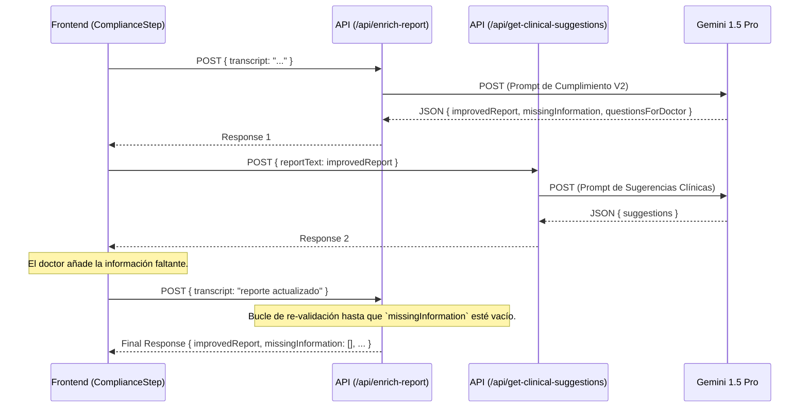

# PRD: Asistente Clínico de IA para Cumplimiento y Sugerencias f

**Versión:** 1.0
**Feature:** Asistente de Cumplimiento Normativo y Sugerencias Clínicas
**Autor:** Cody Coder

## 1\. Visión General y Objetivo

Actualmente, la aplicación **tecsalud** transcribe las consultas médicas, pero el reporte generado no está validado contra normativas específicas y no ofrece asistencia proactiva al doctor.

Esta nueva funcionalidad transformará el flujo de consulta introduciendo un **Asistente de IA** después de la transcripción. Este asistente tendrá un doble propósito:

1.  **Garantizar el Cumplimiento:** Validará automáticamente que el reporte médico cumpla con los estándares de documentación definidos, solicitando al doctor la información faltante de manera interactiva.
2.  **Ofrecer Soporte Clínico:** Analizará el contenido de la consulta para proveer sugerencias y recordatorios médicos relevantes, actuando como un copiloto inteligente para el doctor.

El objetivo es reducir la carga administrativa, minimizar errores de omisión en la documentación y mejorar la calidad de la atención al paciente, haciendo que la IA sea un socio activo en el proceso clínico.

## 2\. Requerimientos de Alto Nivel y Flujo de Usuario

El núcleo de la funcionalidad se integrará como un nuevo paso en el `ConsultationFlow`.

**Nuevo Flujo de Consulta:**
`Resumen Paciente` -\> `Grabación y Transcripción` -\> **(NUEVO) Asistente de Cumplimiento IA** -\> `Verificación Final` -\> `Reporte Final`

### Flujo Iterativo del Nuevo Paso ("Asistente de Cumplimiento IA"):

Este nuevo paso funcionará como un bucle de validación inteligente:

1.  **Análisis Inicial:** La IA recibe la transcripción, la estructura como un reporte profesional y la valida contra la normativa. Identifica información faltante y genera sugerencias clínicas.
2.  **Interacción del Doctor:** La UI presenta al doctor el reporte pre-llenado, las preguntas para completar la información faltante y las sugerencias clínicas.
3.  **Enriquecimiento:** El doctor edita el reporte y/o responde las preguntas de la IA.
4.  **Re-Validación:** El doctor presiona un botón para que la IA vuelva a analizar el reporte ahora enriquecido.
5.  **Ciclo:** El proceso se repite hasta que la IA determina que el reporte está completo y cumple con todos los puntos de la normativa.
6.  **Finalización:** Una vez completo, el doctor puede proceder al paso de verificación final con un reporte robusto y validado.

## 3\. Arquitectura y Flujo de Datos

Para lograr una arquitectura modular y preparada para el futuro, se crearán **dos endpoints de API distintos**. Esta separación permite que en el futuro el modelo de sugerencias clínicas pueda ser reemplazado por un LLM especializado sin afectar el módulo de cumplimiento.



## 4\. Especificación Final de Prompts de IA

### 4.1. Prompt para API de Cumplimiento (`/api/enrich-report`)

Este es el prompt final y validado que se debe usar en el backend para esta API.

-----

**ROL Y MISIÓN**
Eres un Asistente de Documentación Médica especializado en Cumplimiento Normativo. Tu misión es tomar la transcripción de una consulta médica y transformarla en un reporte profesional que cumpla rigurosamente con los estándares de documentación requeridos. Eres un experto en estructurar información clínica y en identificar lagunas de información de acuerdo a un marco regulatorio estricto.

**CONTEXTO REGULATORIO Y FUENTE DE VERDAD**
Tu única y exclusiva fuente de verdad para el contenido y la estructura del reporte médico es la siguiente lista de requerimientos obligatorios, extraída del Apéndice A ("Documentation Contents of the Medical Record"). No debes asumir, inferir o añadir ninguna sección o campo que no esté explícitamente en esta lista.

**LISTA DE CAMPOS OBLIGATORIOS DEL REPORTE MÉDICO:**

  * **Información de Identificación:** Nombre del paciente, Dirección en admisión, Número de identificación (Medicare, Medi-Cal, Hospital, etc.), Edad, Sexo, Estado Civil, Estatus Legal, Nombre de soltera de la madre, Lugar de nacimiento, Autorización legal para admisión (si aplica), Grado escolar (si aplica), Preferencia religiosa, Fecha y hora de admisión/llegada, Fecha y hora de alta/salida, Nombre/dirección/teléfono de responsable, Nombre del médico tratante, Idioma principal.
  * **Información Clínica Principal:** Impresión diagnóstica inicial, Diagnóstico final/de alta, Registro de alergias, Directivas anticipadas (si aplica), Historial Médico (inmunización, pruebas, nutrición, psiquiátrico, quirúrgico, médico pasado, social, familiar, neonatal), Examen Físico, Reportes de consultas, Órdenes (medicamentos, tratamientos, recetas, dieta, etc.), Notas de progreso (con diagnóstico actual), Notas de enfermería, Hoja de signos vitales.
  * **Resultados y Procedimientos:** Resultados de laboratorio, Resultados de Rayos X, Formularios de consentimiento, Registro de Emergencias, Lista de problemas, Registro de anestesia, Reporte de operaciones/procedimientos, Reporte de patología, Instrucciones pre/postoperatorias.
  * **Registros Específicos (si aplica):** Registro de parto, Terapia física/ocupacional/respiratoria, Plan de Educación, Fotografías del paciente, Instrucciones de alta, Resumen de alta.
  * **Comunicaciones:** Copias de cartas a pacientes, Encuentros telefónicos documentados.

**METODOLOGÍA: PROCESO OBLIGATORIO DE DOS PASOS**
Debes procesar el input del usuario siguiendo rigurosamente estas dos fases en orden.

  * **Fase 1: Estructuración del Reporte Médico:** Analiza la transcripción completa, extrae la información clínica relevante y re-escríbela en un formato de reporte profesional, usando encabezados claros basados en la lista de arriba.
  * **Fase 2: Auditoría de Cumplimiento y Generación de Preguntas:** Compara el reporte estructurado con la LISTA DE CAMPOS OBLIGATORIOS. Identifica todos los campos mandatorios que faltan. Para cada uno, genera una pregunta clara y específica para el médico.

**INPUT DEL USUARIO**
El input será la transcripción en texto plano de una consulta médica.

**FORMATO DE SALIDA**
Tu respuesta final DEBE ser un único objeto JSON, sin ningún texto o explicación adicional. La estructura del JSON debe ser rigurosamente la siguiente:

```json
{
  "improvedReport": "El reporte completo basado en la información disponible en la transcripción, estructurado profesionalmente con formato Markdown.",
  "missingInformation": [
    "Nombre del campo faltante 1",
    "Nombre del campo faltante 2"
  ],
  "questionsForDoctor": [
    "Pregunta específica para obtener el campo 1",
    "Pregunta específica para obtener el campo 2"
  ]
}
```

  * `improvedReport`: Un string que contiene el reporte médico completo y formateado.
  * `missingInformation`: Un array de strings, donde cada string es el nombre exacto del campo faltante según la lista de requerimientos.
  * `questionsForDoctor`: Un array de strings, donde cada string es la pregunta correspondiente para el médico.
  * Si el reporte está completo, los arrays `missingInformation` y `questionsForDoctor` deben estar vacíos `[]`.

-----

### 4.2. Prompt para API de Sugerencias Clínicas (`/api/get-clinical-suggestions`)

Este prompt es más directo y debe usarse en la segunda API.

-----

**ROL Y MISIÓN**
Eres un Asistente Médico experto con acceso a vasta literatura médica. Tu misión es analizar una nota clínica o reporte médico y proveer sugerencias accionables para ayudar al médico tratante a considerar todos los ángulos posibles para el cuidado del paciente.

**TAREA**
Analiza el siguiente reporte médico. Basado en los síntomas, diagnósticos iniciales y tratamientos descritos, genera una lista de 2 a 3 sugerencias clínicas. Estas sugerencias deben ser relevantes y prudentes, como posibles estudios de laboratorio o imagen a ordenar, diagnósticos diferenciales a considerar, o puntos importantes para discutir con el paciente en el seguimiento.

**INPUT DEL USUARIO**
El input será el texto de un reporte médico.

**FORMATO DE SALIDA**
Tu respuesta final DEBE ser un único objeto JSON con la siguiente estructura:

```json
{
  "suggestions": [
    "Sugerencia clínica 1",
    "Sugerencia clínica 2"
  ]
}
```

-----

## 5\. Criterios de Aceptación (Checklist del Desarrollador)

  - [ ] Se han creado los dos nuevos endpoints en la API: `/api/enrich-report` y `/api/get-clinical-suggestions`.
  - [ ] El endpoint `/api/enrich-report` implementa correctamente el prompt de cumplimiento y devuelve el JSON especificado.
  - [ ] El endpoint `/api/get-clinical-suggestions` implementa el prompt de sugerencias y devuelve el JSON especificado.
  - [ ] El componente `ConsultationFlow` ha sido modificado para incluir un nuevo 5º paso llamado "Asistente de Cumplimiento IA".
  - [ ] Se ha creado el nuevo componente `ComplianceAssistantStep` con el layout de dos columnas.
  - [ ] Al cargar, `ComplianceAssistantStep` llama a ambas APIs y muestra los datos correctamente (reporte en el editor, sugerencias y preguntas en el panel lateral).
  - [ ] El bucle de re-validación funciona: el doctor puede llenar información, hacer clic en "Re-validar", y la UI se actualiza con la nueva respuesta de la API de cumplimiento.
  - [ ] El botón "Continuar a Verificación Final" solo se activa cuando `/api/enrich-report` devuelve `missingInformation` como un array vacío.
  - [ ] Los datos del reporte final, validados y enriquecidos, se pasan correctamente a los pasos finales del flujo de consulta.

---

## Notas de despliegue (PR de confirmación de cancelación)

Este commit prepara un Pull Request desde branch para que el owner pueda hacer "Squash & merge" y así firmar el commit final, habilitando el auto‑deploy en Vercel cuando hay políticas que requieren que el autor sea miembro del proyecto. No modifica la lógica de IA; documenta el cambio de UX de confirmación de cancelación en los formularios de creación/edición.
